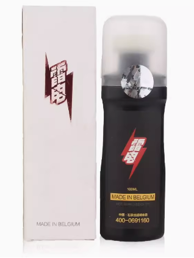
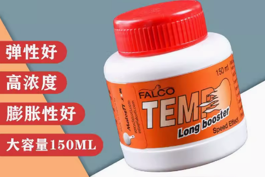
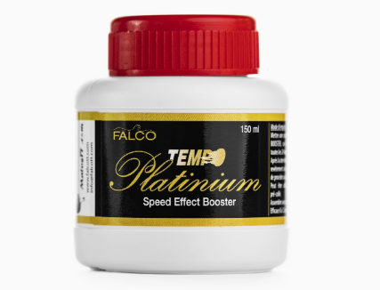
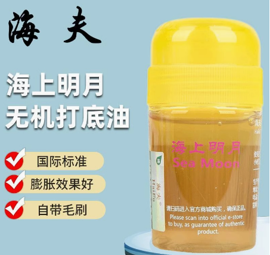
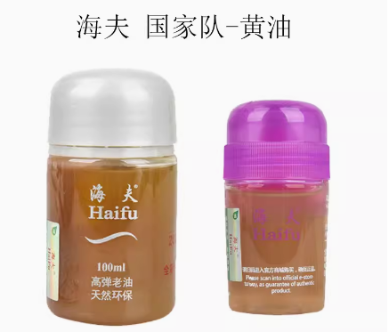
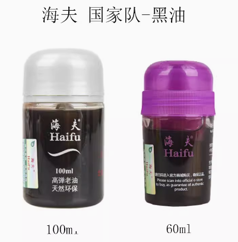

# Booster & Primer Oil Comparison

A practical feel comparison of common expanders / primer oils—especially useful if you play **Hurricane 3**. You can still play H3 with only one or two coats of inorganic glue and no oil, but boosting has clear upsides when the sheet feels stiff or dead.

**What boosting usually improves**

| Effect | On court |
| --- | --- |
| Softer hold | Deeper dwell, less “walled” contact |
| More spring | Faster release / outbound speed |
| Spin & arc | Easier loaded loops, more shapeable arcs |
| Aging sheets | Helps scaled topsheets and faded sponge energy |

Fresh unboosted H3 can feel **stiff and slow**—spin is still there, but pace is easy to block back. That is why many club players open the sponge before match play.

Related: [The Truth About Boosting](boosting-truth.md) · [Hurricane 3 Multi-Stage Boosting](../getting-started/hurricane-3-multi-stage-boosting.md)

---

## Lightning Expander

Works as a softener / expander on **tensor** sheets that have shrunk. Factory Tibhar sheets often already smell like this family of expander.

- Better on **Euro tensors** than on Hurricane  
- On H3 you need a **generous dose** before it soaks through—results are usually only average

---

## Feeling Oil (standard)

Claimed window about **8–12 weeks**: spin, speed, and touch.

Versus Haifu oils below, Feeling on Hurricane tends to feel:

- Softer sponge, deeper bite  
- Higher loop arcs  
- **Less first-speed** than Haifu

Best fit: near/mid-table **spin-first** loopers.

---

## Feeling Oil Platinum

Window and overall softness are close to standard Feeling. Topsheet still softens and grips better.

Same dose vs standard Feeling:

- Sponge stays a bit **firmer**  
- Spring does not rise as much  
- Spin quality improves; arcs sit a little **flatter / lower**

Best fit: near-table counterloop, punch blocks, and quick redirects.

---

## Haifu Sea Moon

Claimed window about **3–4 weeks**.

| vs Feeling | Sea Moon |
| --- | --- |
| Clarity / spin “bite” | Usually a bit less precise than Feeling |
| Softness / arc height | Still softer + higher arcs |
| Spring / speed | **Stronger** than Feeling |

Better than Feeling when you step back to **mid-table** and need more pace.

---

## Haifu National Team Yellow Oil

Often described as the nicer-feeling national-team option (Tokyo-era chatter around top players—not only CNT). Versus regular Sea Moon:

- Sponge a touch **firmer** than Sea Moon  
- Topsheet side feels **springier**  
- From mid/far table, spin + speed pressure usually beats Sea Moon

---

## Haifu National Team Black Oil

Widely used at high level. Said to raise topsheet friction and keep the ball in the sponge longer.

| | Yellow oil | Black oil |
| --- | --- | --- |
| Feel | Softer | Firmer / denser sponge |
| Loop spring | Easier pop and speed | Less springy; needs more force |
| Stability | — | Stronger support on counterloops |
| Punch / counter | — | Slightly quicker on redirects |

!!! tip "Quick pick"
    Spin-first near/mid table → **Feeling** (or Platinum for flatter counters).  
    Need more mid-table pace → **Sea Moon**.  
    Want national-team pressure with softer launch → **Yellow**.  
    Have power and want solid support on counters → **Black**.

---

## Bottom line

Boosting is a tool, not a requirement. Match the oil to **where you create pace** and whether you want softness, spring, or denser support—then keep doses controlled so Hurricane stays legal and playable.
