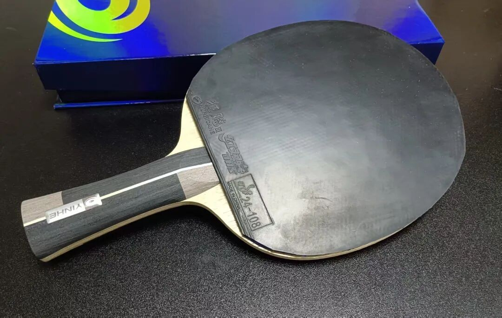
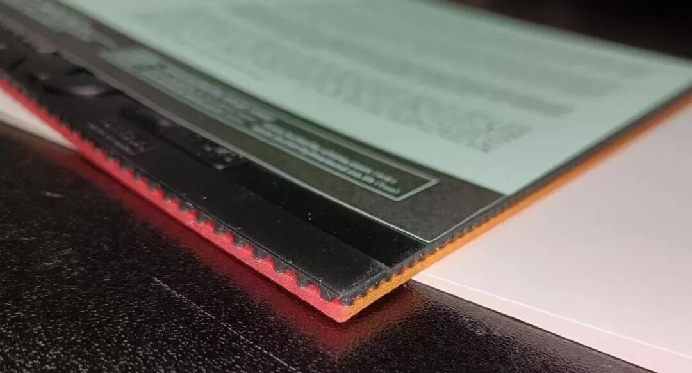
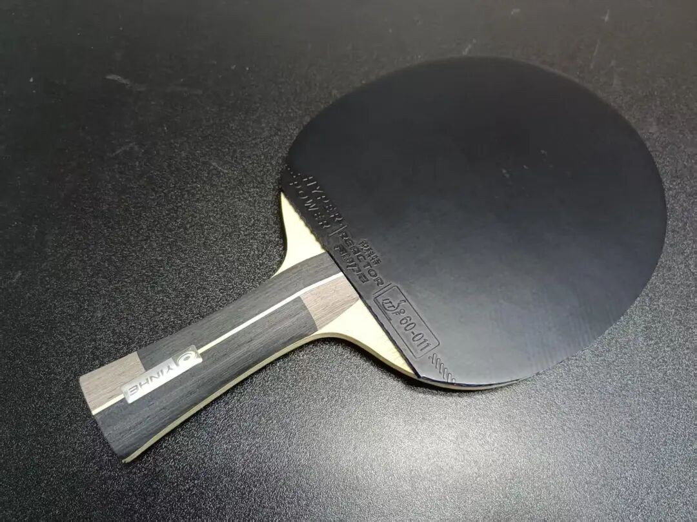

---
source_url: https://mp.weixin.qq.com/s/Av0frugbsDVge74reKV3Ig
source_title: "灌与不灌的真相"
imported: 2026-07-14
---

# The Truth About Boosting (and Not Boosting)

Boosting is not a moral absolute. It is a tool for **opening the sponge** and **adding spring**. Whether you need it depends on the rubber family, blade support, and your ability to punch through.

---

## 1. Hurricane 3 — boost or not?

For many amateurs, unboosted **Hurricane 3** (or **NEO H3**) has always been playable—especially with a moderate hardness and a lively blade. Coaches teaching kids often prefer **lower hardness, no boost**, so the setup stays controllable.

Typical boost benefits on H3 / NEO H3:

| Effect | What you feel |
| --- | --- |
| Easier to open | Soften the “walled” sponge |
| More spring / speed | Faster release, less pure muscle required |

If the blade already has strong spring and the Hurricane sponge is not extremely hard, boosting is **optional**, not mandatory. The modern fashion is still “boost,” and boosted H3 does hit harder—but so do many fresh factory-tuned tensors.

Boosting also helps sheets that feel dead to mid-level force, e.g. some players call unopened **T05 Hard** trash until a light boost makes it usable.

---

## 2. Why overseas sheets can still look “pimple-juicy”

Several reasons, overlapping:

1. Many JP/KR FH players also run **Hurricane** and boost—sometimes chasing old-oil feel like amateur enthusiasts.
2. Some Butterfly FH **T05 Hard** sheets look plump because of **player-side boosting** or stronger **factory preconditioning**.
3. Fresh vs aged stock differs: same model, new packs can bend differently; some sit in warehouses longer. Extreme case: special white-shell **D05** arriving with already-faded sponge.

Boosting usually increases:

- transparency / spring
- wrap / dwell sensation

…and shortens lifespan. Factory energy on foreign tensors also has a clock—**buy fresh when you can**.

On Butterfly **Tenergy**, boost/oil excess often accelerates **topsheet pilling** more than it kills sponge spring (T sponge energy is relatively durable). For many ESN “tuner-free” sheets, factory tension *is* pre-boosting—so longevity is hard to make legendary. If a model claims “longer life,” it usually changed sponge/topsheet chemistry **or** dialed factory energy down.

!!! note "The short-life paradox"
    The easier an imported energy rubber feels out of the pack, the shorter its peak window tends to be.

---

## 3. Two viable paths

| Path | Idea |
| --- | --- |
| A | Chinese tacky (e.g. Hurricane) **+ boost** |
| B | **Tuner-free** outers—usually **mildly tacky / grippy**, not ultra-tacky |

High tack + true factory energy rarely unify perfectly. Better attempts in that niche include things like **Guobiao 3**, **Big Dipper V**, Tibhar **K2**, RKT Hyper-Power AMG-type sheets—but few claim to beat a **well-boosted Hurricane 3**.

**D09c**, **Jekyll & Hyde C55.0**, etc. are closer to **mild tack** than pure sticky china. Mild tack is easier to make fast; ultra-tack factory-tuned speed is the hard combo. You do not need max tack if friction is enough for spin.

Many players successfully migrate from boosted Hurricane to:

- D09c / C55.0 / Dynaryz ZGR / K2 Pro / Stiga DNA hybrids

---

## Decision cheat sheet

| Your situation | Lean toward |
| --- | --- |
| Soft blade + hard china sponge | Boost (or lower hardness) |
| Hard/lively blade + mid H3 | Unboosted can work |
| Cannot open T05 Hard / D05 | Light boost or softer sheet |
| Want low maintenance | Fresh tuner-free / mild-tack outers |
| Chase max china spin weapon | Boosted Hurricane-class |

Related: [Why Tenergy Before Dignics](why-tenergy-before-dignics.md)
