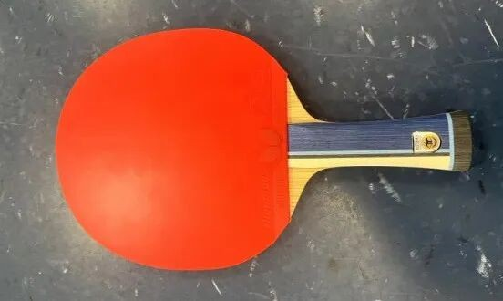

---
source_url: https://mp.weixin.qq.com/s/T0yAzaWtrasS8_tSLJ1ROQ
source_title: "每周乒器观察 217：张本SZLC和SALC的区别"
imported: 2026-07-14
---

# Harimoto SZLC vs SALC

Two Butterfly “Super Harimoto” inner blades look almost identical on paper: **inner fiber + kiri core**. The real differences are fiber type and thickness—and those small numbers change speed, hold, and soft/hard feel more than people expect.

---

## Same skeleton, different engines

| | Harimoto **SZLC** | Harimoto **SALC** |
| --- | --- | --- |
| Layup | Inner fiber + **kiri** core | Inner fiber + **kiri** core |
| Fiber | **SZLC** | **SALC** |
| Thickness (listed) | **6.2 mm** | **5.9 mm** |
| Fiber character | Tougher / higher rebound, faster | Longer pause on contact, easier spin |
| Speed : arc (rough read) | ~**6 : 4** | ~**4 : 6** |

A **0.3 mm** thickness gap is huge on a blade. It pushes hardness feel and spring:

- Thicker blank → easier high rebound
- Thinner blank → softer, more dwell-oriented feel

Japanese trial chatter so far: **SALC still felt a bit firm**, but still holds the ball. Many players also describe SALC as **not ultra-transparent**—fine, as long as dwell is enough.

!!! tip "How to choose"
    Want more first-speed and a snappier release → lean **SZLC**.  
    Want clearer hold and easier loaded arcs → lean **SALC**.

The outer wood looks close to Freitas-style **limba** color. One reason for the finish look: Butterfly blanks usually get wood-sealer before leaving the factory.

---

## Bottom line

For the two Super Harimotos, start with the simple matrix: **SZLC = faster / springier**, **SALC = more hold / spin-friendly**, amplified by **6.2 vs 5.9 mm**. Everything else is fine-tuning once that direction matches your loop distance and force habits.

Related: [Blade Feel Fundamentals](../getting-started/blade-feel-fundamentals.md).
