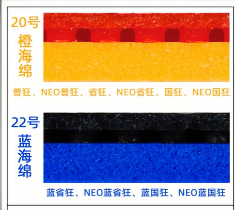
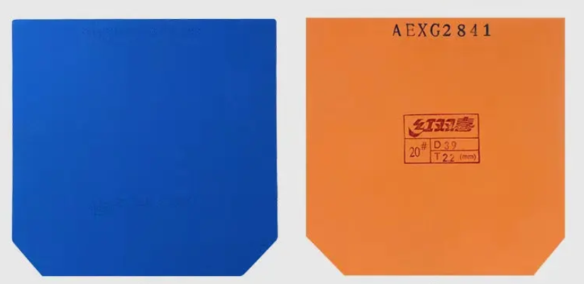

---
source_url: https://mygear.top/blue-sponge-vs-orange-sponge-choosing-the-right-hurricane-3/
source_title: "Blue Sponge vs. Orange Sponge: Choosing the Right Hurricane 3"
imported: 2026-07-14
---

# Hurricane 3: Blue Sponge vs Orange Sponge

For amateurs, Hurricane 3 sponge choice is not a color preference—it is matching sponge physics to your blade and swing. Factory codes matter: **Orange ≈ No. 20**, **Blue ≈ No. 22**.

---

## Core identities

| | **Orange** (No. 20) | **Blue** (No. 22) |
| --- | --- | --- |
| Design aim | Crisp feel | Higher density / tension |
| Elastic character | Crisp-elastic (*cui-tan*) | Tough-elastic (*ren-tan*) |
| Easy to bottom out? | Usually yes | Harder—needs more swing |
| Typical loop arc | Flatter / higher first speed | Longer dwell, dipping “dangerous” arc |

!!! warning "Dyed blue is not Blue Sponge"
    Cheap “blue-dyed” sheets do not copy genuine DHS Blue Sponge structure. Color alone is not the formulation.

---

## Feel at the same hardness

At the same listed degree (e.g. **39°**):

- **Orange** — faster first kick off the bat; more forgiving when power is moderate.
- **Blue** — feels firmer under the same hit; needs more compression work, then a higher energy return ceiling when you fully engage it.

---

## Shot quality

| Goal | Lean |
| --- | --- |
| Close-table speed, quick attacks, flatter kill | **Orange** |
| Mid/far power + heavy friction and a dipping arc | **Blue** |

Blue’s extra dwell feeds spin and “floor,” but only if you can load the sponge. Without that, depth and consistency drop.

---

## Who should use which

!!! tip "Default for most amateurs"
    Start **Orange**. Move to **Blue** only when you consistently bottom out Orange and need more top-end support.

- **Blue power tax:** weak technique or slow swing → Blue feels dead, tiring, more errors.
- **Orange beginner path:** better free speed and consistency while the stroke is still forming.

---

## Blade pairing

| Blade type | Pairing idea |
| --- | --- |
| Softer / more flexible (e.g. Fan Zhendong ALC, Lin Gaoyuan ALC) | **Orange** to add usable first speed |
| Stiffer / Super ALC-class (e.g. Viscaria Super ALC) | **Blue** — wood kicks; sponge adds dwell so the ball spins instead of floating off |

---

## Boost and progression

Both factory sheets are meant for a boosted lifecycle. Boosting opens the sponge and unlocks elasticity—see [Boosting Truth](boosting-truth.md).

**Path:** Orange to lock in form → Blue once Orange is bottomed out and you need more ceiling.

---

## Bottom line

**Orange = crisp speed and forgiveness.** **Blue = dense support and a higher ceiling**—paid for with swing quality. Color is the label; No. 20 vs No. 22 is the real choice.
