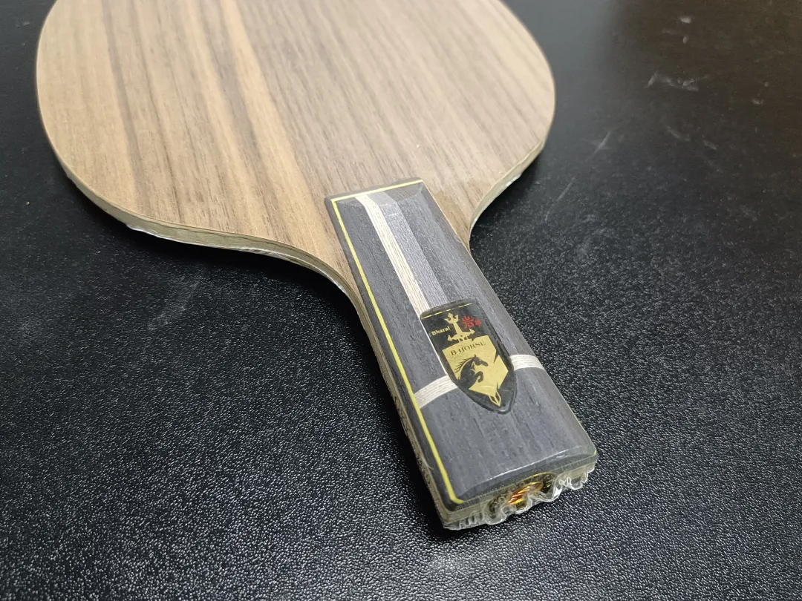

# Outer vs Inner Fiber

Under ITTF rules, a blade must be at least **85% wood**. The remaining materials are usually specialty fibers. The popular layout is **5+2**: five wood plies plus two fiber layers. Where those fibers sit decides whether the blade is **outer** or **inner**.

- **Outer fiber** — fiber sits directly under the face ply  
- **Inner fiber** — fiber sits on both sides of the core  

---

## What changes in play

| | Outer fiber | Inner fiber |
| --- | --- | --- |
| Mid/light contact | Fiber engages early | More **all-wood** feel |
| Speed / spring | Usually snappier, higher rebound | More moderate until you load hard |
| Control / spin | Easier to feel “too springy” | Easier hold, spin, and arc shaping |
| Typical cores | Often **kiri** | Often **ayous** |

Outer examples lean hard into fiber character—classic outer carbon like Zhang Jike **T5000** (no aramid) is very springy and, for many players, harder to tame.

Inner examples (e.g. DHS **W968** with inner **KLC**) stay softer at mid force: more wood-like, easier control and spin—closer to how **Hurricane Long 5** feels on lighter swings.

---

## Why many top players lean inner

Plastic-ball rallies reward **multi-ball control**. That pushes demand toward blades you can steer: hold, spin, and arc. National-team setups often favor **inner** for that reason.

Even outer blades have shifted toward more dwell—**gold Viscaria**, Lin Gaoyuan **ALC**, Fan Zhendong **ALC** are common “hold-oriented outer” references.

!!! tip "Simple pick"
    Prefer to **create** spin and shape the ball yourself → start with **inner**.  
    Prefer to **borrow** pace and chase first-speed → consider **outer**.

Related blade note: [Harimoto SZLC vs SALC](harimoto-szlc-vs-salc.md) (both inner, different fiber / thickness).

---

## Why some inner blades still feel fast

Inner does **not** mean slow. At mid force it shows more wood character—and wood hardness varies a lot.

Same inner **KLC**, different face:

| Blade | Face | Mid-force feel |
| --- | --- | --- |
| **N301** | Koto | Firmer / faster |
| **W968** | Limba | Softer / woodier |

Harder faces (walnut, rosewood, ebony, bharal/岩羊, etc.) can make an inner blade block almost as quick as an outer. The difference shows more when looping:

- **Hard-face inner** — big deformation + ayous cores often give **longer arcs** and stronger behind-the-table threat  
- **Outer** — with common kiri cores, arcs are usually shorter; better suited to **near/mid-table** pace games

Use your stance as a filter: fast near-table counterplay → outer is a natural fit; stepping back to load heavy loops → inner (especially with a supportive core) often helps.

---

## Thickness still matters

Blade thickness changes stiffness and support. A thick inner blank can approach outer speed—e.g. **6.2 mm** Harimoto **SZLC** or Ovtcharov **ALC**.

Factories usually balance fiber aggression with thickness. Boll **ZLC** was once called extremely violent: high-rebound **outer ZLC** would punch through immediately, so Butterfly kept the blank near **~5.5 mm** so the blade could still bend and loop.

---

## Bottom line

1. Outer = fiber closer to the face → earlier spring, more first-speed.  
2. Inner = fiber deeper → more wood feel until you hit through; easier control/spin for many players.  
3. Face wood, core, and thickness can make an “inner” play fast—or an “outer” play more hold-friendly. Match the layout to **how you create pace**, not only to the fiber sticker.
