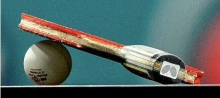
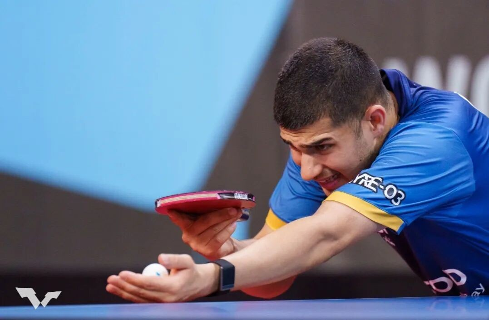
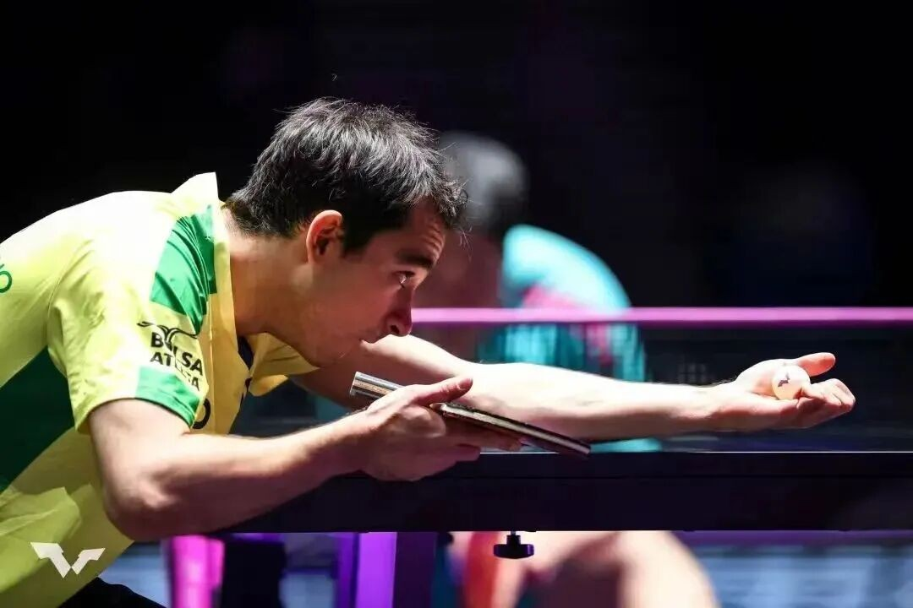
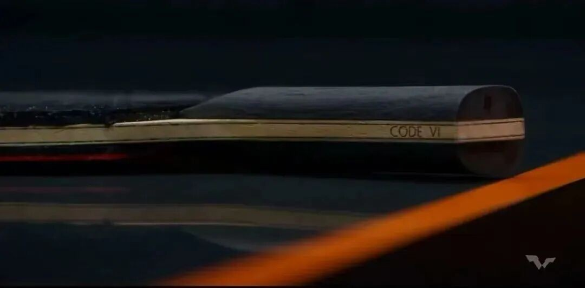

# Pro Special Blades: Names That Do Not Match Retail

Retail labels are not always what pros swing. The awkward case studies: some **Ovtcharov ALC** hands are **outer**, and some recent **Boll ALC** hands are **inner**—even though the market editions reverse those stories.

---

## What retail vs hand blanks can mean

| Name on handle | Typical market structure | Observed hand blank oddities |
| --- | --- | --- |
| Ovtcharov ALC | Inner blue ALC | Some long-used Ovtcharov hands were **outer** ALC |
| Boll ALC | Outer blue ALC | Some recent Boll ALC hands (e.g. earlier noted with Achanta) look **inner** |

That mismatch is poison for gear analysis. You watch a match to “learn the blade,” then discover the handle badge and the ply stack may tell different stories.

When Achanta moved from Super Viscaria to Boll ALC, interviews mentioned a **softer feel** than Super Vis. Open question: was that a true outer Boll ALC—or an inner construction wearing a Boll grip?

!!! warning "Trust-gap claim"
    “Pro specials feel like retail” is not something you can assume. An “Ovtcharov ALC” might behave like Viscaria DNA; a “Boll ALC” might not be outer; a “Viscaria” hand might hide inner SZLC-type guts.

---

## Where customization is easier to accept

Some specials only change **geometry**, which is easier for fans to digest:

| Example | Change | Why it is more understandable |
| --- | --- | --- |
| Lin Yun-Ju Super special | Larger face than retail | Stronger pros often want mass + sweet spot |
| Lee Sang-su Innerforce Layer ALC | Chopper-sized face | Extreme, but still a size story |
| Grip swaps (e.g. Innerforce handle on another face) | Cosmetics / grip preference | Brand may have little say once the player insists |

Hidden **structure swaps** hurt consumer trust more than “bigger face / heavier blank.” Seeing many star “Boll ALC” users that may not share Boll’s outer identity makes shoppers wonder what they are actually buying toward.

---

## Hugo HAL as a cautionary tale

Hugo Calderano’s HAL boom after Macao / Doha successes likely sold many retail outer-fiber expectations. Photo reads of his peak equipment suggest he may have been on **inner arylate-carbon**, not outer fiber—and after joining JOOLA he quickly settled on **inner green AC** builds (after only a short pure-wood detour). That logic would match an inner peak, not an outer one.

---

## What consumers should do

1. Treat handle names as **marketing handles**, not structural certificates.
2. Prefer reviews that inspect **edge plies / fiber placement**, not only badges.
3. Remember athletes adapt: changing brand, grip, or a tweak in process is not as apocalyptic for them as it is for shoppers chasing “the exact wand.”

!!! tip "Buyer mindset"
    Buy the **playing construction** that matches your feel goal—not the celebrity silhouette on Instagram.

Related: [Harimoto SZLC vs SALC](harimoto-szlc-vs-salc.md) · [Elasticity, Hardness, and Core Wood](gear-philosophy.md)
