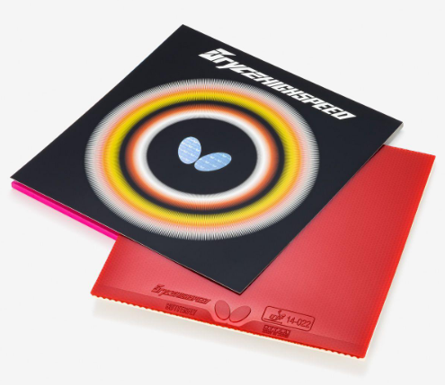
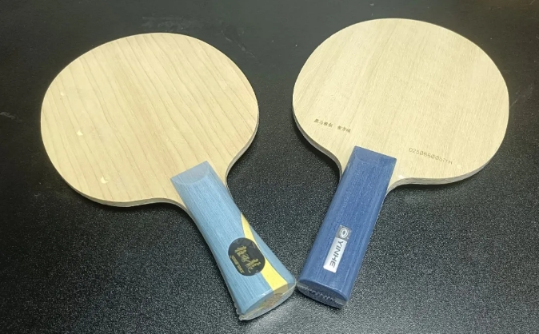
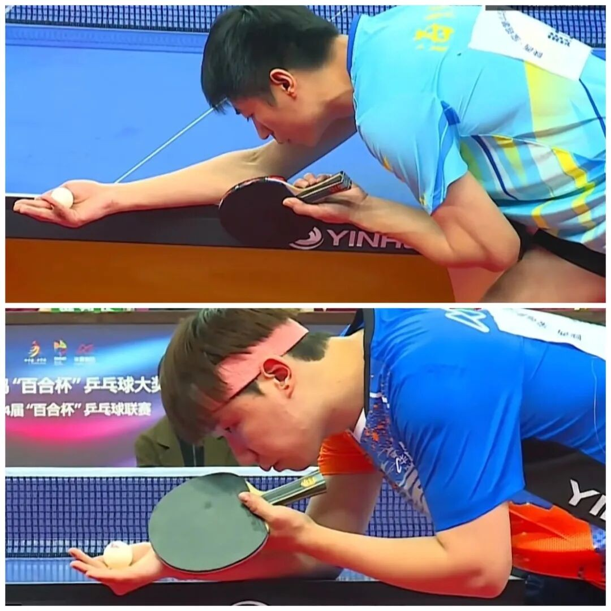

# Style and Gear: Choosing Between Tradition and Trend

Plastic-ball eras push harder sponges; younger topspin systems push stiffer inners; celebrities swing between classical ALC and Super ALC. You still have to pick a lane that matches **how you score**.

---

## 1. Butterfly’s hard-sheet signal

Butterfly has been retiring softer inverted lines and some pimple variants (volume-dependent). Notable soft classics on the way out include **Sriver FX** and **Bryce HighSpeed**—organic-era BH icons and microlayer easy-speed tools. **Roundell Soft** is also in that softer bucket. Market demand keeps drifting hard.

Even amateurs who once swore BH **D09c** was “too hard” are now often putting it on. Parallel blade retirements include favorites like **Yoshida Kaii** for some penholders, plus multiple **AN** (and some **ST**) grip SKUs across Harimoto full lines, Mizutani pairs, Super Lin Yun-Ju, Boll ZLC, Apollonia / Franca ZLC, etc. Pro AN users are vanishing; **FL is winning**.

---

## 2. Underspin systems vs topspin systems

Younger high-level play (pro and strong amateur) skews **topspin exchange** identity. Older players more often still built from **underspin first**. Gear biases differ:

| System | Inner-blade lean | Typical scoring idea |
| --- | --- | --- |
| Underspin-first | Softer holds (**W968**, Innerforce Layer ALC/ZLC…) | Half-long kill, or high-spin loop → next-ball finish |
| Topspin-rally | Firmer / thicker “刚柔并济” inners (**S968**, Ovtcharov ALC, Yinhe Max KLC, Harimoto ALC…) | Closer to outer-blade usage: stable exchanges, speed + placement |

Classical **inner** focus: extreme spin and single-shot mass—you must drive it.  
Classical **outer** focus: easier stable rallies—pair with rubber that can still hold and spin.

Match tactics reverse the strengths:

- Vs topspin-first opponents: win more from short underspin and tempo/spin variety
- Vs underspin-first opponents: open angles, move them, raise pace
- Academy juniors vs veterans: juniors should avoid endless short-ball spin traps—play big topspin windows; veterans should force variation early and cash the first three balls

---

## 3. Fan Zhendong ALC vs SALC

Two hot blanks, different eras of “正确”:

| | Fan Zhendong **ALC** | Fan Zhendong **SALC** |
| --- | --- | --- |
| Character | More classical / traditional | Super ALC trend |
| Incoming spin | Easier to handle simply | More sensitive / can “eat” spin more |
| Self-drive | Needs more of your power (less free spring) | Better mid-force spin–speed blend |

!!! tip "Tradition vs trend"
    Neither style nor gear has a universal winner. Pick the bias that matches how **you** already win points—then upgrade along that line instead of chasing every celebrity blank.

Related: [Harimoto SZLC vs SALC](harimoto-szlc-vs-salc.md) · [Elasticity, Hardness, and Core Wood](gear-philosophy.md) · [Accelerating With Gear](../getting-started/accelerating-with-gear.md)
