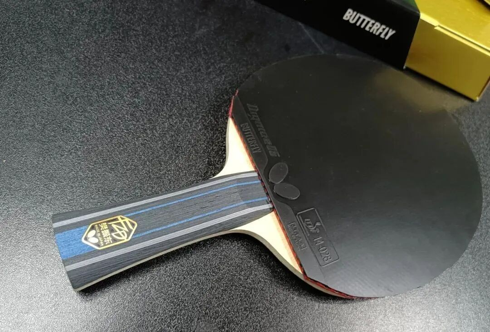
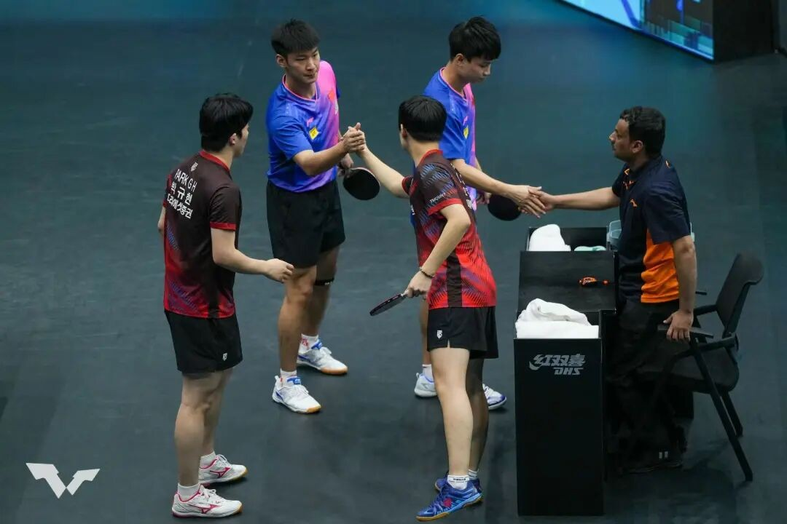

# Why Play Tenergy Before Dignics?

Many Butterfly stars eventually land on **Dignics**—yet most of them still pass through **Tenergy** first. That is not wasted time. For a lot of players, Tenergy is the stage where the stroke learns to punch through before a harder D-series sheet pays off.

---

## Recent switches that rhyme

Recent examples:

| Player | Blade (reported) | Path |
| --- | --- | --- |
| Tojo Hayato | Fan Zhendong ALC special | FH **T05 Hard** → **D05**; now both sides **D05** |
| Polcanova (new Euros WS champion) | Innerforce Layer ZLC | BH **T64** → **D05**; now both **D05** |

Shared pattern: **Tenergy → Dignics**.

Among Butterfly-contracted men, Tenergy users are already rare. Among women, roughly half still linger on T—often because:

- Tenergy’s **catapult** is friendlier
- Aside from **T05 Hard**, many T sheets feel **less force-demanding**
- Dignics usually grips better at small force, but is **harder to drive through**

On an inner blade, plenty of amateurs can fully open **T05** on FH but find **D05** a struggle. If you cannot punch through, you never get full acceleration. Top male pros usually do not have that ceiling problem.

---

## If D is the destination, why stop at T?

Because history shows a **staged migration**, not a teleport.

### Harimoto Tomokazu (compressed timeline)

| Period | Blade | Rubbers |
| --- | --- | --- |
| 2018 | Innerforce ALC special (ZJK-ALC style grip art) | FH T05 / BH T05 FX |
| 2019 | Harimoto ALC | both T05 |
| 2020–2021 | Harimoto ALC | FH **D05** / BH **T05** (BH still could not open D05) |
| 2022–2023 | Harimoto ALC | both D05 |
| Now | Harimoto SALC | both D05 |

### Tojo Hayato

| Period | Blade | Rubbers |
| --- | --- | --- |
| 2020 | Zhang Jike ZLC | both T05 |
| 2022 | Zhang Jike ALC | T05 Hard + T05 |
| 2023 | Fan Zhendong ALC | T05 Hard + D05 |
| 2024 | Fan Zhendong ALC | both D05 |

Even when players already suspect **double D** is the end state, they often **cannot open D yet**—so they must earn that stroke window first.

A personal parallel: years ago **T80** on BH felt tough and slow; years later it felt lightning fast; later still it felt almost *too* transparent on BH. Gear “difficulty” moves with your punch-through ability.

---

## Practical takeaway

!!! tip "No one-step top-tier kit"
    Do not demand peak D-series performance before your impact share and timing can open that sponge. Walk the stairs: usable T → mix → full D when the stroke is ready.

Also worth watching in the same period: Tibhar’s Japan push—**Hao Shuai** on **MK Carbon + K3 PRO**, **Wu Junseong** moving from outer ALC special + D09c toward outer ALC special + **K3 PRO** after joining Tibhar. Brands follow “effective” ambassadors; gear paths still follow what the player can actually open.

Related: [Boosting Truth](boosting-truth.md)
