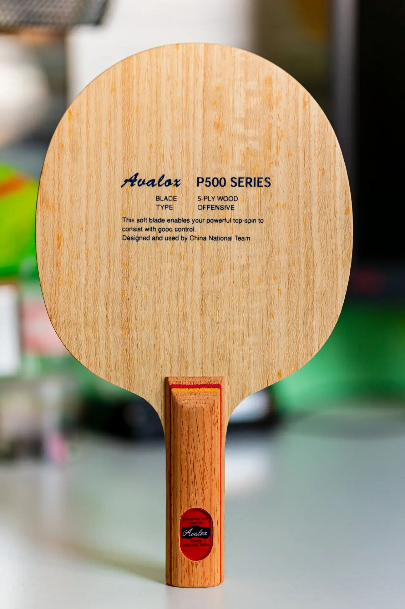
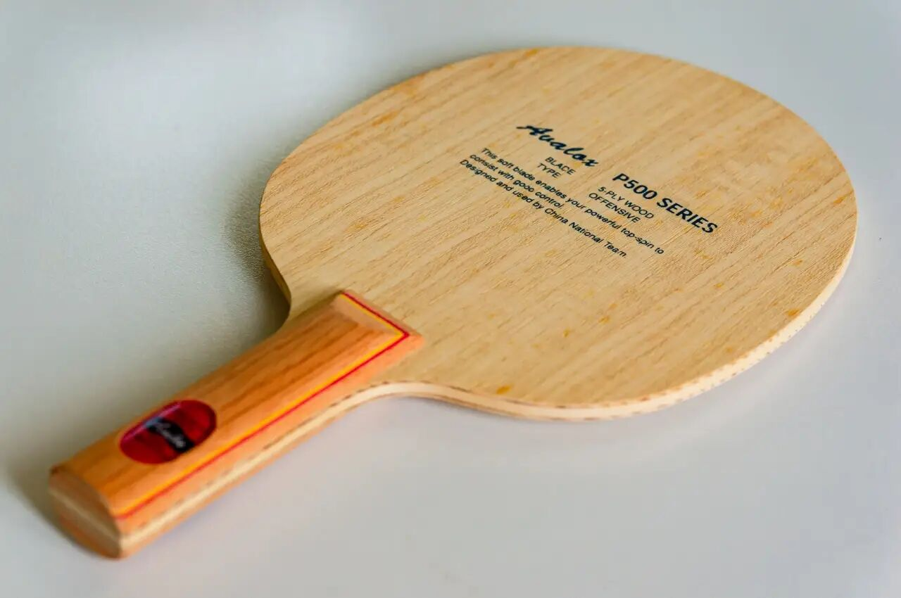
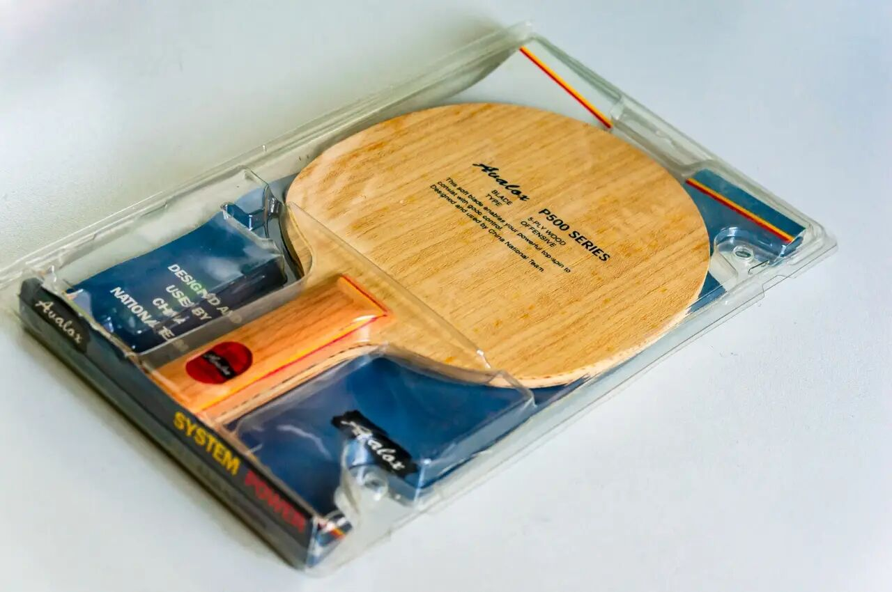
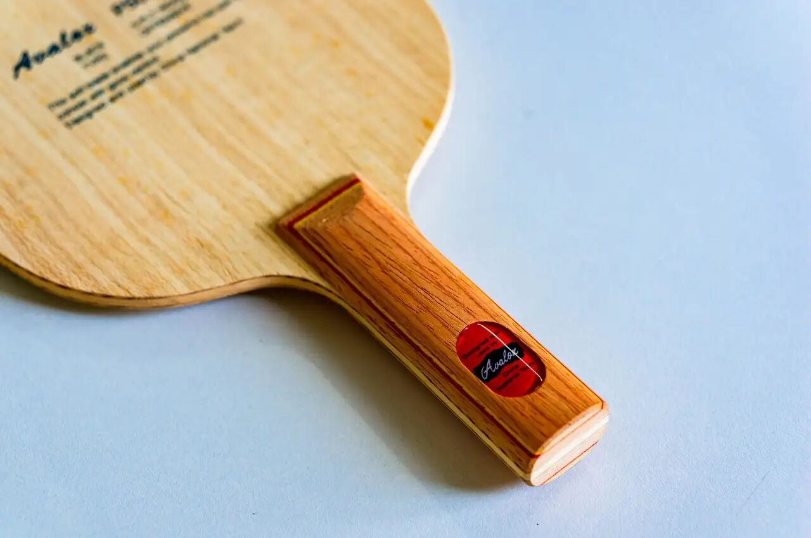

# Avalox P500

**Avalox P500**—Swedish-made legend of Chinese loop training eras (**ST**). Brown handle + red “cat’s eye” cosmetics were once near-standard in many pro environments; later retail copies vary a lot from the oldest stock.

---

!!! tip "Related"
    Another older wood tool in this library: [Nittaku Runlox-5](nittaku-runlox-5.md). Live USD references: [Pricing & Sourcing](../shop/pricing-and-sourcing.md).
