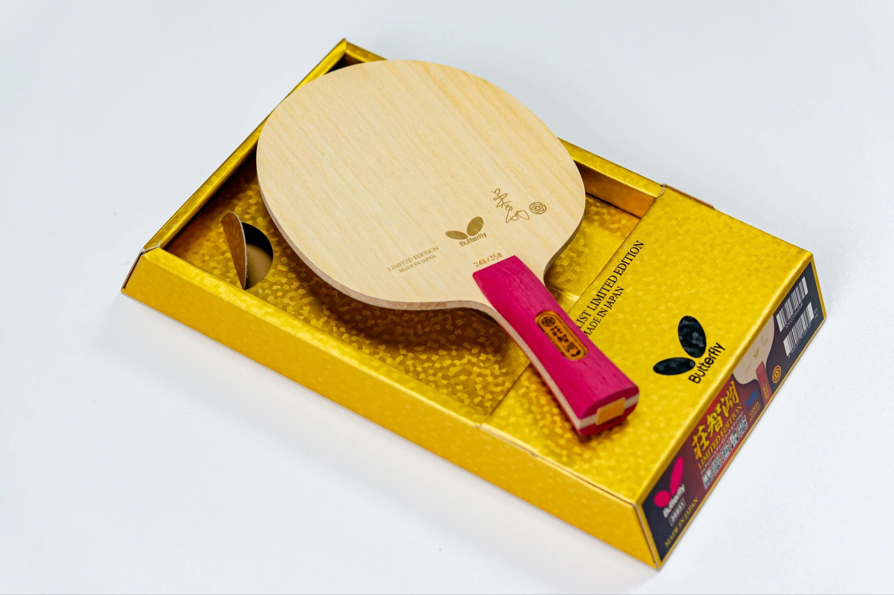
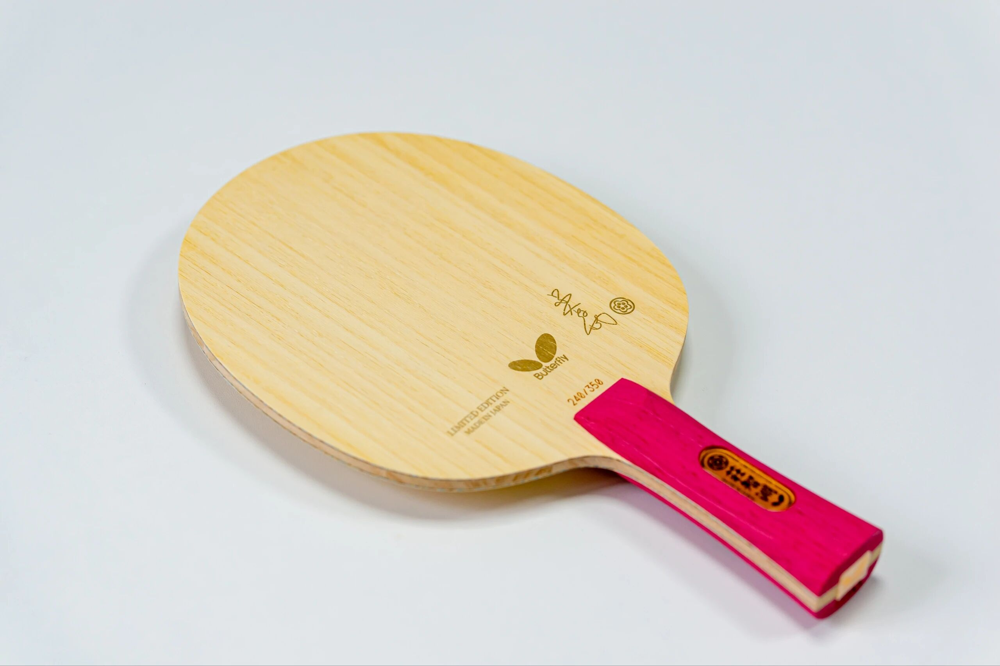
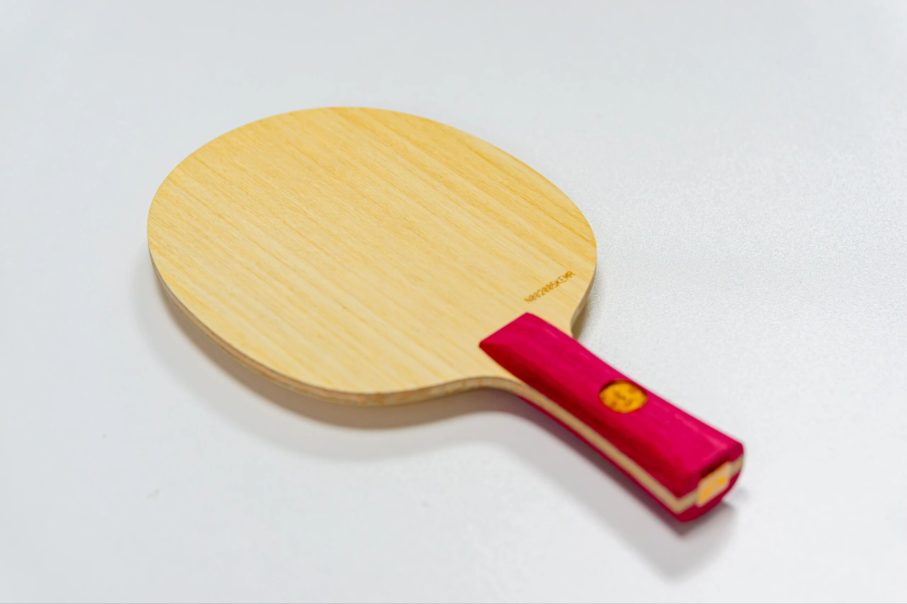
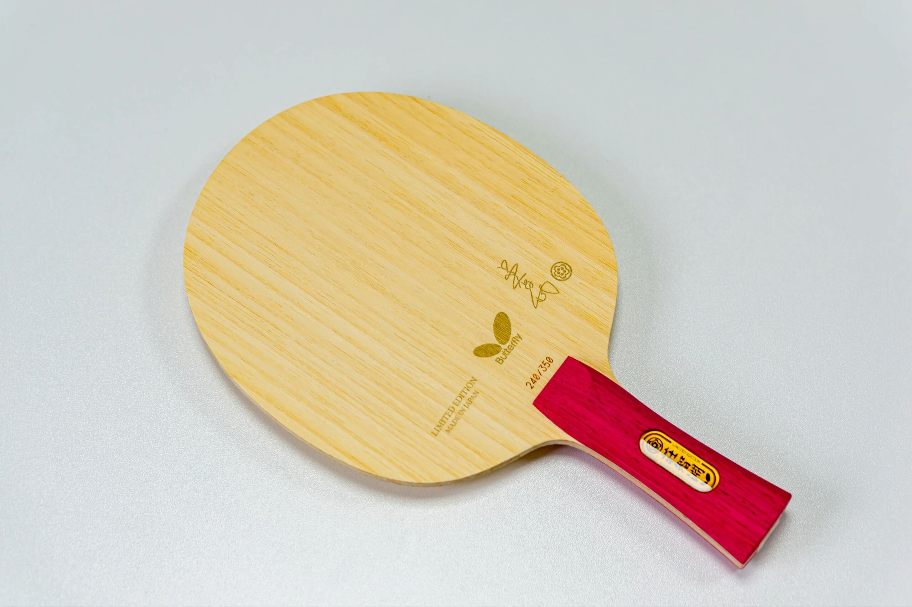

# Butterfly Chuang Chih-Yuan Gold

Butterfly’s first-generation **Chuang Chih-Yuan gold-label limited**—an early gold-label outer **ALC**, often called an ancestor of later gold Viscaria styling. Linked to the 2013 Worlds men’s doubles title era with Chen Chien-An; shown with an **FL** handle.

---

!!! tip "Related"
    Fiber placement basics: [Outer vs Inner Fiber](../guide/outer-vs-inner-fiber.md). Live USD references: [Pricing & Sourcing](../shop/pricing-and-sourcing.md).
