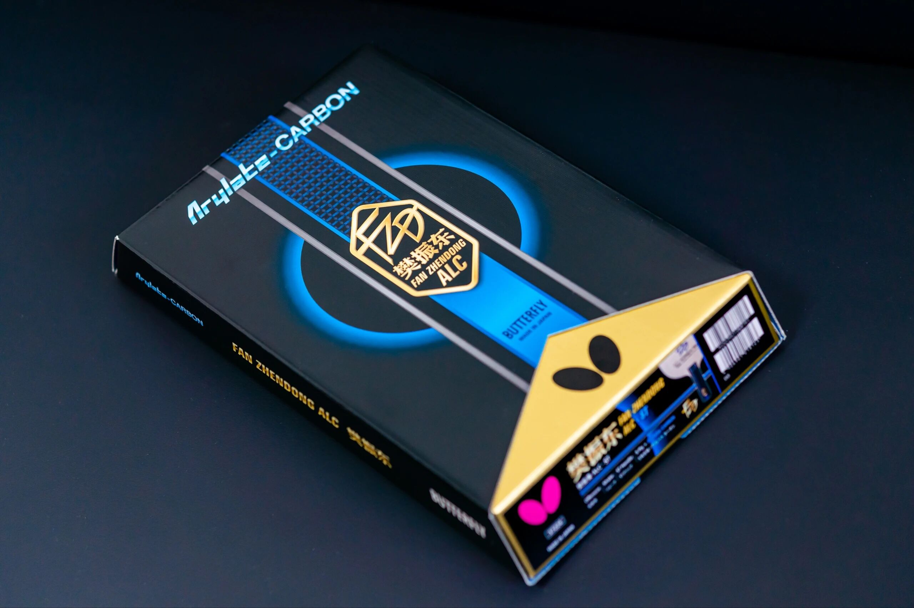
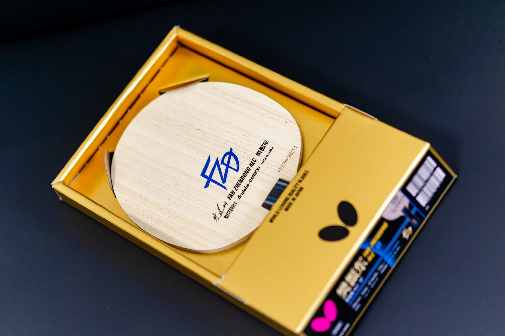
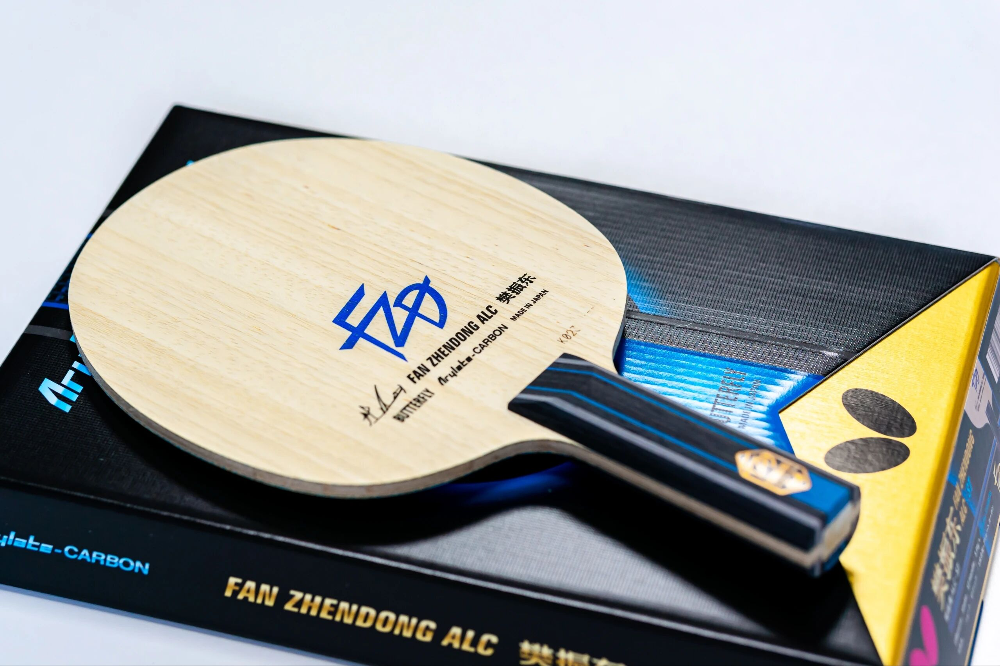
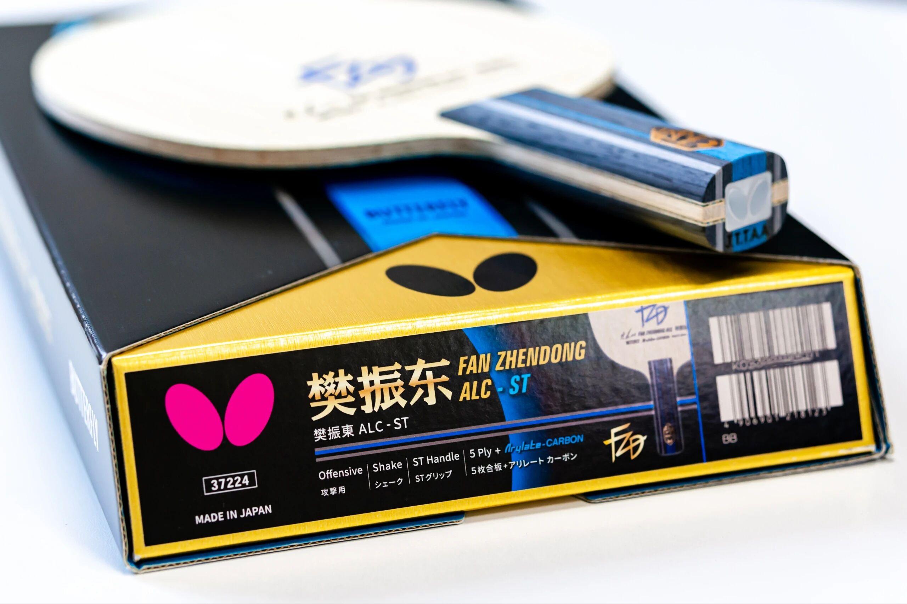

# Butterfly Fan Zhendong ALC

Butterfly **Fan Zhendong ALC**—Viscaria-structure outer ALC with FZD naming (**ST** here). Same family conversation as Viscaria / Zhang Jike Super ZLC-class outer tools.

---

!!! tip "Related"
    Compare: [Donic Zhang Jike Original Carbon](donic-zhang-jike-original-carbon.md). Fiber basics: [Outer vs Inner Fiber](../guide/outer-vs-inner-fiber.md).
