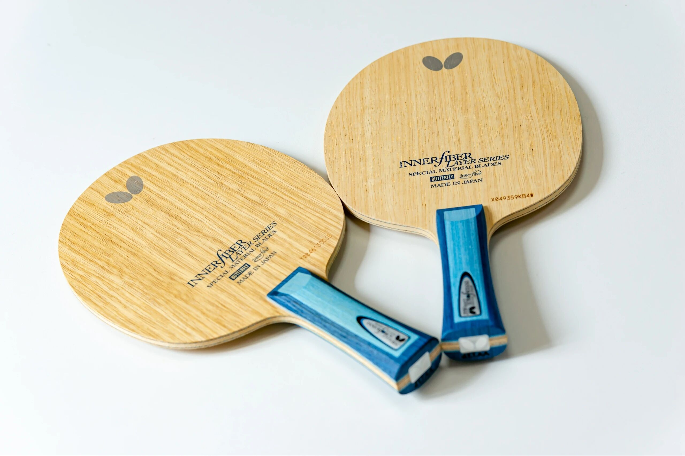
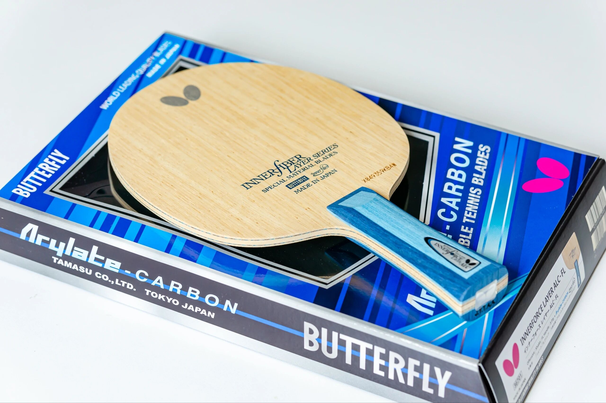
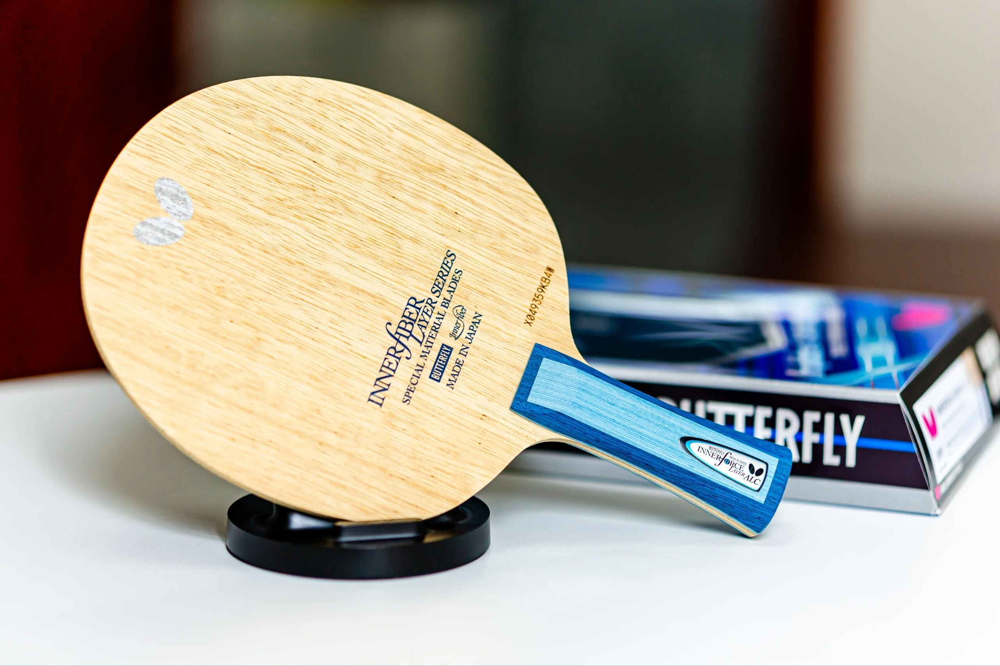
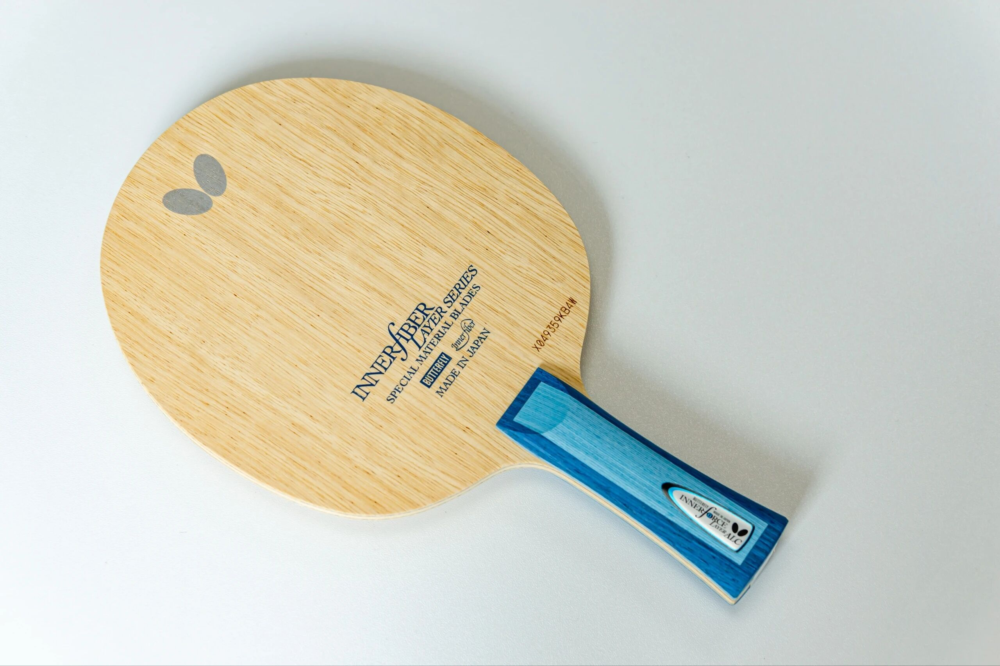

# Butterfly Innerforce Layer ALC

Butterfly **Innerforce Layer ALC**—inner ALC under the face wood (“little blue” aesthetic for many fans). Hold-oriented fiber feel versus outer Viscaria-class blades; shown with an **FL** handle.

---

!!! tip "Related"
    Fiber placement basics: [Outer vs Inner Fiber](../guide/outer-vs-inner-fiber.md). Live USD references: [Pricing & Sourcing](../shop/pricing-and-sourcing.md).
