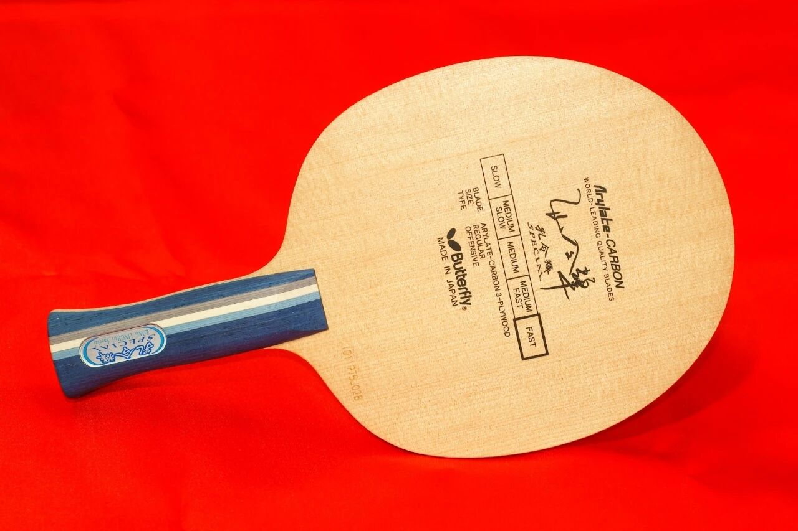
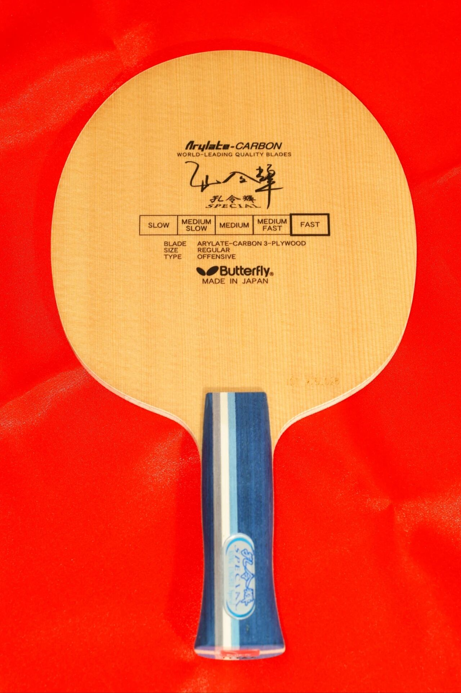
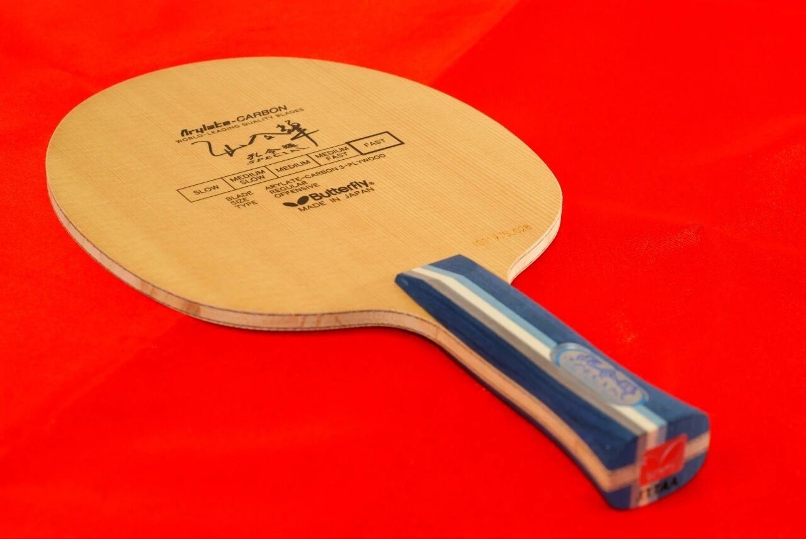
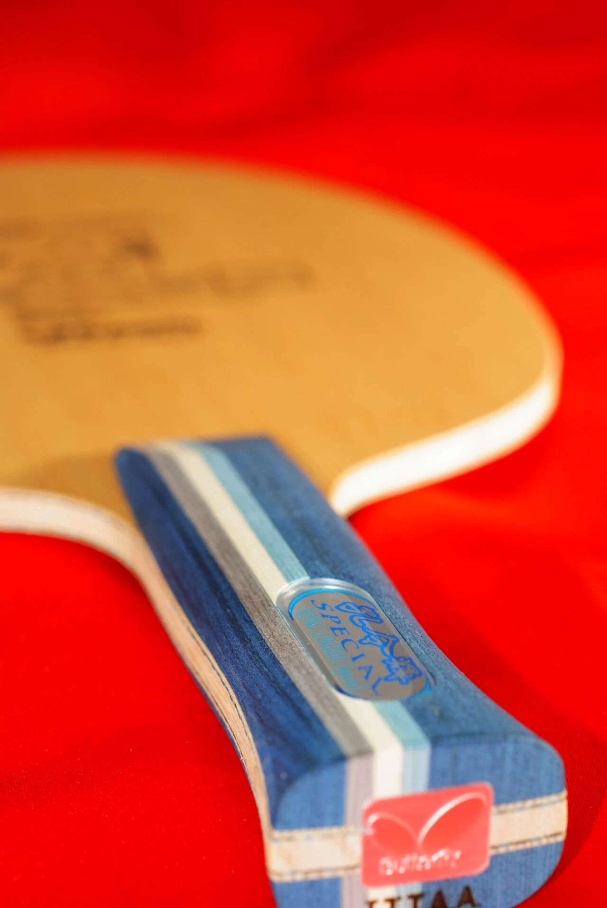

# Butterfly Kong Linghui Arylate-Carbon

Butterfly **Kong Linghui Arylate-Carbon**—the classic “Kong board.” This copy is the scarce **AN** handle; vintage Kong AC blanks (especially AN) trade at collector prices on secondary markets.

---

!!! tip "Related"
    Fiber placement basics: [Outer vs Inner Fiber](../guide/outer-vs-inner-fiber.md). Live USD references: [Pricing & Sourcing](../shop/pricing-and-sourcing.md).
