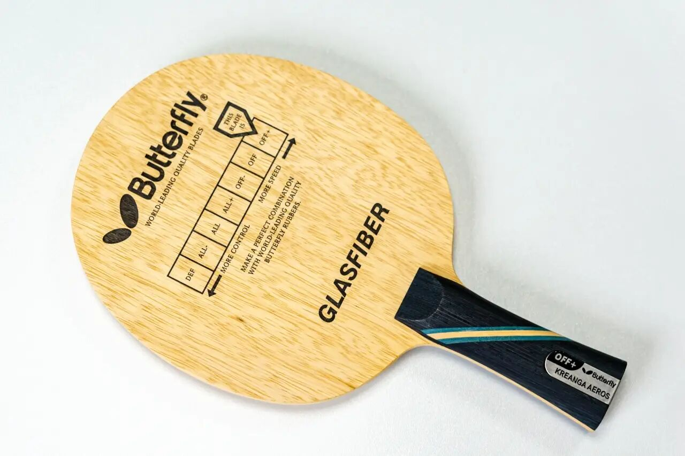
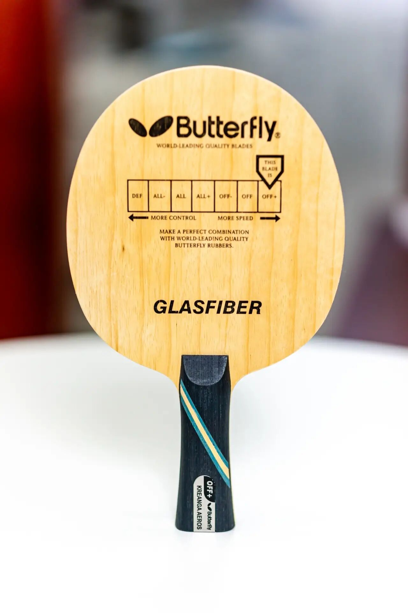
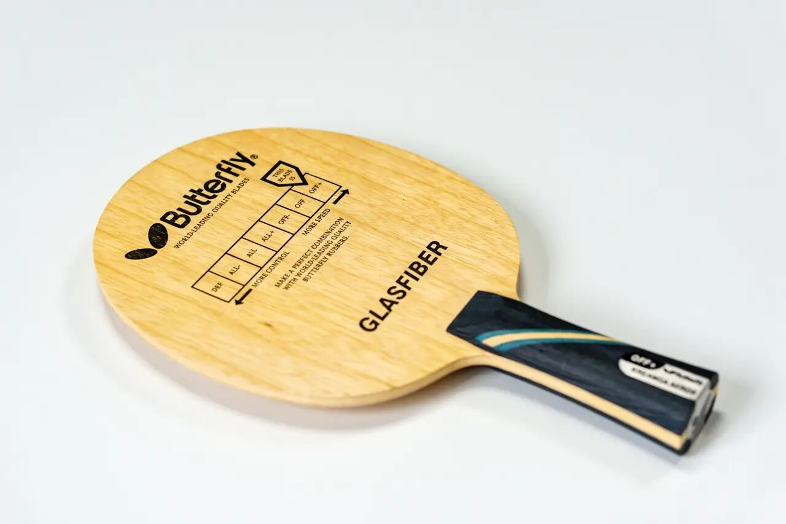
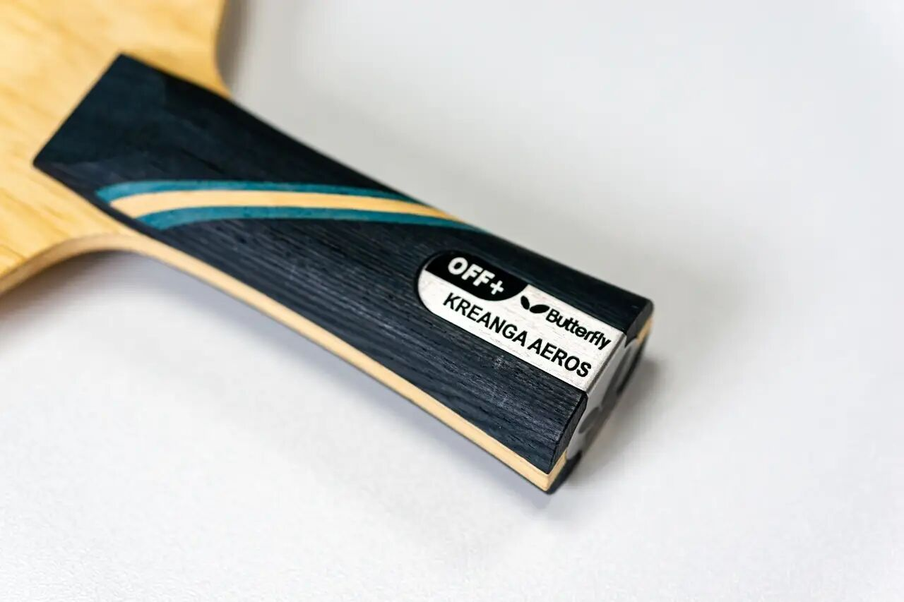

# Butterfly Primorac Fiber Glass

Butterfly **Primorac Fiber Glass** (**FL**)—glass-fiber classic from the BBS era of “spin like a black hole” GF talk (with Persson GF peers). Distinct hold/feel versus modern ALC.

---

!!! tip "Related"
    Fiber placement: [Outer vs Inner Fiber](../guide/outer-vs-inner-fiber.md).
