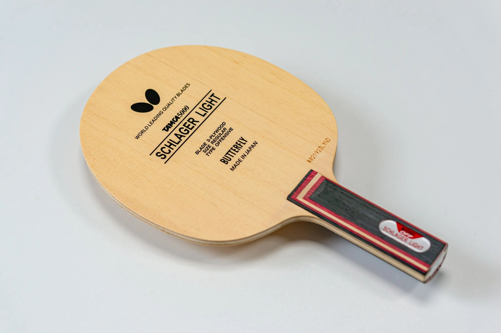
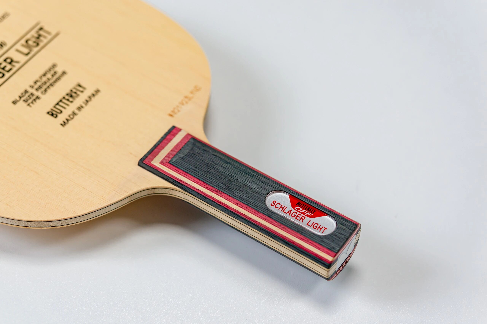
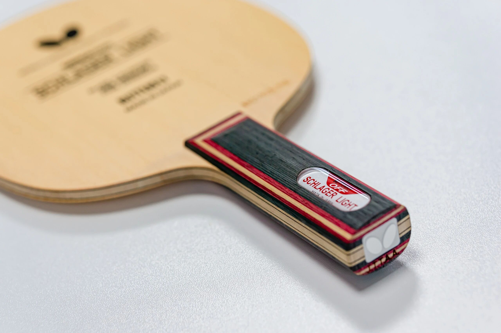
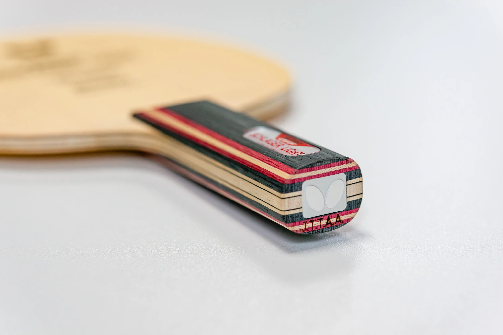

# Butterfly Schlager Light Carbon

Butterfly **Schlager Light Carbon** (施拉格轻碳)—shown here in the sharper-looking **ST** handle. A light carbon-assisted blank: more about quick handling and clean looks than raw fiber violence. FL versions are already flashy; many fans say the ST handle looks even better.

---

!!! tip "Related"
    Fiber placement basics: [Outer vs Inner Fiber](../guide/outer-vs-inner-fiber.md). Live USD references: [Pricing & Sourcing](../shop/pricing-and-sourcing.md).
