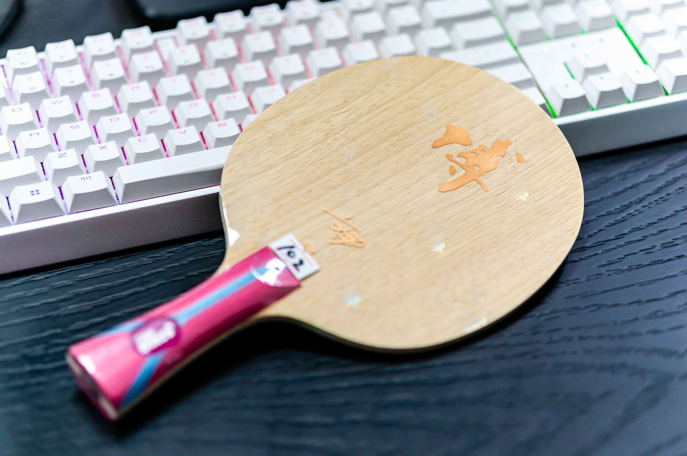
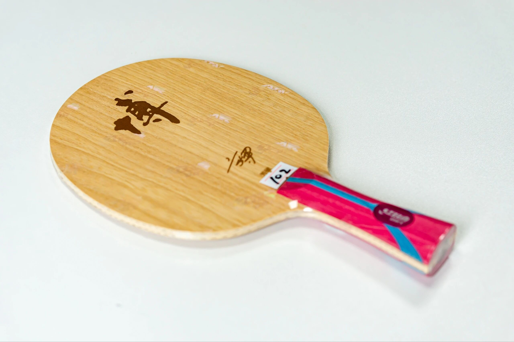
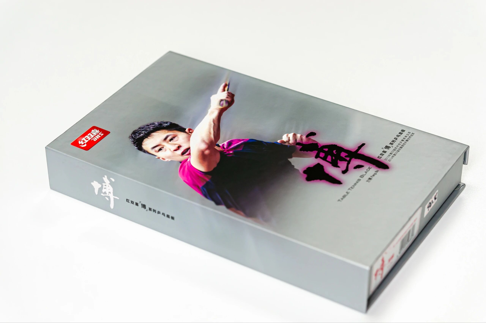
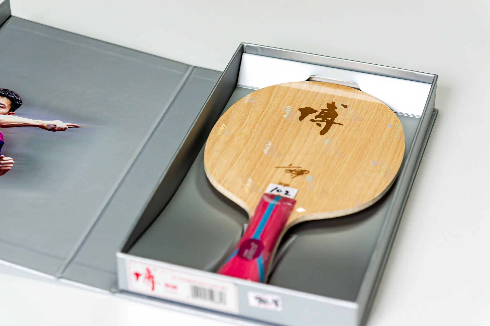

# DHS Bo Arylate-Carbon (Early)

Early **DHS Bo Arylate-Carbon** (**FL**) from Fang Bo’s DHS era—**968**-family build often nicknamed a budget Dragon 5. Later Bo AC / Bo AC-X drops swapped the portrait butt for a trophy mark; this album is the older face version.

---

!!! tip "Related"
    Fiber placement basics: [Outer vs Inner Fiber](../guide/outer-vs-inner-fiber.md). Live USD references: [Pricing & Sourcing](../shop/pricing-and-sourcing.md).
