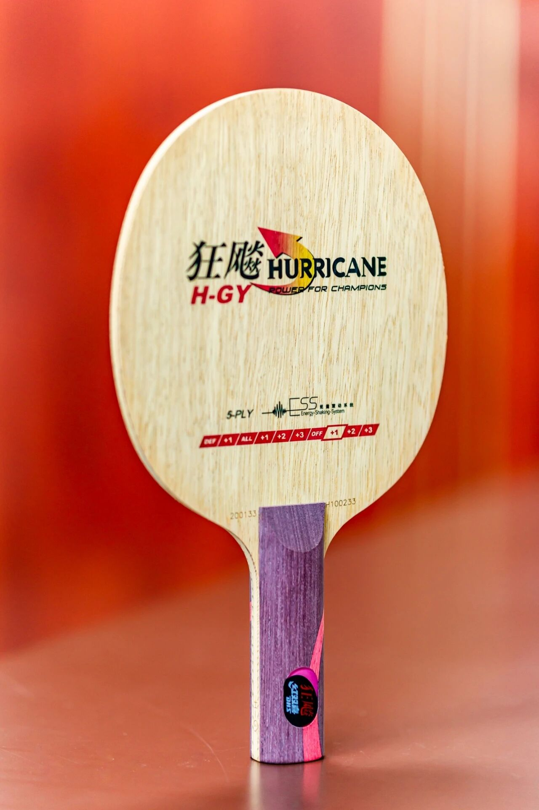

# DHS Hurricane Guo Yan

DHS **Hurricane Guo Yan (H-GY)**—period national-team–line spruce five-ply (**ST**). Lower tier than Hurricane King / Hao in its day; now mostly a collector blank.

---

!!! tip "Related"
    Live USD references: [Pricing & Sourcing](../shop/pricing-and-sourcing.md).
