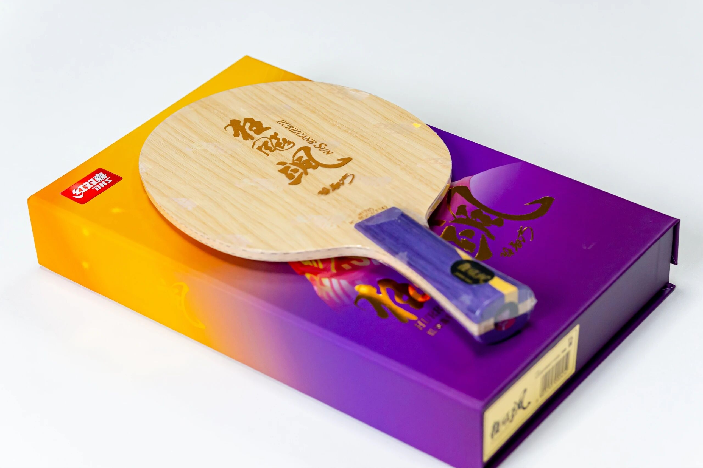
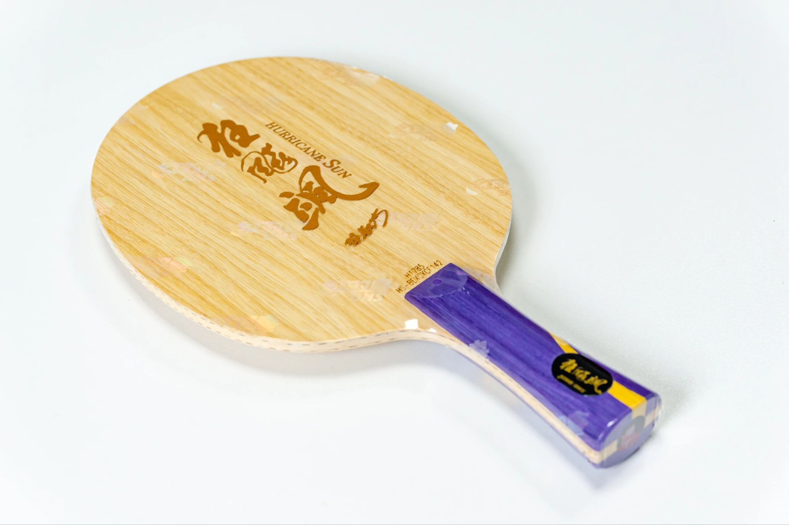
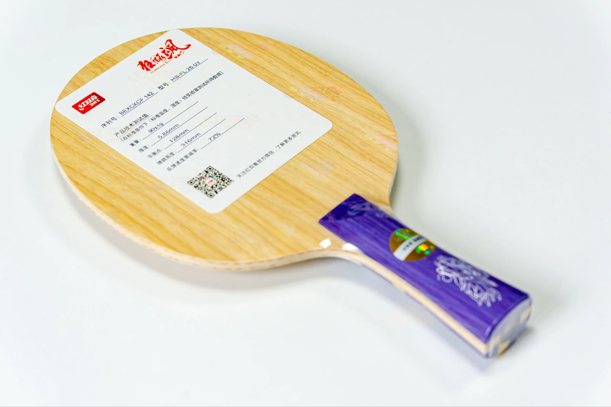
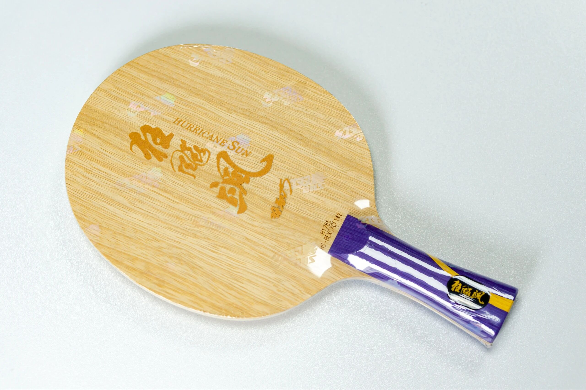

# DHS Hurricane Sa

**DHS Hurricane Sa** (狂飙飒)—retail market version of the blank family tied to Sun Yingsha’s **S968**. Same era also brought Wang Chuqin’s **Q968** retail “Hurricane King.” Both keep the familiar 968-line design language; shown with an **FL** handle.

---

!!! tip "Related"
    Fiber placement basics: [Outer vs Inner Fiber](../guide/outer-vs-inner-fiber.md). Live USD references: [Pricing & Sourcing](../shop/pricing-and-sourcing.md).
