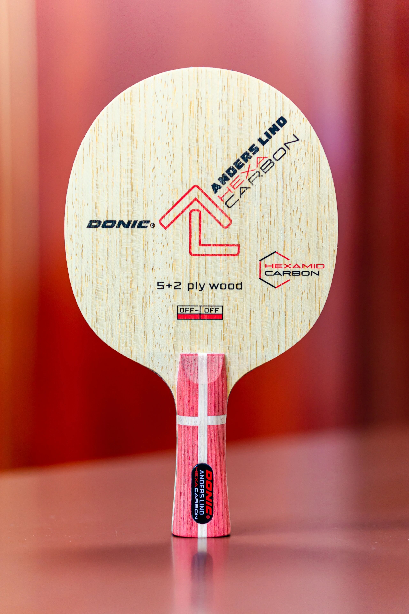
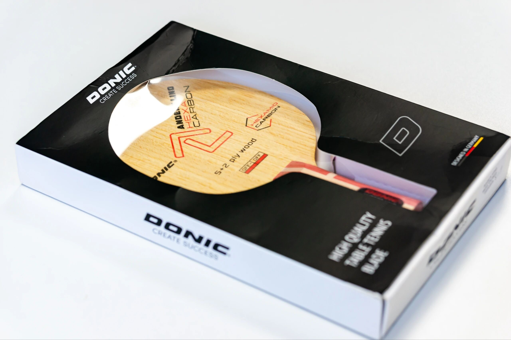
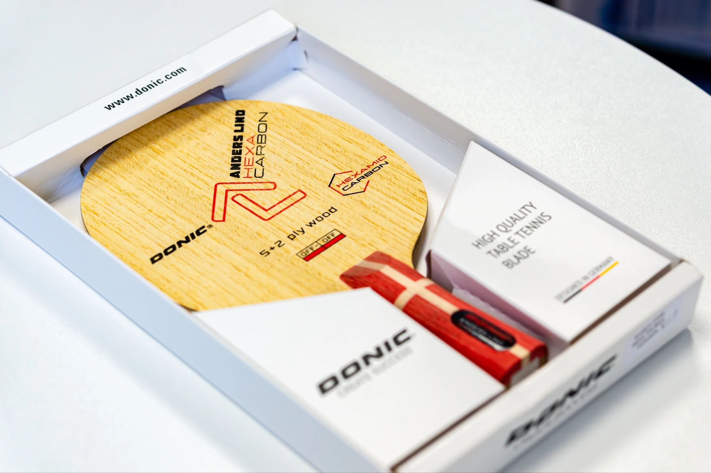
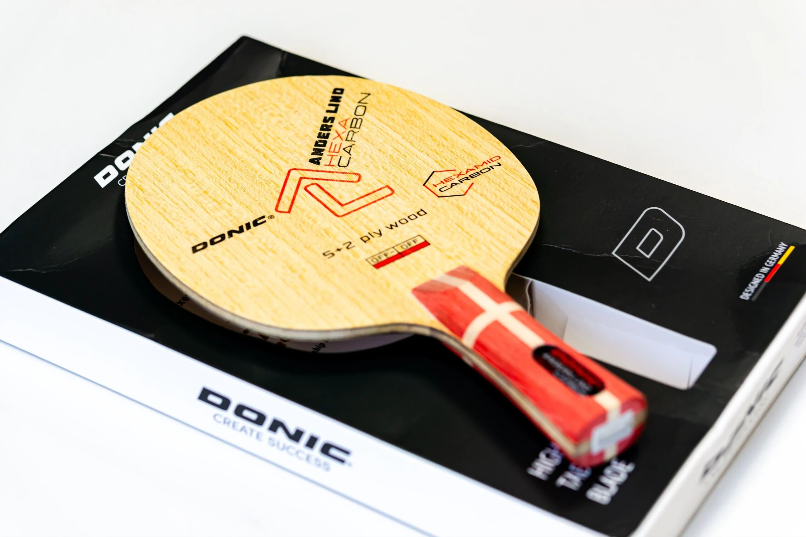

# Donic Linde Carbon

**Donic Linde Carbon**—carbon-assisted shakehand blank (**FL**). Photo-album spotlight of a less-common Donic fiber model.

---

!!! tip "Related"
    Fiber placement: [Outer vs Inner Fiber](../guide/outer-vs-inner-fiber.md). Live USD references: [Pricing & Sourcing](../shop/pricing-and-sourcing.md).
