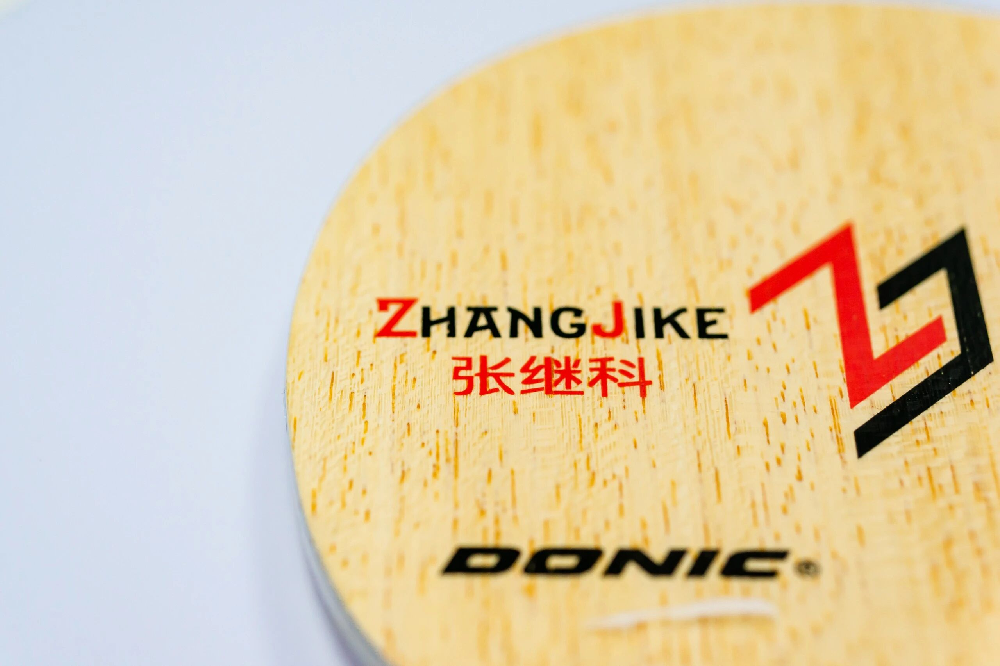
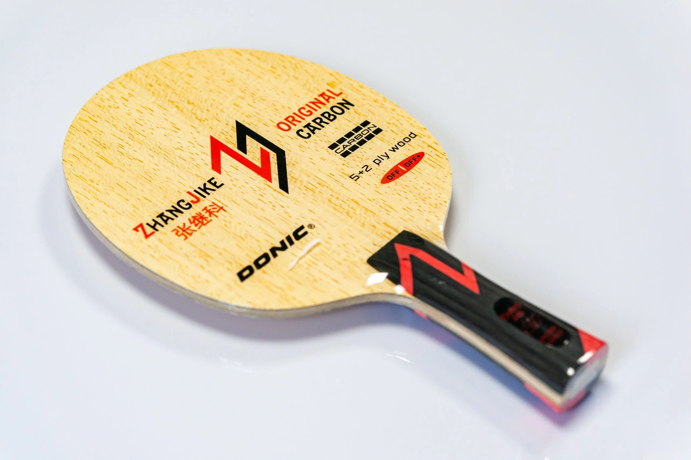
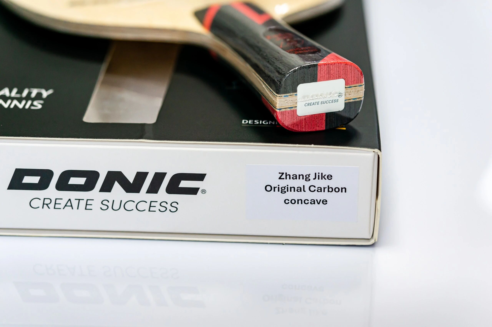
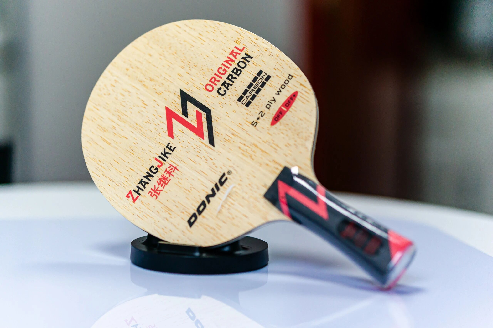

# Donic Zhang Jike Original Carbon

Chinese players often call this **红张** (“Red Zhang”)—Donic’s **Zhang Jike Original Carbon**, shown here in the common **FL** (concave) handle. It is a classic **outer 5+2** Viscaria-style build: hard face, fiber close to the surface, aimed at fast near/mid-table offense.

---

## What it is

Donic built this with Zhang Jike as a more powerful flagship next to the softer **Zhang Jike New Era**. Think “Viscaria template, tuned a bit more elastic / aggressive,” not a Butterfly clone with the same QC story.

---

## Feel & who it suits

Reviews split hard—some love the direct pop and pressure; others find it demanding or “too raw.” Looks are utilitarian (the original album notes a “straight-guy” aesthetic), but Zhang’s name keeps demand high.

Typical fit:

- Compact, active strokes; you create spin with technique  
- Want outer-ALC first-speed without paying Viscaria money  
- Fine with a crisp, less forgiving short game  

Less ideal if you want soft dwell / high forgiveness—look at **New Era** or a hold-oriented outer like Fan Zhendong ALC instead.

!!! tip "Viscaria alternatives"
    Same outer-ALC family as [Outer vs Inner Fiber](../guide/outer-vs-inner-fiber.md) discusses. For live USD reference, see [Pricing & Sourcing](../shop/pricing-and-sourcing.md) (Donic Zhang Jike Original Carbon).

---

## Bottom line

**Original Carbon** = Viscaria-class **outer 5+2**, red ZJK branding, FL common in the wild. Polarizing feel, strong popularity. Try it if you want aggressive outer fiber; skip it if you need a soft, error-tolerant blade.
