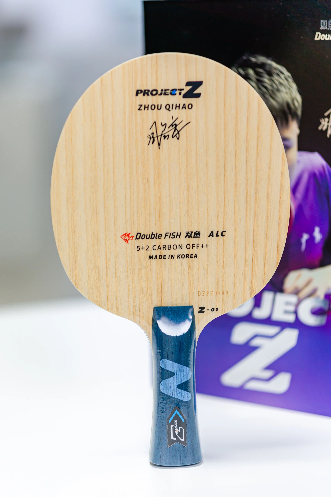
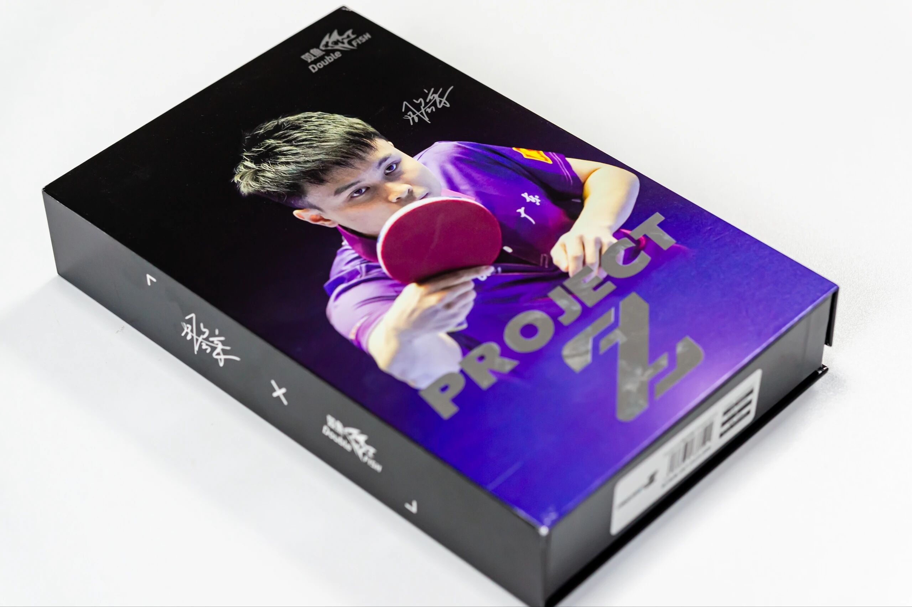
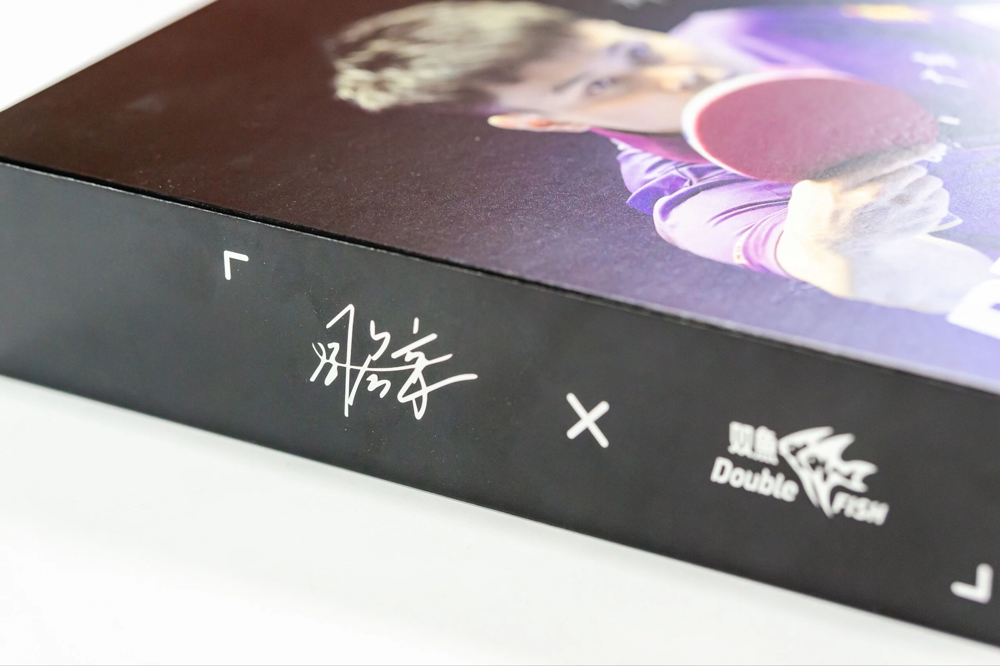
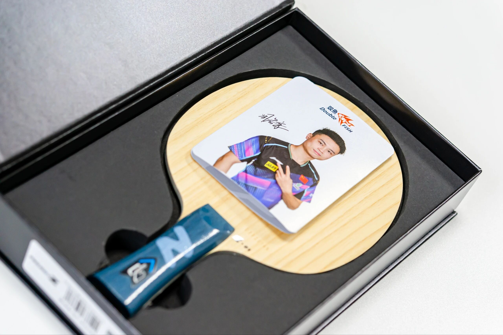

# Double Fish Zhou Qihao Project Z

**Double Fish Zhou Qihao Project Z**—Korea-made outer **5+2** with green Arylate-Carbon, **FL**. Double Fish’s first real high-end national-team signature blank; feel talk online clusters around Butterfly ALC-class tools.

---

!!! tip "Related"
    Fiber placement basics: [Outer vs Inner Fiber](../guide/outer-vs-inner-fiber.md). Live USD references: [Pricing & Sourcing](../shop/pricing-and-sourcing.md).
