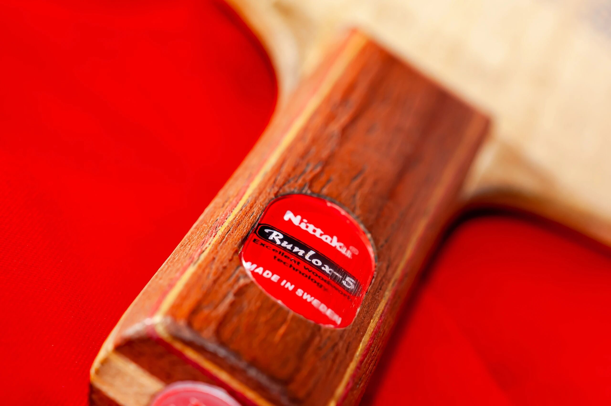
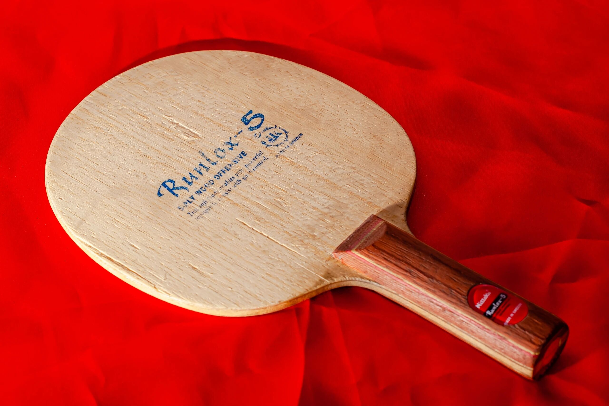
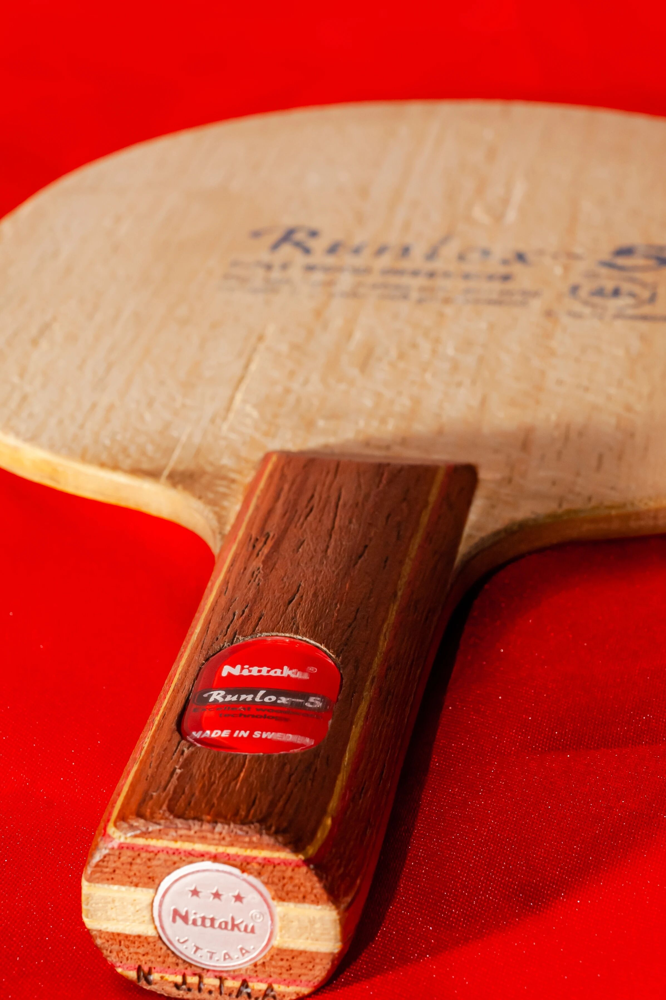
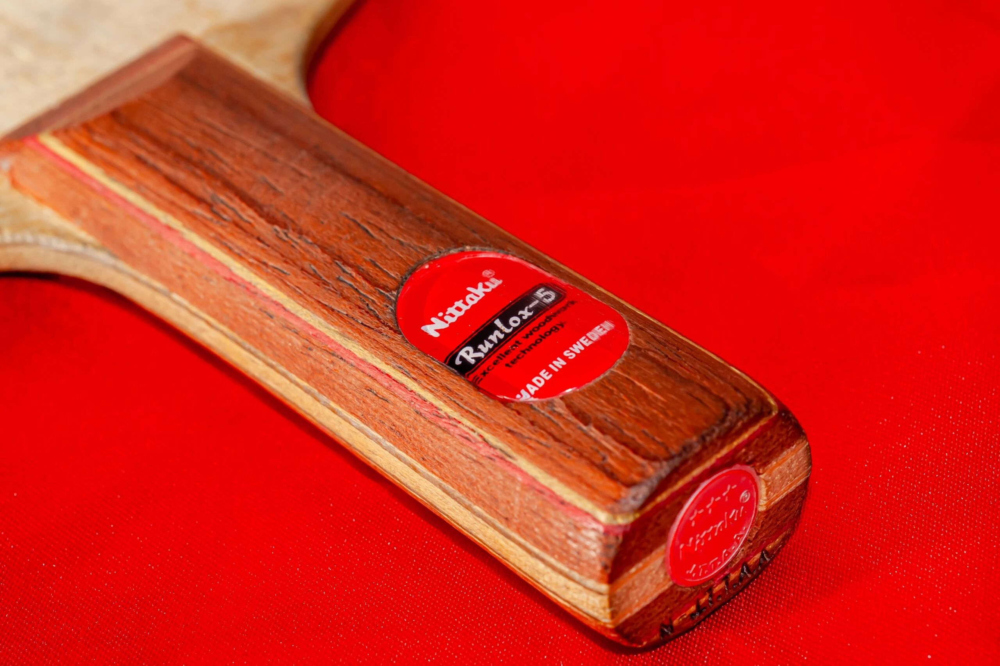

# Nittaku Runlox-5

Bonus spotlight: **Nittaku Runlox-5**. An older blank (roughly two decades), with sparse older photos—hence the “easter egg” framing. Once discussed as a serious rival feel to Avalox **P500**-class wood tools; shown with an **ST** handle.

---

!!! tip "Related"
    Fiber placement basics: [Outer vs Inner Fiber](../guide/outer-vs-inner-fiber.md). Live USD references: [Pricing & Sourcing](../shop/pricing-and-sourcing.md).
