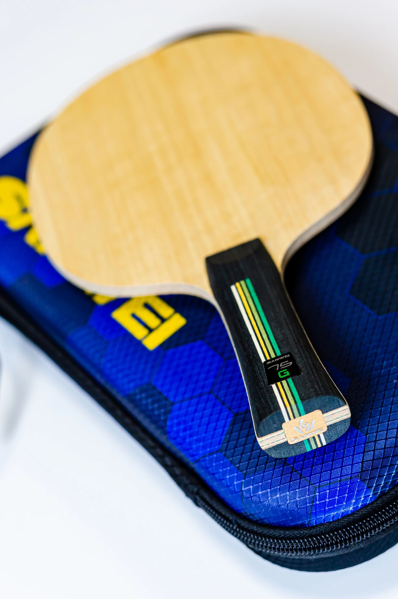
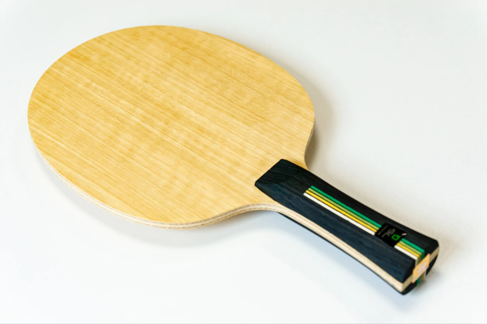
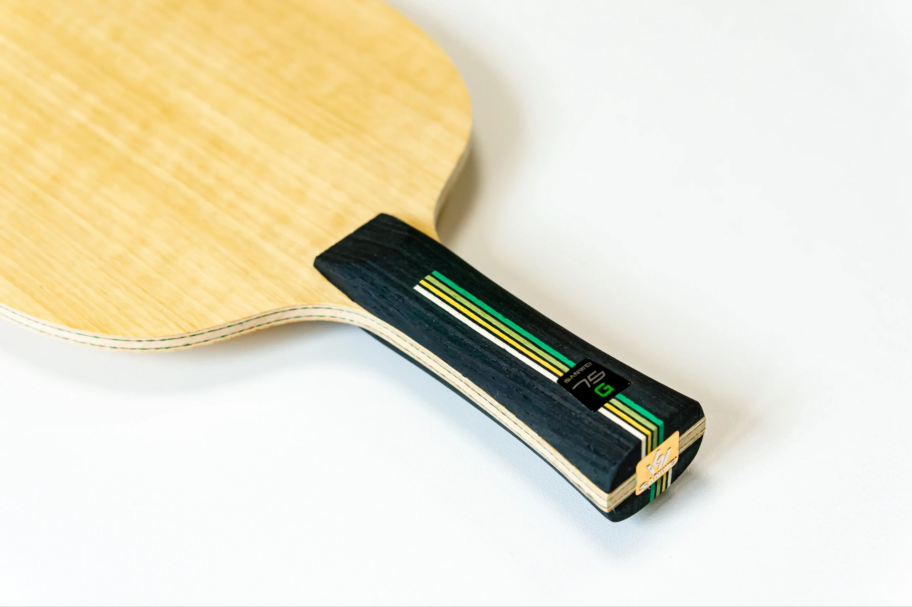
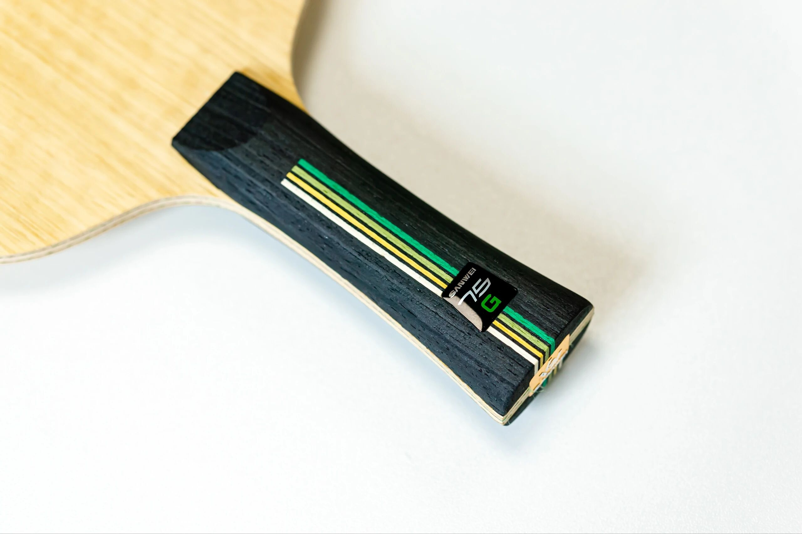

# Sanwei 75G

**Sanwei 75G**—green-fiber edition of the 75 line (**FL**): large face (~159.6 mm) with thick power plies and **inner** fiber. Positioned as an all-round / power-capable mid-price blank.

---

!!! tip "Related"
    Related: [Sanwei 75R](sanwei-75r.md), [Sanwei 75 PAR](sanwei-75-par.md).
