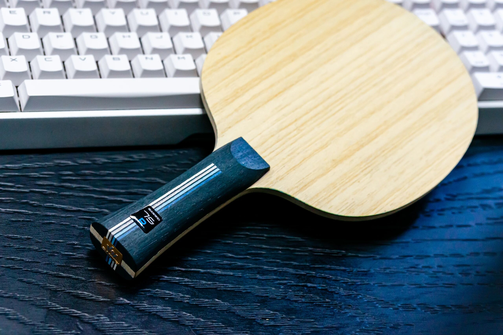
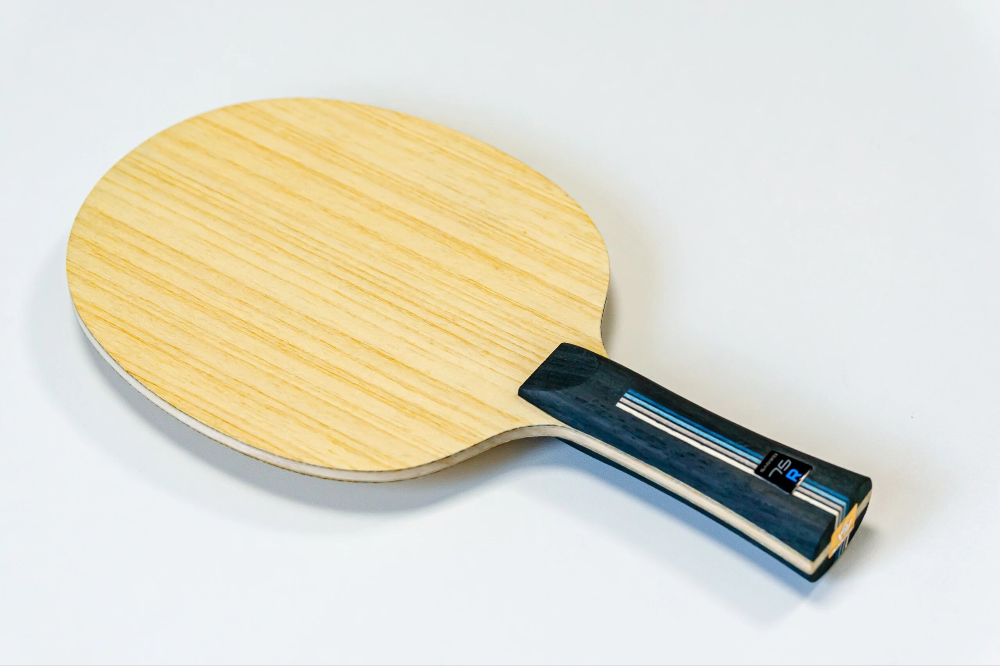
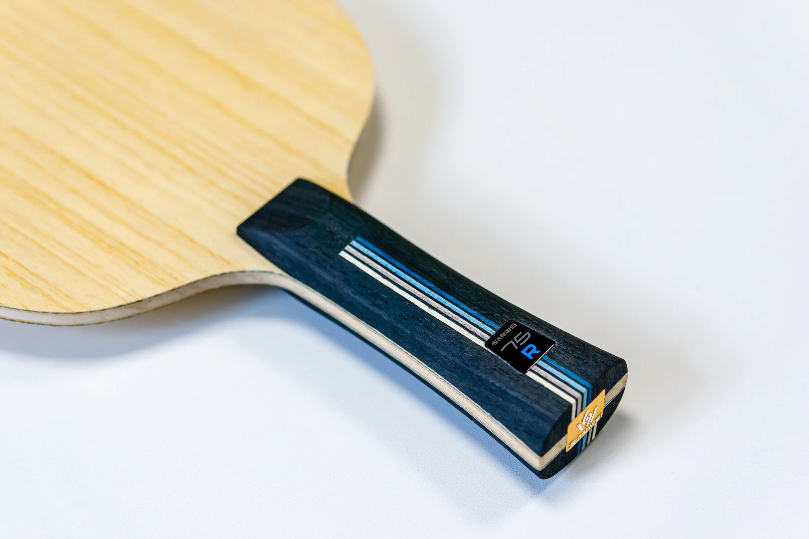
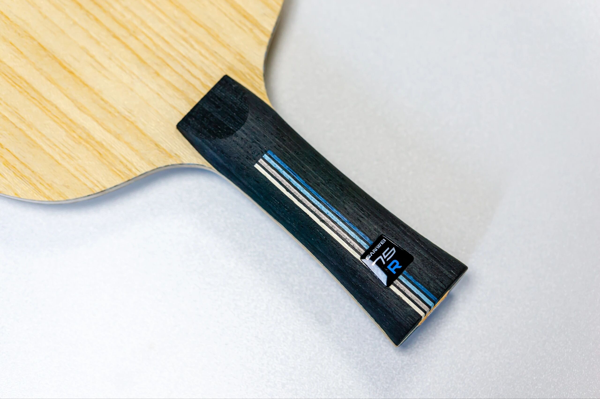

# Sanwei 75R

**Sanwei 75R**—sister design language to the **75G**, but a different layup. Classic **outer 5+2** with a pressed core and blue Taiwan plastic **H-GLC** fiber. Often discussed as a strong early-era Sanwei 75-family attacker’s blank; shown with an **FL** handle.

---

!!! tip "Related"
    Fiber placement basics: [Outer vs Inner Fiber](../guide/outer-vs-inner-fiber.md). Live USD references: [Pricing & Sourcing](../shop/pricing-and-sourcing.md).
