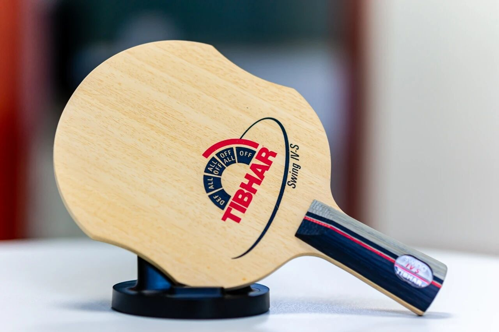
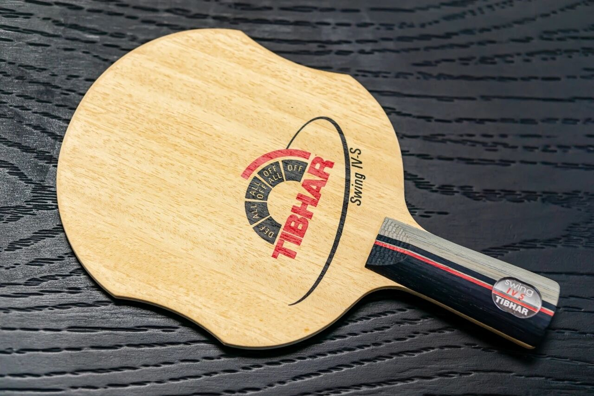
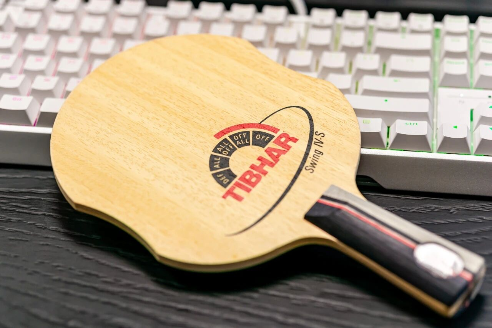
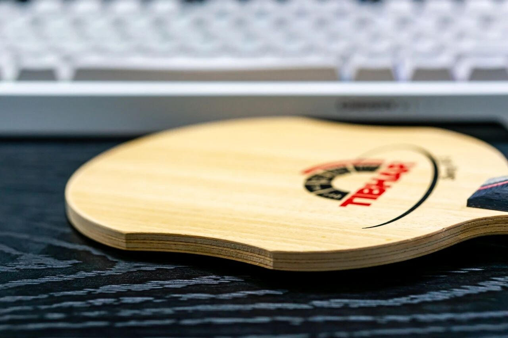

# Tibhar Elowa Violin (CS)

**Tibhar Elowa Violin** in Chinese penhold (**CS**). The Violin blanks (Elowa / Sheila) are design classics; structure is an unusual thin–thick–thin–thick–thin five-ply stack.

---

!!! tip "Related"
    Shakehand Violin + Samsonov Alpha set: [Tibhar Samsonov Alpha & Elowa Violin](tibhar-samsonov-alpha-elowa-violin.md).
