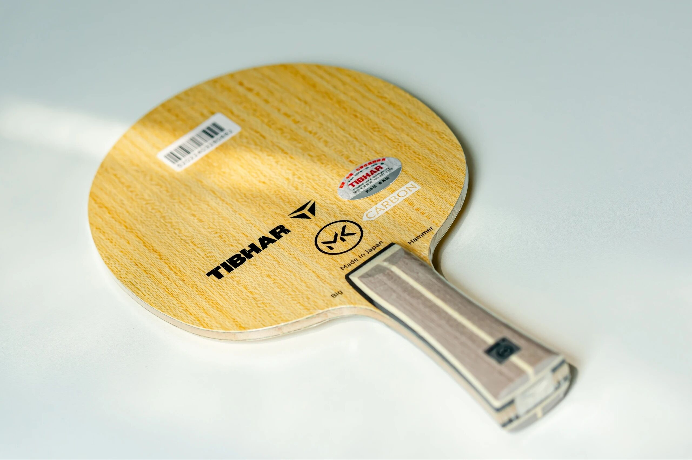
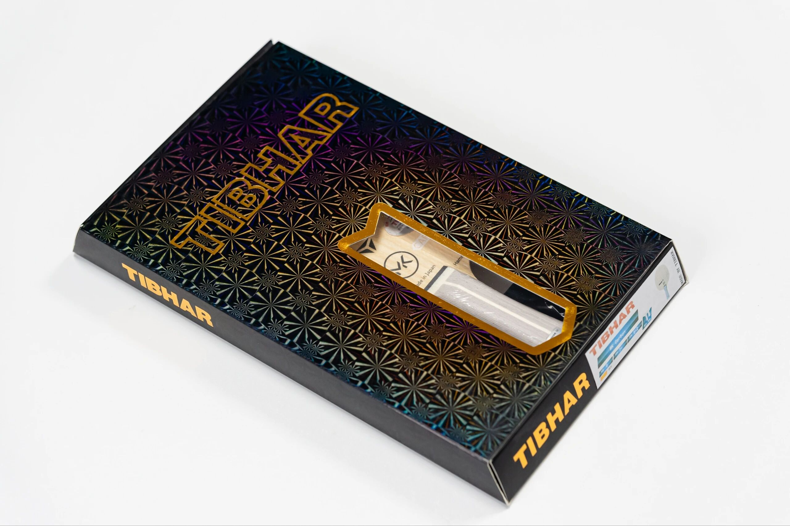
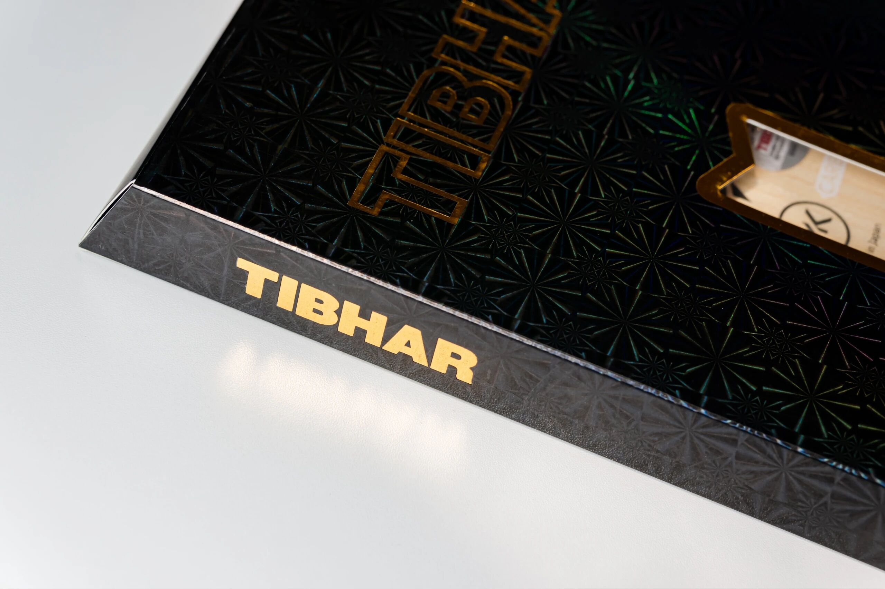
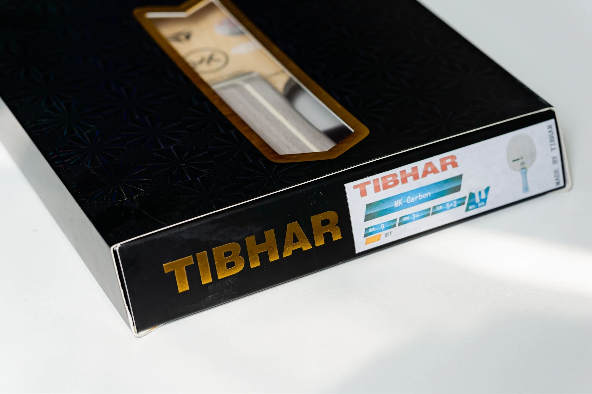

# Tibhar Kenta Matsudaira MK Carbon

Tibhar **Kenta Matsudaira MK Carbon**—classic **outer 5+2**, but with a distinctive **green** fiber look. High visual presence to match Kenta’s own flash; built for fast, compact offense. **FL** in the photos.

---

!!! tip "Related"
    Fiber placement basics: [Outer vs Inner Fiber](../guide/outer-vs-inner-fiber.md). Live USD references: [Pricing & Sourcing](../shop/pricing-and-sourcing.md).
