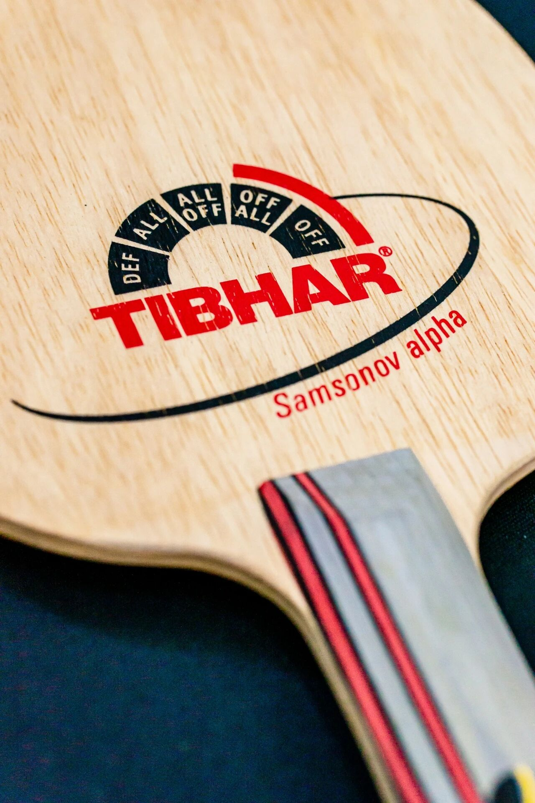
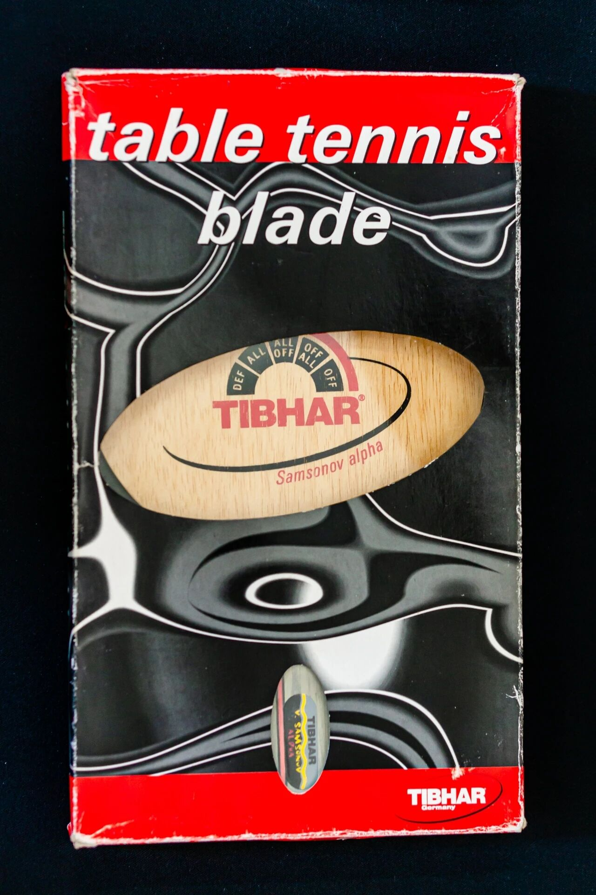
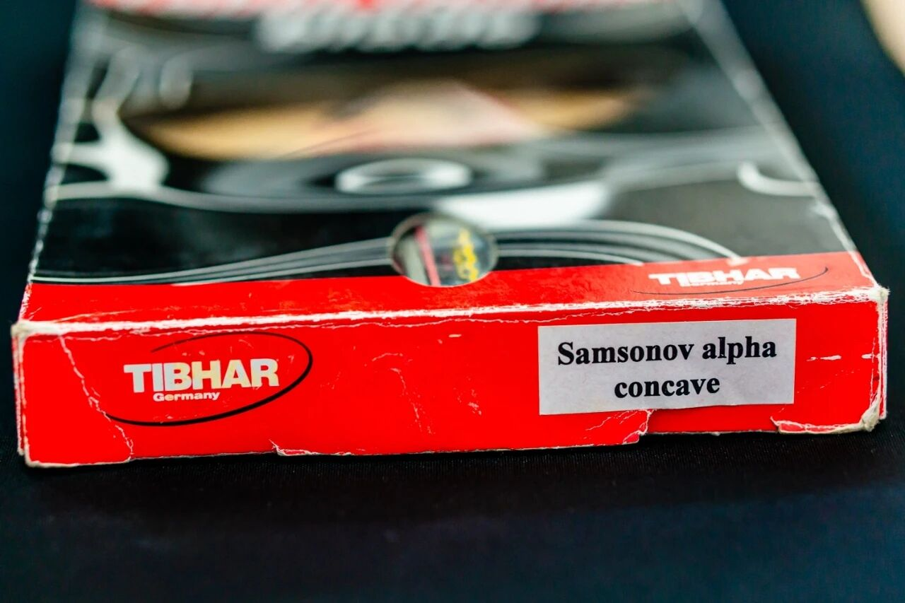
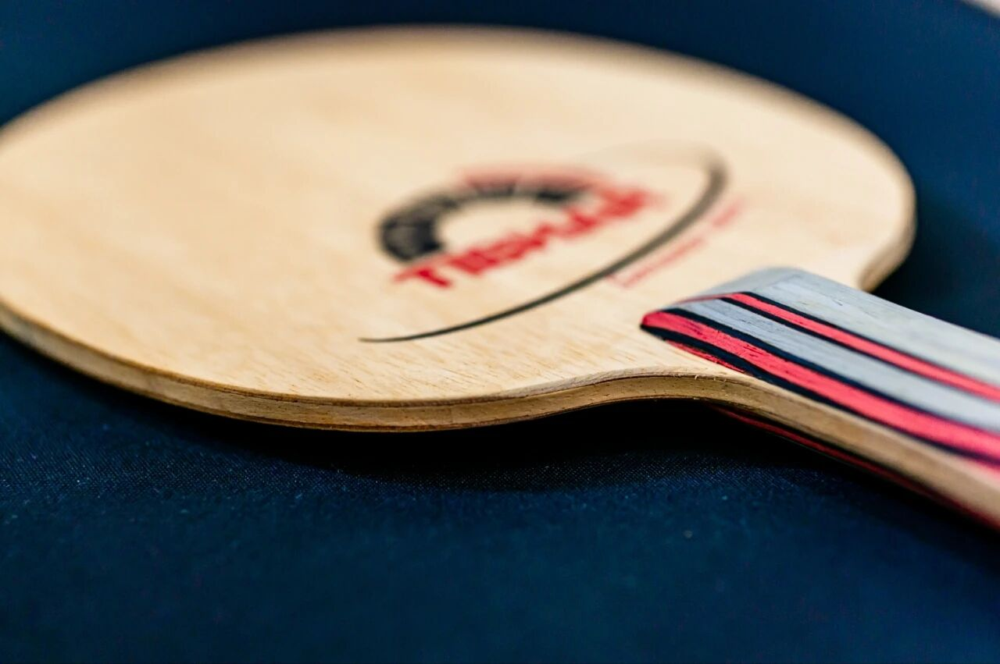

# Tibhar Samsonov Alpha

Classic **Tibhar Samsonov Alpha**—organic-era “Old Sa” tool with a smaller-than-usual shakehand face: control-first, soft power. Still the Alpha many fans think represents Samsonov’s style best.

---

!!! tip "Related"
    With Elowa Violin: [Tibhar Samsonov Alpha & Elowa Violin](tibhar-samsonov-alpha-elowa-violin.md).
