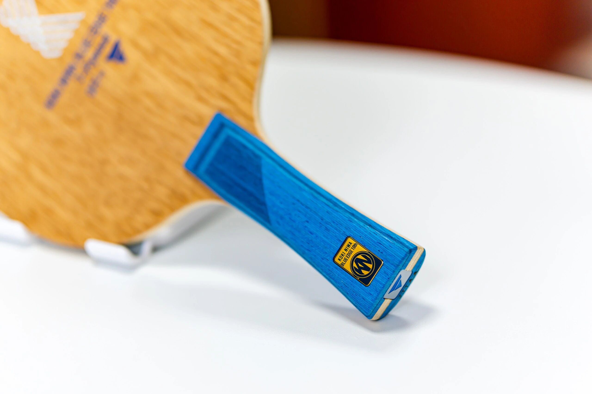
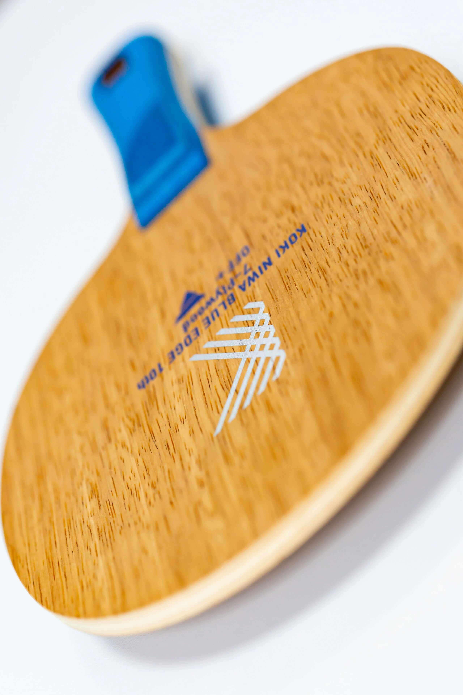
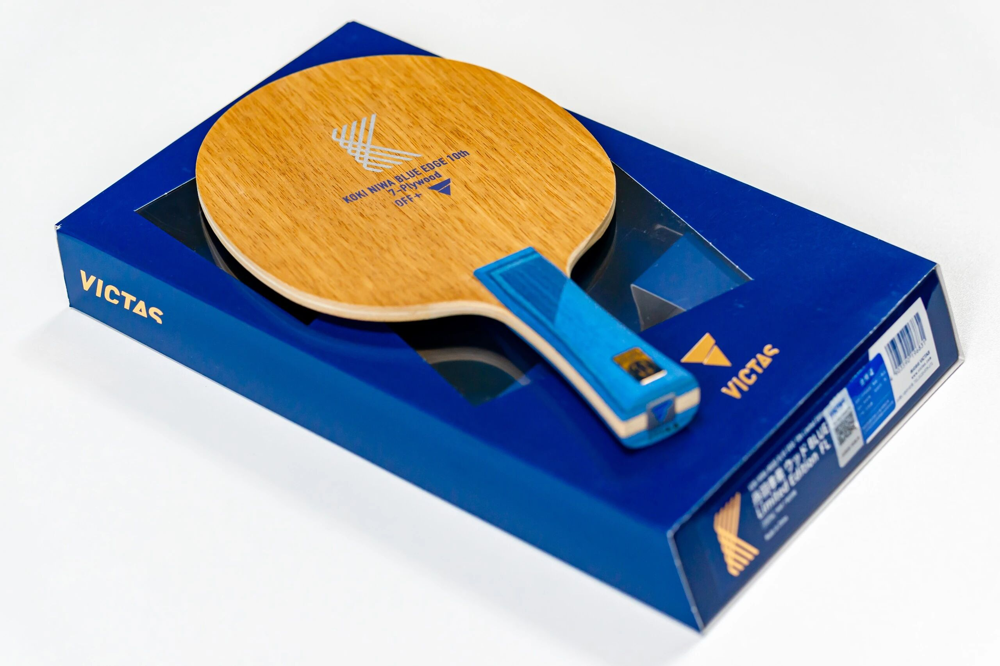
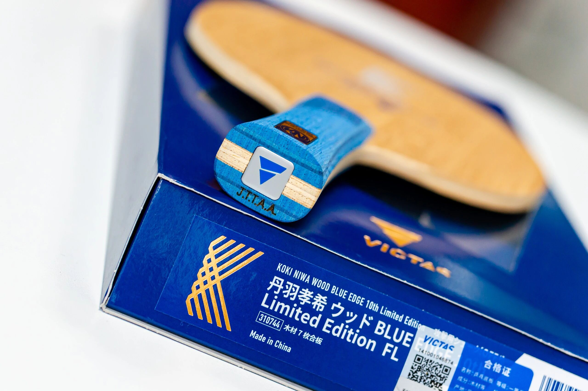

# Victas Koki Niwa 10th Anniversary

Victas all-wood blade for **Koki Niwa’s 10th anniversary**—shown with an **FL** handle. Niwa is one of the few Japanese players many Chinese fans follow closely: soft hands, creative paths, and a “feel-first” game that fits a pure-wood blank better than a stiff fiber rocket.

---

!!! tip "Related"
    Fiber placement basics: [Outer vs Inner Fiber](../guide/outer-vs-inner-fiber.md). Live USD references: [Pricing & Sourcing](../shop/pricing-and-sourcing.md).
