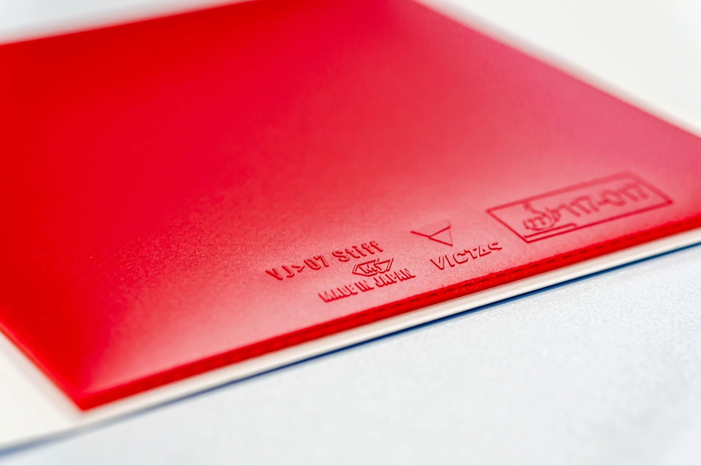
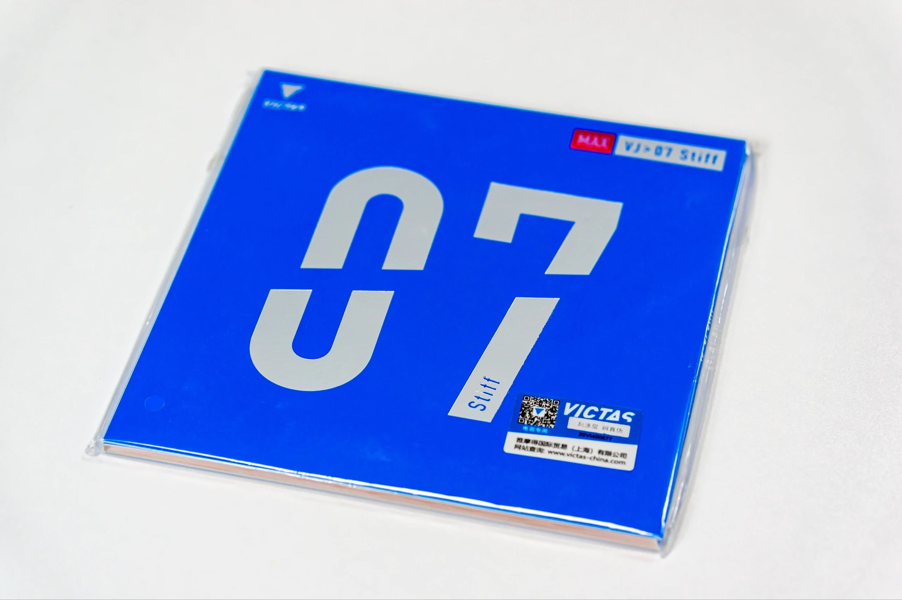
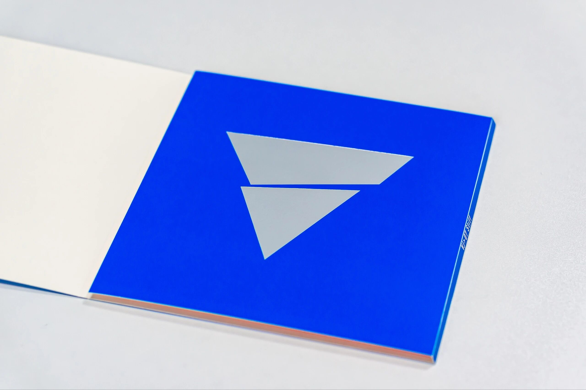
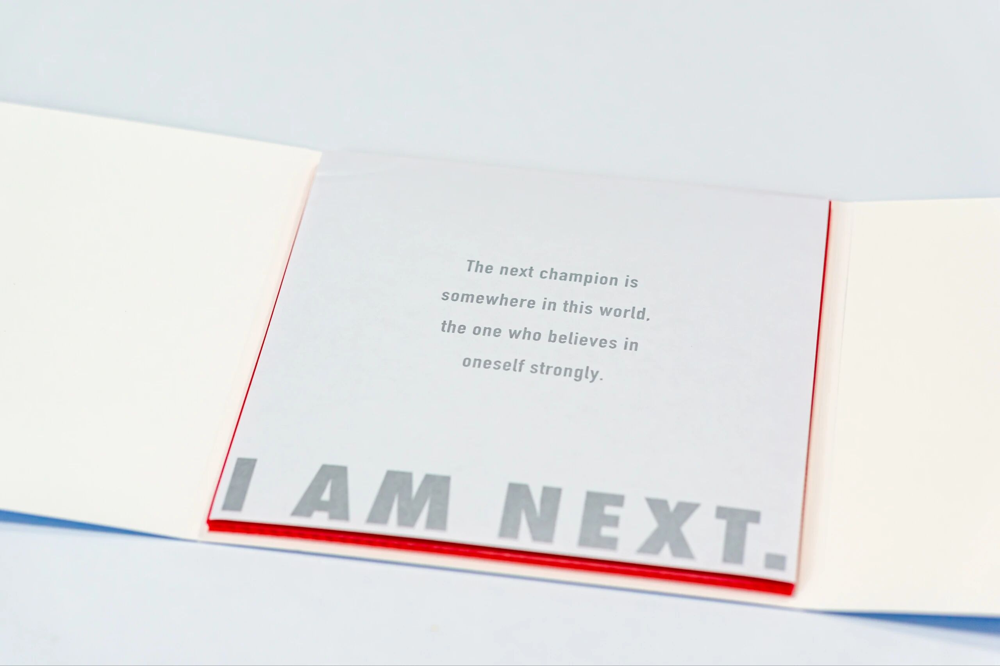

# Victas VJ > 07 Stiff

**Victas VJ > 07 Stiff** inverted rubber in red **Max**—same Victas visual language as the rest of the recent VJ / V> line. A photo spotlight more than a full lab review.

---

!!! tip "Related"
    Thickness vs hardness trade-offs: [Rubber Thickness vs Hardness](../guide/choosing-thickness-vs-hardness.md). Live USD references: [Pricing & Sourcing](../shop/pricing-and-sourcing.md).
