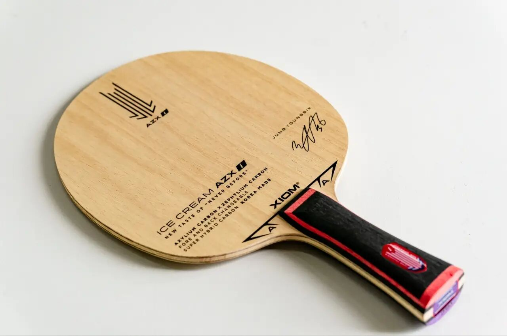
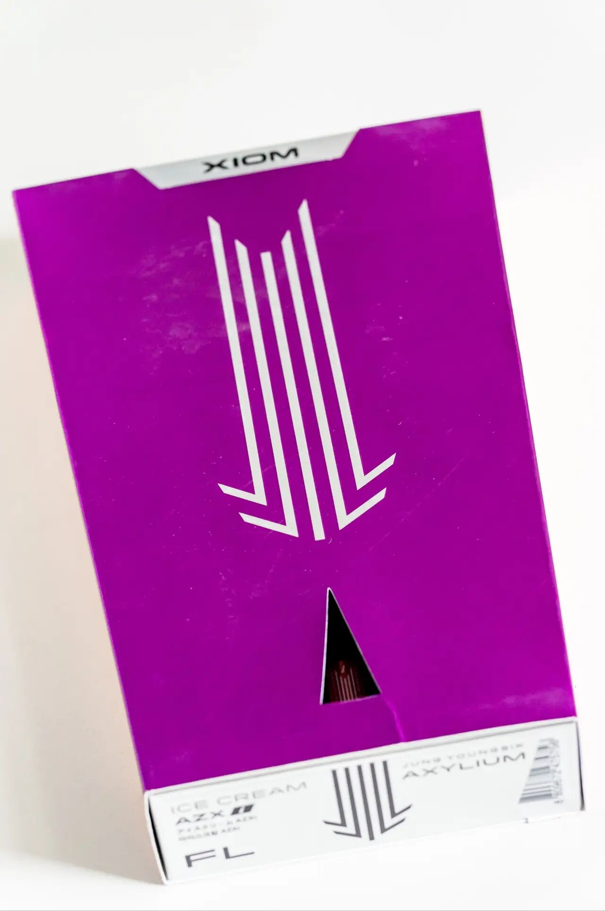
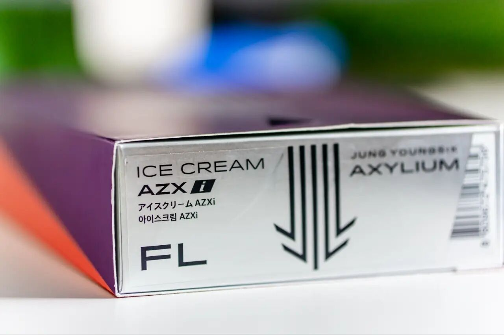
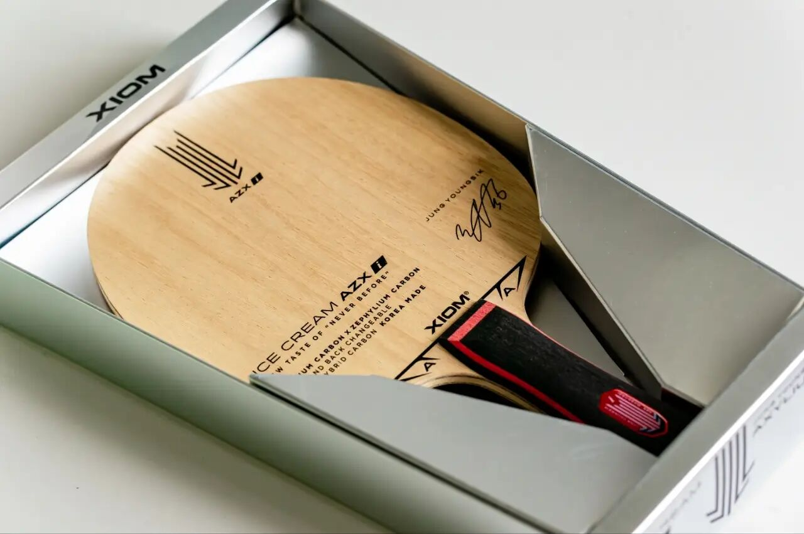

# Xiom Ice Cream AZXi

**Xiom Ice Cream AZXi**—asymmetric inner fiber (**FL**): one face **ZLC**, the other **ALC**. Jeong Youngsik’s Ice Cream line is one of the few retail asymmetric blades that stayed visible; unusual construction, not a Viscaria clone.

---

!!! tip "Related"
    Fiber placement basics: [Outer vs Inner Fiber](../guide/outer-vs-inner-fiber.md). Live USD references: [Pricing & Sourcing](../shop/pricing-and-sourcing.md).
