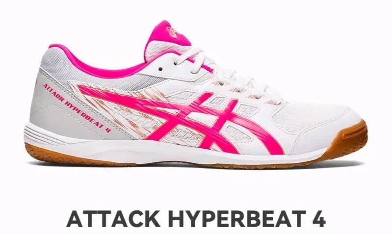
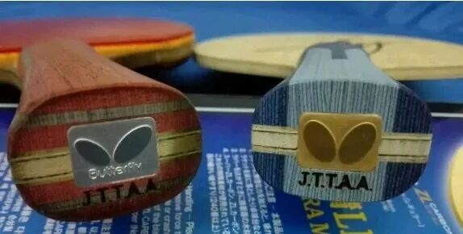
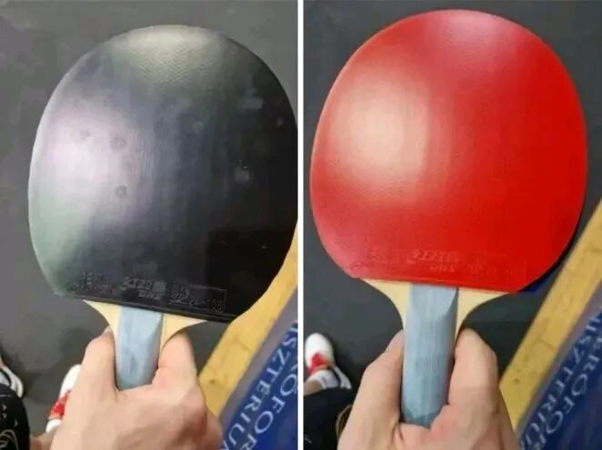

# Accelerating With Gear

“Acceleration” is first a **technique** story—better footwork, earlier reads, looser hands. Gear can still help. Three practical levers: **shoes**, **racket elasticity**, and **weight**.

---

## 1. Start from the feet

In major events you sometimes see Liu Shiwen or Chen Meng cover shoe logos with tape when personal favorites conflict with sponsors. Chen Meng’s Asics **Hyperbeat 4** (轻快王 / quick-launch line) is known for a fast first step. Mizuno **Crossmatch Plio**-class shoes earn “barefoot feel + quick start” reputations at strong value.

| Player type | Shoe lean |
| --- | --- |
| First-three focus, lighter body | Thinner “barefoot” shoes |
| Heavier players, knee issues, one-shot power styles | More cushioning / protection (e.g. Asics 跨界王-class; higher-end models help more) |

Stable, sticky first steps quietly stabilize your hands. If your footwork shoe has not leveled up with your technique, a better pair is often the cheapest “acceleration” upgrade.

---

## 2. Blade and rubber spring

Racket elasticity is **trainable**. Players moving from ordinary ALC-style boards to outer **SZLC**, from market Hurricane Long 5 to **W968**, or from retail Butterfly to specials (inner or outer) usually feel a jump in rebound—and need days/weeks to own it.

That spring can mean:

- Faster borrowed pace and better block support
- Stronger deformation store → burst and reserve power when you commit

You rarely get “max spring + zero adaptation cost.” Stronger players adapt faster. Rubber works the same way—habits block adaptation more than physics does. Moving ALC → SALC, or china tacky → mild-tack outers, is an intentional speed trade you practice into.

Slow gear can feel more faithful and controllable, but it can also mean **not enough finishing threat**—especially if spin and raw force are not your strengths. Then speed + placement become your injury-free upgrade path.

  
Aging softens speed

  
Long-used blades and rubber lose some spring. That alone can explain a season of “why am I slower?”

---

## 3. Cut weight (amateurs especially)

Pros often stack kits past **200 g** and adapt with huge training loads. Amateurs usually gain more from **lighter blanks and sheets**—faster transitions, freer swings.

Trade-off: lighter equipment often thins ball quality. Check whether your game is built more on **spin + mass**, or on **two-wing swing cadence**.

---

## Quick checklist

1. Shoes: can you start and stop cleanly?
2. Elasticity: are you still fighting spring you could own with practice?
3. Weight: is total kit helping swing tempo or dragging it?

Related: [Essential Questions Before Buying](essential-questions-before-buying.md) · [Blade Performance Metrics](blade-performance-metrics.md)
