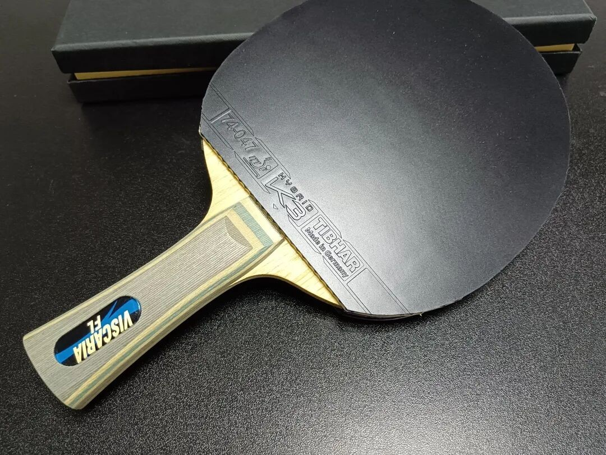
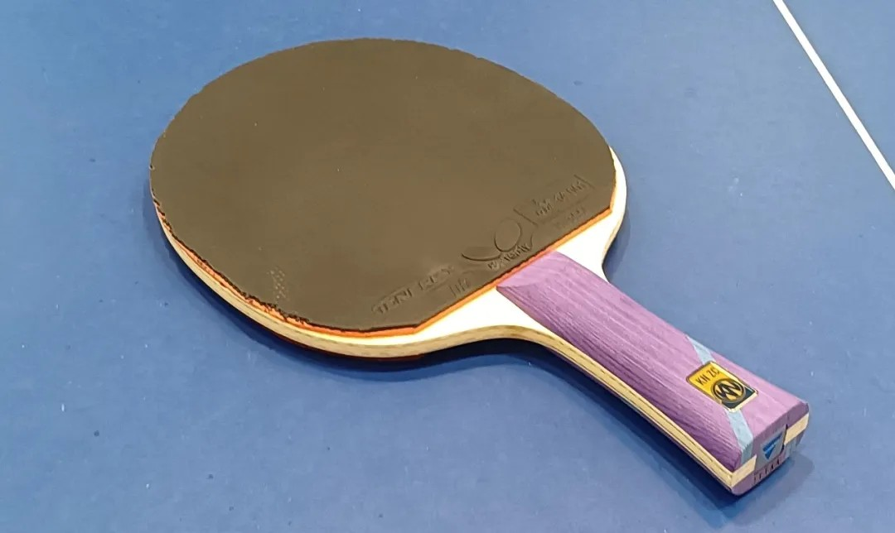

# Essential Questions Before Buying a Blade

A beginner-friendly checklist. Before you chase brand names, check these six basics: **weight**, **balance**, **blade face size**, **thickness**, **outer ply**, and **construction**.

---

## 1. Weight

Blade weight varies a lot—even within the same model from a top brand. One **Viscaria** might land at **80 g**, another near **99 g**.

For a shakehand player with inverted rubbers on both sides, **99 g+** is usually brutal once rubbers go on.

Most players like this ballpark:

| Grip style | Comfortable blade weight (approx.) |
| --- | --- |
| Penhold | ~**85 g** |
| Shakehand | ~**90 g** |

For two-wing inverted beginners, **moderate weight matters more than chasing the lightest blank**.

!!! note "There is no universal “best” weight"
    Butterfly’s published weight is typically an **average of produced blanks**, not a design target—and that published number often gets revised. The best weight is the one that feels right **for you**.

---

## 2. Balance (Center of Gravity)

Balance is hard to judge until you hold the blade. Rough cues:

- **Slimmer handles** → head often feels more forward
- **Thicker handles** → balance more often nearer the center

Hollow handles are complicated. Today, **most handles on the market are hollow**. Even within the same model (e.g. certain Boll ALC codes), some handles are hollow and some are not—often because the blank came out too heavy and needed weight removed.

Brand tendencies (many models, not every model):

| Brand tendency | Balance feel | Trade-off |
| --- | --- | --- |
| Butterfly, Yinhe (many lines) | Less head-heavy | Usually easier to swing longer |
| DHS, Stiga (many lines) | More head-forward | More attack power, more tiring |

---

## 3. Blade Face Size

Face size ties directly to weight and balance.

Examples of the trend:

- Smaller faces like **Harimoto / Ovtcharov class** (~158×152) often feel a bit heavier in the hand than
- classic **Viscaria / Zhang Jike ALC class** (~157×150)

Larger faces such as **Xiom JDA / DHS W968** class push the modern direction further: bigger face usually means **better ball hold and reserve power**, but also more swing load. Too large and the blade simply feels tiring.

---

## 4. Thickness

For two-wing inverted looping, thickness is a style choice:

| Thickness | Typical effect |
| --- | --- |
| Not too thick (often **≤ 6.4 mm** if you emphasize self-start and spin) | Easier active opening and spin manufacture |
| Thicker (e.g. classic **Primorac Carbon ~6.9 mm**) | Stronger block/defend, more rigidity, faster borrowed pace |
| Too thin (**&lt; 5.5 mm**) | Often vibration-heavy; defense on borrowed pace drops |

Thicker “borrow-force” blades can also mute clarity and make full wood-through harder. When you fail to punch through, balls drop and errors rise.

---

## 5. Outer Ply (Surface Wood)

The outer ply touches the rubber, so small-to-medium force feel shows up quickly.

| Outer ply tendency | Feel cue |
| --- | --- |
| Koto | Crisper, quicker first-speed off the board |
| Limba | More adjustability, softer dwell, easier control |

Except for push-blocking / punching styles, beginners usually should avoid very hard outer woods such as:

- Ebony
- Walnut
- Wenge

**Hinoki** outer can also feel mismatched with many Chinese tacky rubbers—some players report a blurrier hand feel in that pairing.

---

## 6. Construction

Lots of builds can win matches. For beginners, popular structures are easier to adapt to:

| Structure | Typical character |
| --- | --- |
| All-wood 5-ply | Practice / training friendly; strong spin and control |
| All-wood 7-ply | Steady, faithful, linear |
| Outer ALC | Faster; often friendlier on backhand handling |
| Inner KLC | Longer dwell; easier forehand arcs from mid-distance |

!!! tip "Beginner shortcut"
    Pick a **popular structure** first. Hot builds have wider community feedback, easier rubber pairing advice, and fewer “mystery blank” surprises.

---

## Quick Checklist

Before you click buy:

1. Weight in your comfort zone after rubbers?
2. Balance forward enough for power, without killing endurance?
3. Face size big enough for hold, not so big it tires you?
4. Thickness fits active spin vs borrowed-force defending?
5. Outer ply matches your rubber and touch style?
6. Construction is a common, well-documented type?

For the next layer—speed, spin, control, power, and reserve power—see [Key Performance Metrics When Buying a Blade](blade-performance-metrics.md). For elasticity, hardness, and core wood, see [Elasticity, Hardness, and Core Wood](../advanced/gear-philosophy.md).
