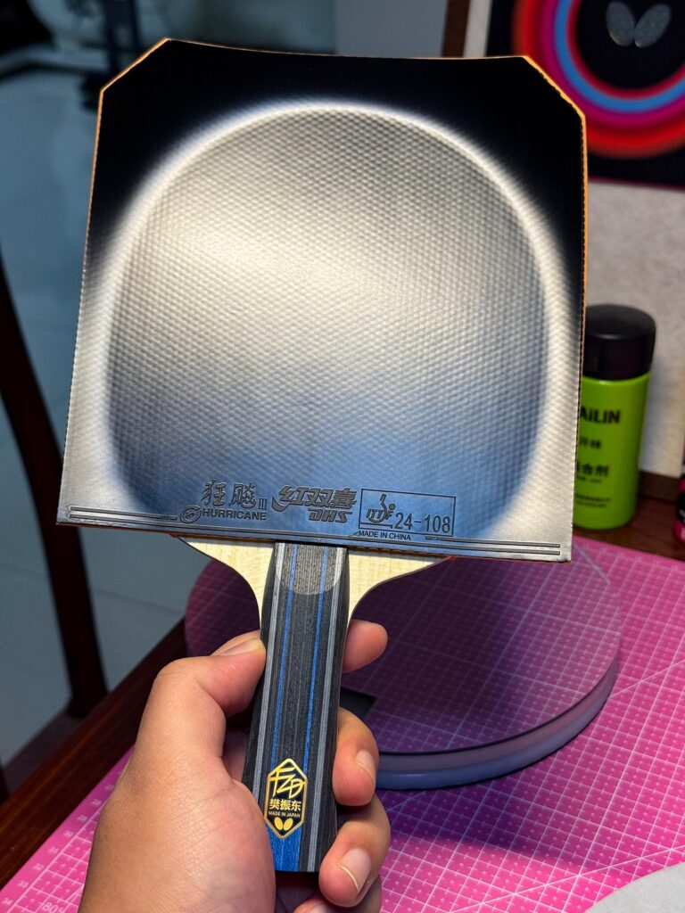
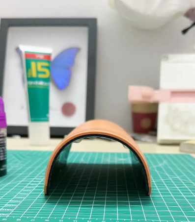

# Hurricane 3 Multi-Stage Boosting

For players chasing a transparent, lively H3 sponge—not just bulk expansion. Five thin stages: open the sponge, soften deep, lock with glue, final charge, then assemble.

Background on whether to boost at all: [Boosting Truth](../advanced/boosting-truth.md).

---

## 1. Initial activation

Brush a **very thin** layer of booster on the sponge—even coverage, no pools. This “opens the door” so oil can reach deeper fibers.

- **Wait:** about **6–12 hours**

---

## 2. Deep softening

When the first layer is mostly absorbed, add a **second thin** layer the same way. Raises expansion further and eases the factory “dead/hard” feel.

- **Wait:** about **12 hours** (overnight is fine)

---

## 3. Glue base (locking layer)

After both oil layers have soaked in, brush **two thin layers of water-based glue** in **one direction**—no scrubbing back and forth. Bonding layer + film to slow oil evaporation.

- **Interval:** about **1 hour** between glue coats  
- **Tip:** cold hairdryer until glue goes white → clear, if you want to shorten the wait

---

## 4. Final charge

When the glue film is fully dry, apply **one last thin** booster layer. It seeps slowly through the glue into the sponge.

- **Wait:** about **12 hours** (overnight)

---

## 5. Assembly

One layer of water-based glue on blade and rubber; when dry, mount as usual.

---

## Mistakes to avoid

!!! warning "Cold air only"
    If you use a dryer, use **cold**. Hot air ages the topsheet and can bubble (topsheet lift).

!!! tip "Thin is king"
    Oil or glue—**less is more**. Thick coats absorb unevenly or create a bumpy sheet that won’t lay flat.

**Curl:** After this process H3 often curls hard. If mounting is difficult, flatten under books (plastic sheet in between) for **1–2 hours**.

Related: [Hurricane Blue vs Orange Sponge](../advanced/hurricane-blue-vs-orange-sponge.md) · [Choosing Thickness vs Hardness](../advanced/rubber-thickness-and-hardness.md)
