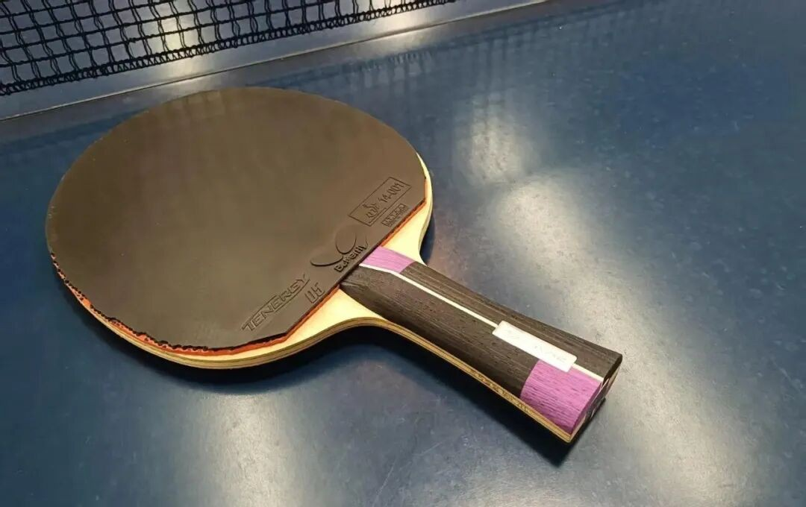
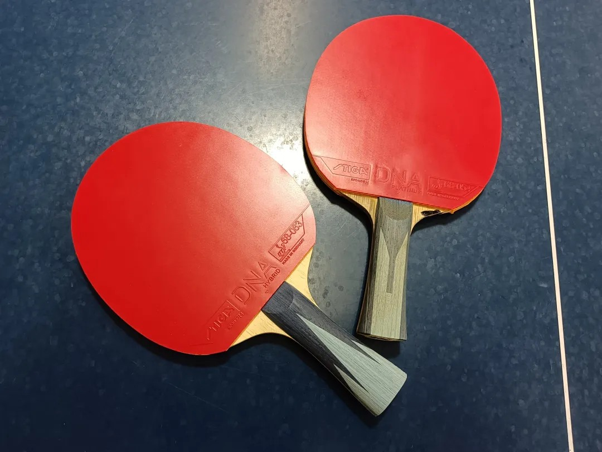
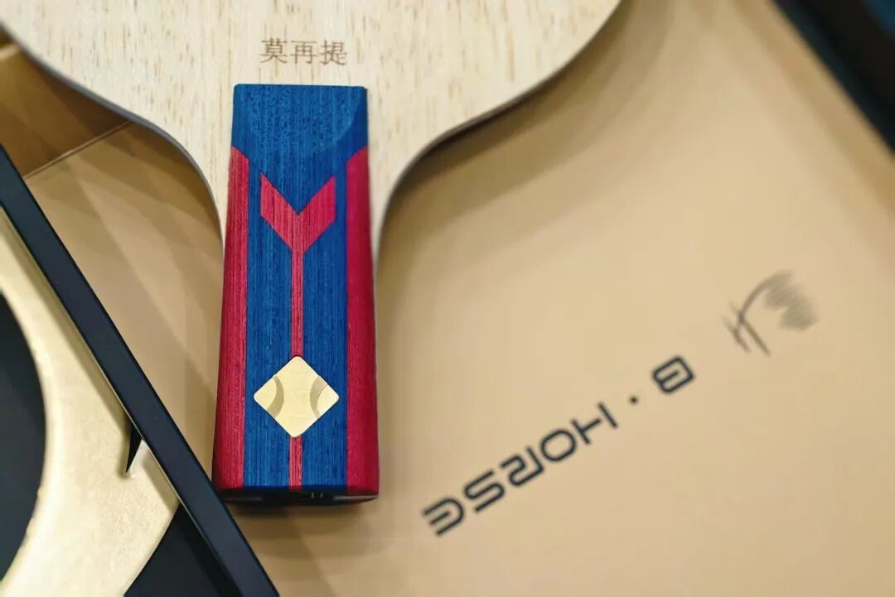

---
source_url: https://mp.weixin.qq.com/s/JLzhdeX2-H3Z8q6kNxWcPw
source_title: "胶面起鳞、海绵内能消退，还能不能用，怎么用？"
imported: 2026-07-14
---

# When Rubber Pills and Sponge Energy Fades

Topsheet pilling and dying sponge spring are normal wear. Whether you should keep playing that sheet depends on your level, match schedule, blade pairing, and how picky you are about bite.

---

## Tenergy lifespan

If budget is not a constraint—some pros change sheets constantly, and some paid / sponsored players replace several times a month—you never have to worry about pilling or energy fade.

For Butterfly **Tenergy** in amateur use:

- Serious pilling within about **one month** is common
- Sponge energy usually lasts **longer** than the topsheet looks good
- So unless you are very particular (or very well funded), many players keep using it after the surface looks worn

A practical consensus among strong local amateurs roughly in the **1850–1900+** band for a fresh **T05**:

| Phase | Rough window | Feel |
| --- | --- | --- |
| Peak | ~**3 months** | Still satisfying |
| Acceptable | next ~**3 months** | Playable, more compromises |
| Beyond | optional replace | Valid to change once you no longer want to “make do” |

Other modifiers:

| Situation | Effect on “can I still use it?” |
| --- | --- |
| Strong player, rarely competes | You may stretch T05 to **a year+** in practice and nobody notices—until a match exposes poor bite, control, and power |
| Lower level / less brush-heavy looping | Slower wear; ~**1600** players often get ~**a year** if frequency is not extreme |
| Mostly weaker practice partners | Old rubber still “feels fine” |
| Facing stronger opponents often | Wear shows up sooner |

!!! tip "Match-day check"
    If you are not feeling that drop in bite and punch, try a fresh sheet for one event anyway—results often improve when the rubber stops hiding behind “I’m used to it.”

---

## ESN / German tensor lifespan (cake sponge)

Compared with Tenergy’s early heavy pilling:

- Many German tensors **still grip after pilling**—friction drops less severely
- Tenergy after heavy pilling often feels like it **doesn’t hold** at low-to-medium force
- Mildly grippy ESN sheets can still bite well even when the surface looks ugly

Example from long use of Tibhar **1Q**: six months to a year of heavy pilling, and the topsheet could still catch the ball.

On sponge energy:

| Family | Topsheet wear | Sponge / inner energy |
| --- | --- | --- |
| Tenergy | Pills fast | Energy often lasts relatively longer |
| Many ESN (e.g. Tibhar Evolution lines, national / “guobian” types) | May still friction after pills | Factory energy can feel tired around **~1 month+** |

If your blade is **hard and springy**, sponge fade is often less obvious. If the blade is already soft and low-support, a tired sponge feels “dead” much sooner.

!!! note "Always pair the discussion with the blade"
    Rubber lifespan is not only a rubber number—it is rubber **×** blade support.

---

## Dignics lifespan

**Dignics** also pills easily, but after pilling the topsheet behaves more like many German tensors: usable friction can hang around for a longer stretch. Overall service life is generally rated **above Tenergy**.

When players say “D-series loses bite after pilling,” two things usually explain it:

1. **Harder sponge** — players who rely on thin topsheet brush feel the pill earlier
2. **Technique** — players with stronger hit+brush integration keep getting results even on damaged sheets

If a pilled outer starts dumping balls and you do not want to replace yet:

> Raise the **impact share** in your drive-loop (more hit through, less pure skim brush).

Boosting / expander on the sponge can also help **soften** the problem for a while—not always a full fix.

---

## Quick decision guide

| You care most about… | Practical call |
| --- | --- |
| Peak spin bite in matches | Replace earlier (don’t ride the “acceptable” window into events) |
| Training cost | Ride sponge energy; ignore ugly pills longer on ESN / Dignics than on Tenergy |
| Soft blade + tired ESN sponge | Replace sooner—fade shows fast |
| Hard / lively blade | Worn sponge is more forgivable |
| Dropping balls on pilled outers | More impact in the stroke, or light boost, or replace |

Related: [Key Performance Metrics](blade-performance-metrics.md) · [Essential Questions Before Buying](essential-questions-before-buying.md)
