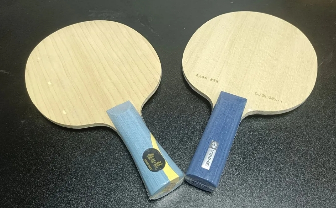
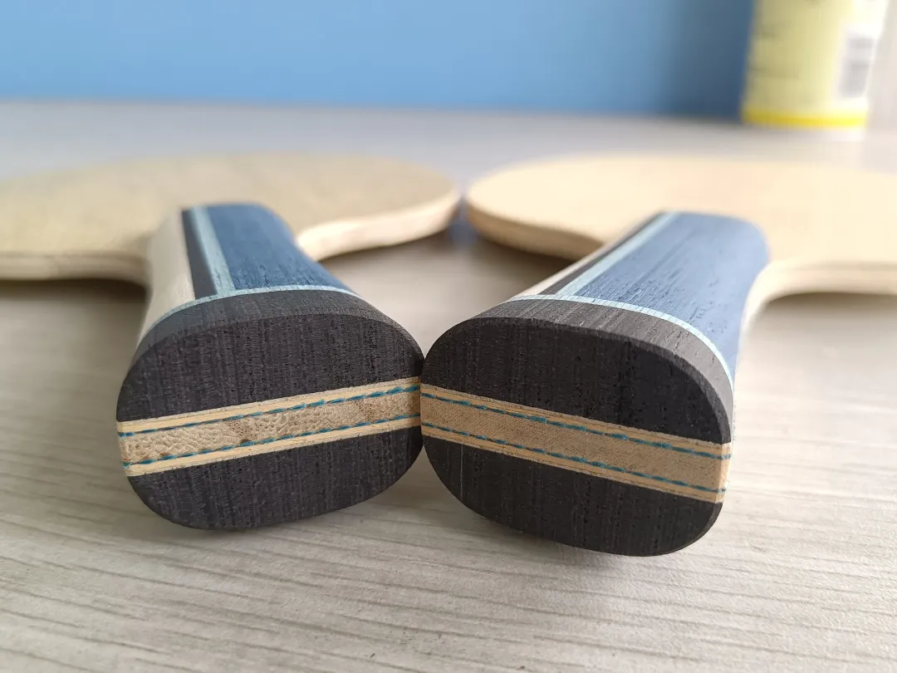
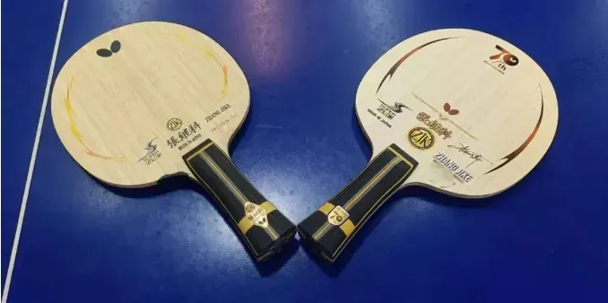

# Blade Thickness — Penetration, Spin vs. Speed, and Flatness

When it comes to **blade thickness**, there are really only two questions to consider. One is whether you can hit through it. The other is the trade-off between spin and speed.

---

## Can You Hit Through It?

Whether you can penetrate a blade is something you'll roughly know after a hands-on hit. Take two blades with the same construction: the **Harimoto Tomokazu ALC** and the **Ovtcharov ALC** — the former is **6.0mm**, the latter **6.2mm**. The thicker one is harder to penetrate. If you can't hit through it, then with insufficient power you'll tend to drop the ball; and when you want to hold it, you can't hold it.

On the other hand, a thicker blade is generally faster when it comes to blocking and redirecting borrowed pace. But the thinner one adds spin more easily, because it deforms more readily. So — assuming you can penetrate both — if you play mainly drive-and-attack, or you emphasize speed, the thicker blade suits you better. But if spin is your first priority, then pick the thinner one.

---

## Applying It: W968, Stiga CL, and 7-Ply Woods

This is also worth considering when picking the thickness of a **W968**. Once it goes past 6mm, it genuinely isn't as easy to penetrate as something under 6mm, and doesn't add spin as easily. On the other hand, the backhand is firmer when blocking with borrowed pace or adding power. If you're worried the W968's backhand is too mushy, then yes — you can go a little thicker.

The **Stiga CL** is an even more extreme case. There was a time when a CL as thin as **6.4mm** was regarded as a god blade for looping. But there simply weren't many of them around. So plenty of players turned instead to the thinner **Donic UP**. These days plenty of all-wood 7-ply blades are deliberately made not-too-thick to suit the "loop-ification" of the game — the **Banda Offensive** (measured **6.08mm**) and **Chunli** (measured **6.2mm**), for example. Most CLs today are still over 6.5mm. If you play pips, then you really should pick a thicker one — that's what gives you enough support and makes it easy to speed the ball up.

---

## Flatness: Consistency Across the Face

How thick a blade actually is involves the question of **flatness**, so normally we measure at least three points and take an average. Say one point reads 5.9, another 5.8, and another close to 6.0. For a blade that isn't expensive, that is entirely normal — **0.2mm** of thickness variation is everywhere.

Does this affect your technique? The higher your level, the more sensitive you may be to it. At the level of **Butterfly player-spec** blades, most are fairly precise — for instance, a thickness difference of **0.03mm** between points, which is quite frightening. On the **Butterfly Zhang Jike Super ZLC 70th Anniversary Limited Edition**, the flatness is likewise very good, with very small variation. Which shows: this is controllable to a degree — it depends on whether they bother to be careful.

What flatness affects should be: the uniformity of rebound and of the sweet spot. If hitting at different points across the face doesn't produce much difference in rebound or sweet-spot feedback, that necessarily gives you a higher margin for error, and shot quality you can trust.

For players at a lower level, who often can't even penetrate their rubbers, the effect is naturally smaller. The higher the level, the more entitled you are to be picky, in theory.

---

## Thin vs Thick at a Glance

   Thinner blade
   Thicker blade

  

    
Penetration

    

      
Easier to hit through at moderate power

      
Harder — under-powered shots drop off

    

  

  

    
Spin

    

      
Easier to add — the blade deforms more

      
Less easy to load up

    

  

  

    
Borrowed-pace speed

    

      
Slower on block and redirect

      
Faster off the bounce, firmer backhand

    

  

  

    
Suits

    

      
Spin-first loopers; players who can't fully penetrate a thick blade

      
Speed-first drive and block play; pips hitters who want support

    

  

---

## Thickness Reference

| Blade | Thickness |
| --- | --- |
| Harimoto Tomokazu ALC | 6.0 mm |
| Ovtcharov ALC | 6.2 mm |
| DHS W968 | over 6 mm |
| Stiga CL (most current pieces) | over 6.5 mm |

Figures as cited in the source article — maker-stated where available, otherwise the reviewer's own measurements. Treat them as typical values for the model, not a guarantee for the individual blade in your hands.

  

    
Choosing a thickness?

    
Check the live price table or request a quote via WhatsApp.

  

  

    <a class="mg-home-hero__btn mg-home-hero__btn--primary" href="https://wa.me/8618627156285?text=Hello%2C%20I%27d%20like%20help%20picking%20a%20blade%20thickness.%0D%0A%0D%0AShip%20to%20(city%20%2F%20postal%20code)%3A%0D%0A%0D%0A">Request a quote on WhatsApp</a>
    <a class="mg-cta-card__outline" href="/blades/">Live price table</a>
  

## Ordering

For live USD pricing on the blades mentioned here, see the [Blades price list](../blades.md). We ship worldwide — see [How to Order](../order.md).

!!! tip "Related"

    Blade structure: [How to Choose a Blade: All-Wood, Outer & Inner Fiber](../guide/choosing-blade-structure.md). Fibre placement: [Outer vs Inner Fiber](../guide/outer-vs-inner-fiber.md). Rubber thickness and hardness: [Rubber Thickness vs Hardness](../guide/choosing-thickness-vs-hardness.md).

The content above is my personal opinion. If you spot an error or have a better suggestion, feel free to <a href="https://wa.me/8618627156285">message me on WhatsApp</a> — let's share better content with everyone together.

