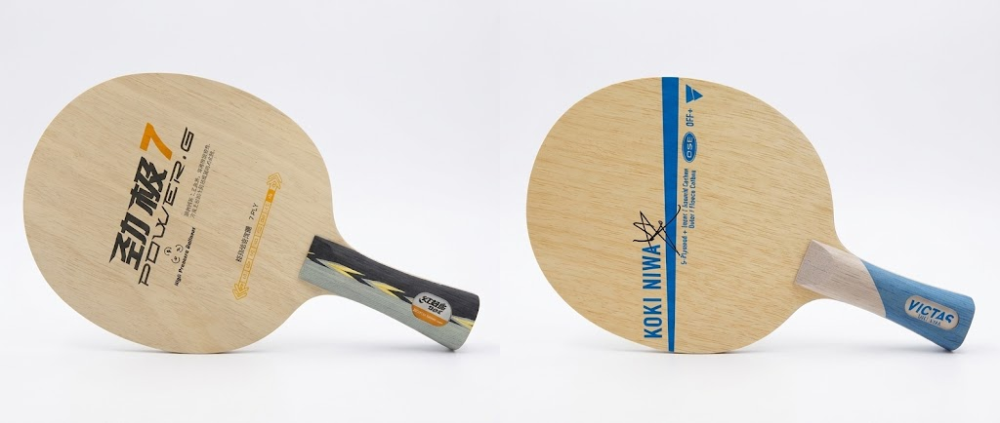
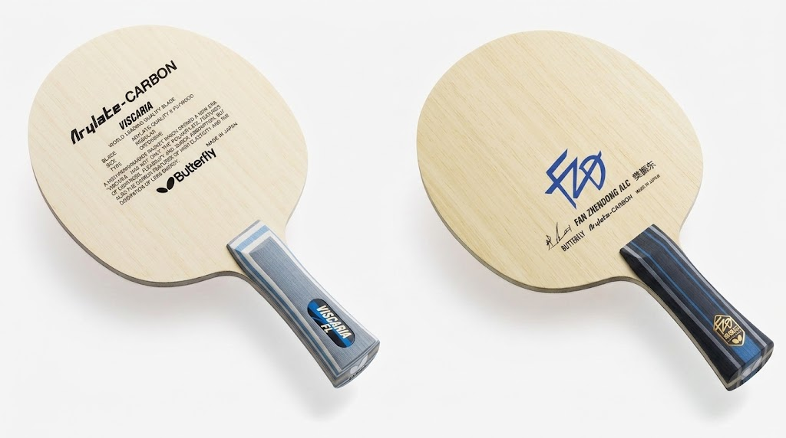
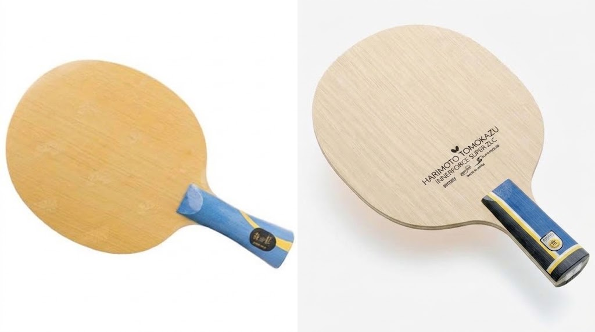

# How to Choose a Blade: All-Wood, Outer Fiber, and Inner Fiber

When choosing table tennis equipment, the blade is the core component that decides your playing style and technical ceiling. Under ITTF rules, at least **85% of a legal blade must be natural wood**; the remaining 15% may be carbon, aramid, glass fiber, or other reinforcing materials. This rule gives rise to the three mainstream structures, classified by where the fiber layer sits: fiber **above** the strength ply (**outer**), fiber **below** the strength ply / above the core (**inner**), and **all-wood** with no fiber at all.

Since the **40+ ball** was introduced in 2014, ball speed has dropped and spin has decayed, so a blade's demands on *dwell feel*, *flex feedback*, and *timing of elastic release* have risen sharply. Structure is no longer just a spec-sheet number — it maps directly onto your shot arc, margin for error, and growth path. Choosing a blade is therefore choosing a **kinematic response pattern**, not simply chasing "premium" or "pro."

## All-Wood Blades: Clear and Linear — The Mirror of Fundamentals

An all-wood blade is built from multiple layers of natural wood (ayous, hinoki, limba, koto, and more) hot-pressed together, with no fiber material at all — strictly **100% wood**. Its core advantage is high structural consistency: the wood fibers run in one direction with no abrupt interfaces in stress transmission, so the hitting feedback is remarkably transparent, linear, and predictable. When you lightly drive a fast loop, the blade's flex and ball speed rise in almost direct proportion; in blocking, a small forearm movement gives a clear rebound rhythm. This *"what you send in is what you get out"* character makes it a golden tool for refining feel and building a correct power chain.

But the other side of the coin is a clear performance ceiling: without fiber's stiffness support and energy return, single-shot quality is visibly capped in the big-ball era — especially in sustained mid-to-long range rallies, where it can feel like *"you have power but can't let it out."* Backhand flicking is slower, and in exchanges an outer-fiber blade tends to dictate the pace.

So all-wood is not *"outdated"* — it is the ideal fit for **beginners building muscle memory**, for **advancing players fine-tuning short-game control** (pushes, drops, flicks), and for anyone **chasing maximum spin generation** (such as professional choppers). It hides no mistakes and amplifies no talent — the most honest mirror for testing fundamentals.

## Outer Fiber Blades: Explosive Off the Block — An Accelerator for Fast Attack and Backhand Play

The typical outer-fiber construction is *"face ply — strength ply — fiber layer — core,"* with the fiber hugging the top surface of the strength ply, closest to the hitting surface. This layout lets the fiber activate under very small flex, sharply raising the blade's overall rigidity and instant response. Flagship examples are **Butterfly Viscaria** and **Fan Zhendong ALC**, whose trademark is *"high output at low effort"*:

- In blocking, a light push of the wrist produces a strong drive.
- Backhand flicking needs almost no leg-and-hip rotation — forearm snap alone delivers a penetrating straight line.
- Near-table fast-arc loops convert the incoming ball's energy into outgoing speed, with an oppressive *"ball's over before you've finished"* feel.

But high speed inevitably comes with shorter dwell: the fiber engages early and compresses the wood's natural flex cycle, so the ball doesn't *"rest"* on the surface long enough, and spin generation efficiency drops. Short pushes tend to pop up, drop shots tend to net; when looping with heavy spin, the shallow catch and brief friction produce a flatter arc with a strong second bounce — but placement is harder to control and the error rate rises clearly.

So an outer-fiber blade is no *"universal speed booster."* It best suits players with a **mature backhand**, a **near-table fast-attack game**, more **blocking and passive defense than active power**, and relatively loose requirements on spin precision.

## Inner Fiber Blades: Deep Dwell — The Powerplant for Looping and Mid-to-Long Range Battles

The inner-fiber construction is *"face ply — strength ply — fiber layer — core,"* but the fiber is covered by the strength ply, so the strength ply must flex substantially before the fiber responds. This *"delayed response"* mechanism produces two key traits:

1. **Deep dwell** — the strength ply flexes first and cushions, lengthening contact time and favoring full friction for spin.
2. **The harder you swing, the more it gives** — with light strokes it feels close to all-wood, stable and easy to control; once you open up fully from mid-to-long range, the fiber releases the stored elastic energy in an instant, the blade shows bottomless power, and loops dive sharply on the second bounce — lethal.

Flagship examples like **DHS W968** and **Butterfly Tomokazu Harimoto SZLC** are built precisely for the modern two-wing looping game. But that high-end performance comes with a real threshold: with insufficient power the fiber *"sleeps"* and the blade feels soft and sluggish; in passive blocking, if your power control is slightly off, light contact nets the ball (fiber not engaged) while heavy contact sends it long (fiber over-rebounds) — a narrow window of forgiveness.

So inner-fiber blades demand **excellent body coordination, weight transfer, and consistent power delivery**, and best suit advancing-to-pro players who already own a complete looping technique and want high-quality rallies and mid-to-long range dominance.
