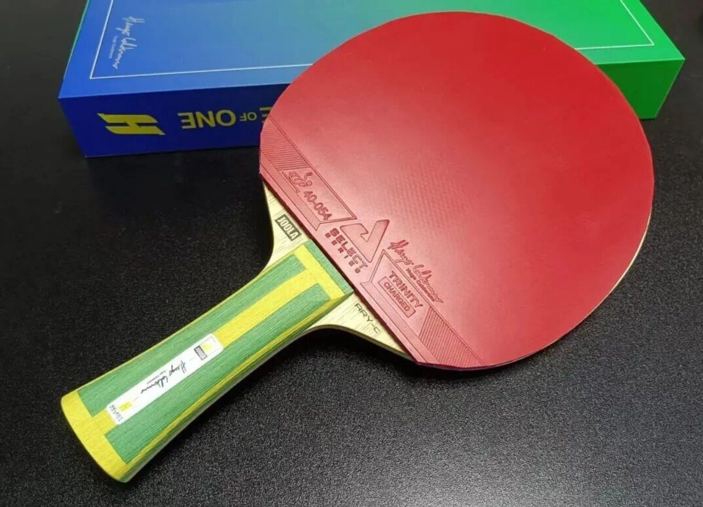
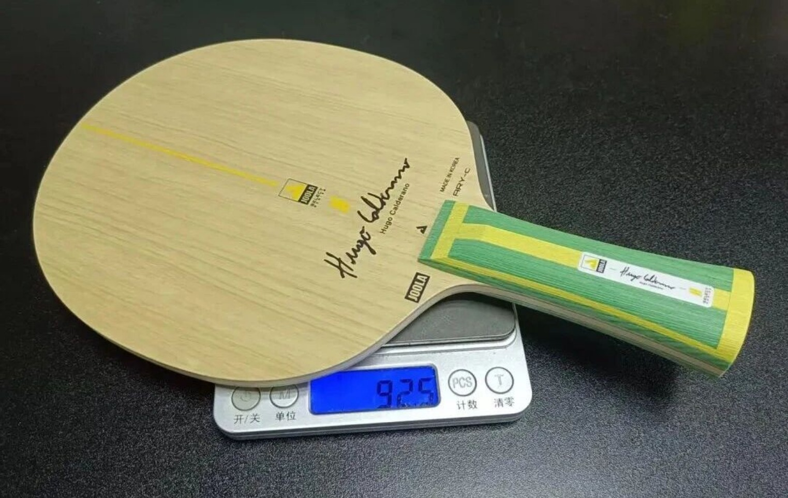
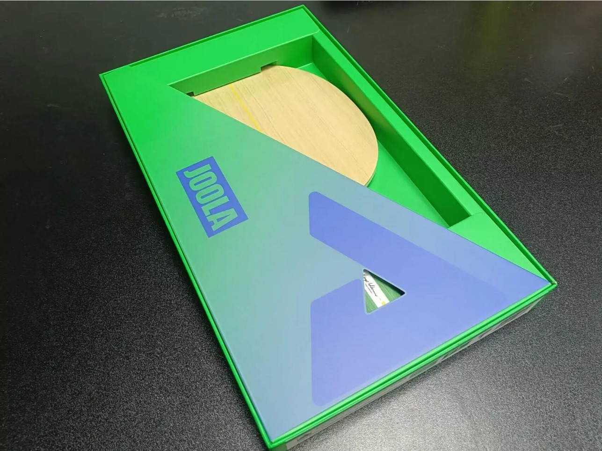
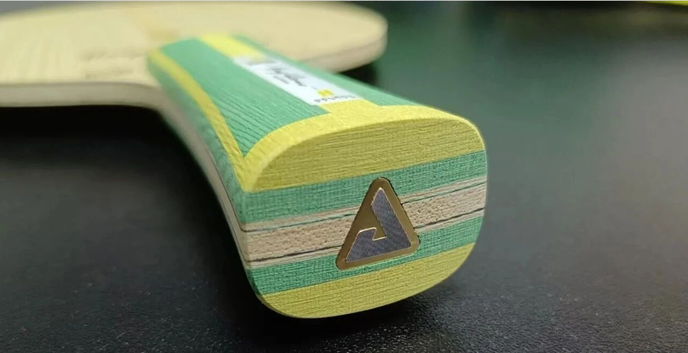

# Joola Hugo ARY-C — Ultimate Balance, Right Amount of Rigidity and Violence

This blade isn't just a brand flagship — it holds a significant place among this year's new blades from all brands. One reason is the results Brazilian star **Hugo Calderano** has achieved.

2025 Macao World Cup men's singles champion, Doha World Championships men's singles runner-up, and most recently a title at the WTT Star Contender São José dos Campos. By results, Hugo is currently unarguably the strongest rival of the Chinese national team.

His current racket, the **Joola Hugo ARY-C**, has become a talking point for many. In a way, it represents the top standard of Korean manufacturing.

## The Basics

The Joola Hugo ARY-C is **Korean-made**. Construction:

**Limba face · Ayous reinforcement · Green aramid-carbon · Ayous core**

The structure resembles the DHS **W968**, but with green aramid-carbon fiber instead. Green aramid-carbon blades are known for good rebound and excellent arc/loop ability.

In structure, the Hugo ARY-C is the same inner green-carbon layout as the Waldner Olympic Gold Edition (the "Golden Waldner") and the Joola Ola Hybrid Carbon — though the weave of the green aramid-carbon may differ.

Measured thickness: ARY-C **6.05mm**, Golden Waldner 5.93mm, Ola Hybrid Carbon 5.99mm.

In the grip, the ARY-C feels the fullest and likely the most rigid of the three. The handle color scheme references the Brazilian flag.

In feel, the ARY-C is like a faster, higher-dwelling, slightly harder-to-transparent Golden Waldner; or a hybrid of the Ovtcharov ALC and the Ola Hybrid Carbon.

## Ultimate Balance

Measured weight **92.5g**, thickness **6.05mm** with a thick core, head size about **159×152mm** — a large head.

From these numbers you'd guess it has some power threshold. But even if that's true, it already delivers enough ball quality at low-to-mid power — that's remarkable.

**Rubber compatibility:** works with smooth or tacky on both sides. The reviewer first put Butterfly Tenergy on both sides and found it good, though the forehand wasn't easy to fully penetrate. Switching the forehand to Hugo **Trinity Charged** (a harder rubber) paired surprisingly well — at that point you realize you don't need full penetration; enough ball quality is fine.

**Short game and control:** the blade body is rigid, not spongy. Short balls are really controllable — especially with a micro-tacky rubber like the Hugo Trinity Charged, both push and flick can stay very low and flat. It doesn't demand much technique.

**Receiving and backhand loop:** you can bite the ball and produce more spin than expected on the backhand flip. Whether flipping or looping, you instantly feel supported by the blade. Opponents report the incoming rotation is really strong. That is, with low-to-mid power strokes you get great spin quality.

**Backhand and forehand attack/defense:** the compact backhand motion gets good speed. On the forehand, with a large swing it's not easy to hit through fully — but even so, its speed feels better than a typical inner ALC blade. Similar to the Ovtcharov ALC, it plays both drive and loop. When looping with power it's not easily penetrated but speed is good; when spinning, it spins a bit more than expected.

The backhand has strong support and rigidity. Blocking with borrowed power is easy, with decent direction control. You feel right away that despite being an inner-fiber blade, the backhand is no worse than an outer blade — while still having good ball-holding feel.

**Mid-to-long distance:** the support and stamina remain strong. When you step back, the rigidity and rebound are enough that the blade doesn't feel hollow — it holds power steadily, and actually feels easier at mid-far range.

## Verdict

This is a genuinely balanced blade — balanced to the point of almost no weakness. Spin, speed, and power seem to lack nothing. Attack is sharp, defense is stable. Especially paired with Joola's own Hugo rubber, they complement each other well.

The only real criticism: players used to thin blades (under 5.8mm) may need some adaptation. And the blade has a slight power threshold — it's not easily fully penetrated at 70% effort.

Even if you can't fully penetrate it, with the right rubber (pay attention to the rubber's transparency/through-feel), its controllability and mid-power threat are already excellent. Above mid power, don't doubt its ball quality. After all, this is the hand blade of Hugo — the ambassador of violent aesthetics. A genuine benchmark product!

!!! tip "Related"

    Fiber placement: [Outer vs Inner Fiber](../guide/outer-vs-inner-fiber.md). Live USD references: [Blades](../blades.md).
