# Tibhar Darko Jorgic Infinity Carbon — Inner/Outer Hybrid, Distinctly Characterful

This blade isn't just another signature model — it stands out as one of the most intriguing releases this year across all brands. One reason is the performance Slovenian star **Darko Jorgic** has delivered.

At the Swedish Smash, though he fell to Félix Lebrun in the semifinals, Jorgic's run to the men's singles final four was still impressive. His current blade, the **Tibhar Infinity Carbon**, has drawn significant attention. Notably, Chinese youth team player **Li Hechen**, who plays for Shandong Weiqiao alongside Wang Chuqin and won the WTT Contender Taiyuan men's doubles title (partnering Wen Ruibo) as well as the WTT Contender U19 men's singles title, also uses the Infinity Carbon as his main blade.

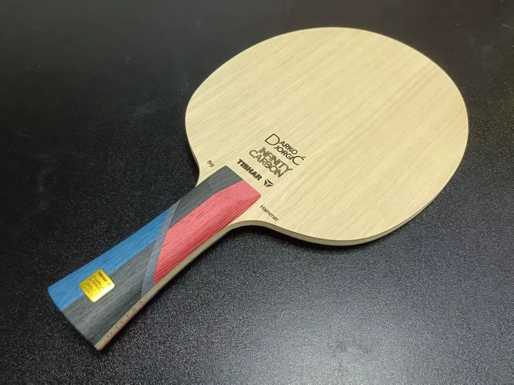

This asymmetric (heterogeneous) blade has been among the most anticipated releases this year. Let's dive into the review.

---

## Design & Construction

At first glance, the handle design is refreshingly bold. Large color blocks — blue, red, and dark grey — are organically combined, and the addition of a gold nameplate gives it a premium feel.

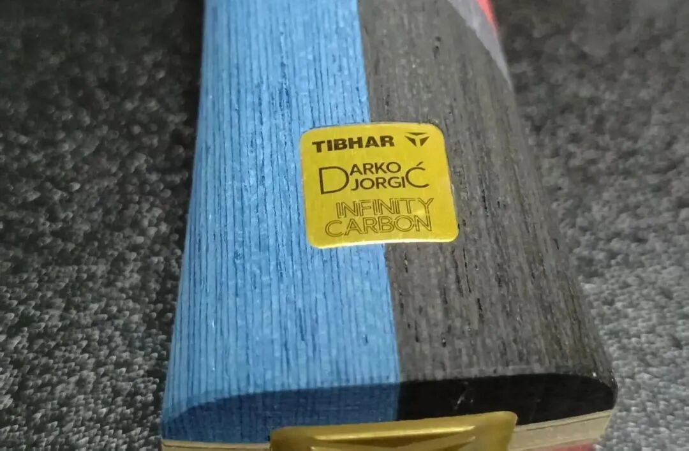

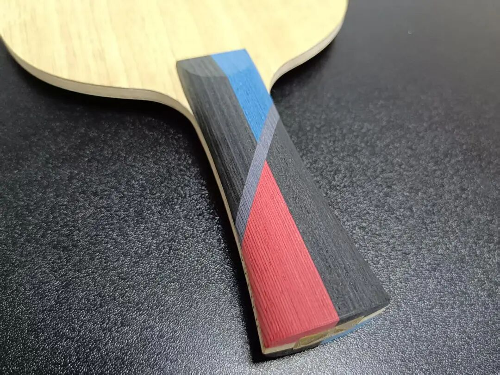

The handle itself is relatively slim. This pushes the balance point slightly more toward the head, helping to enhance offensive power.

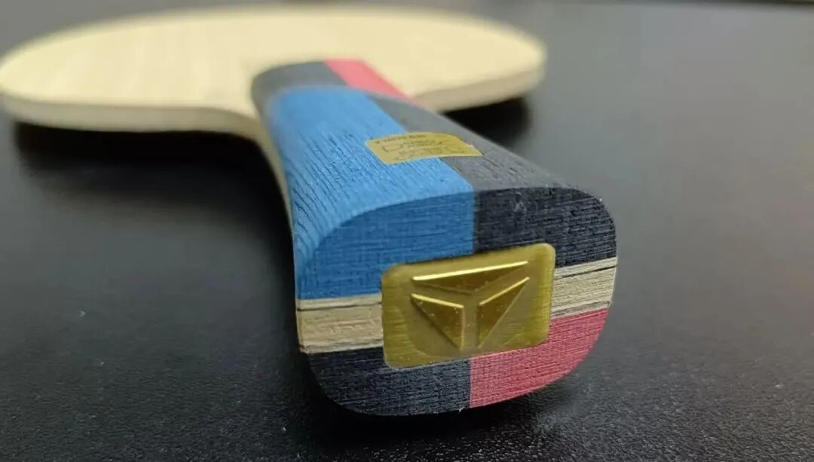

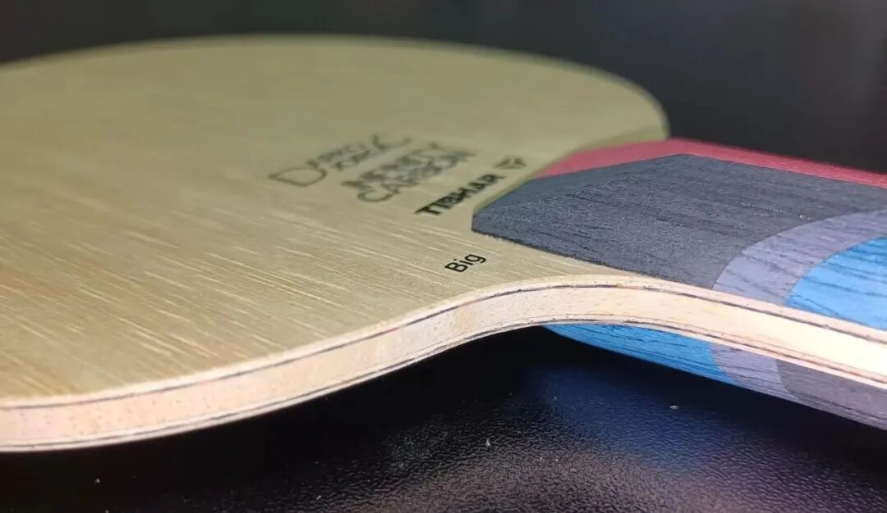

The construction is:

**Limba face · Ayous reinforcement · Orange-red aramid-carbon · Ayous core · Ayous reinforcement · Orange-red aramid-carbon · Limba face**

A closer look reveals this is a **heterogeneous blade**: the forehand side (marked with the nameplate) is **inner-fiber**, while the backhand side is **outer-fiber**. Of course, you can flip it based on your playing style, but Jorgic himself uses it as forehand-inner, backhand-outer.

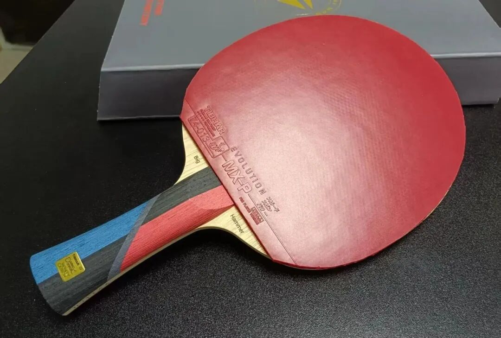

The Infinity Carbon measures approximately **158×151mm** in head size, with a measured thickness of **5.75mm** and weight of **87.9g**.

The orange-red aramid-carbon used here is rarely seen in domestic blades — it appears mainly in Korean-manufactured ones. The direction of the core's cut also suggests Korean production. Korean-made blades are known for their firmly compressed cores: good ball-holding feel, though slightly firm and unyielding.

Generally, outer-fiber aramid-carbon blades offer faster initial ball speed, explosive power, and direct impact. Inner-fiber aramid-carbon blades provide stronger ball-holding feel, easier arc adjustment, and — often paired with an Ayous core — better power storage and depth.

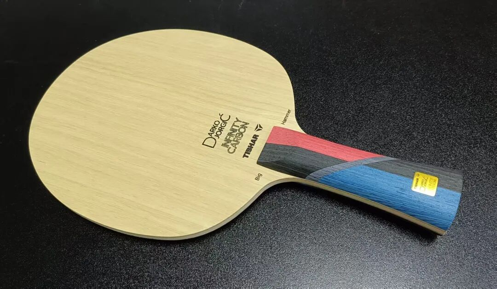

The Infinity Carbon's design — forehand inner, backhand outer, Ayous core — aims to fuse the advantages of both. In the past, such heterogeneous blades lacked durability, but modern manufacturing has overcome that. The reviewer feels that for this asymmetric design, an **Ayous core** works better than Kiri (Paulownia): it ensures power and lethality, raises the ceiling, and better showcases the forehand's characteristics. Compared to Kiri-core asymmetric blades, the Infinity Carbon offers superior sustained power in long rallies.

---

## A Perfect Match for "Jorgic-Style" Play

The Infinity Carbon feels like two blades in one: the forehand resembles the Donic Waldner Olympic Gold Edition (inner green aramid-carbon), while the backhand plays like a Viscaria (outer blue aramid-carbon).

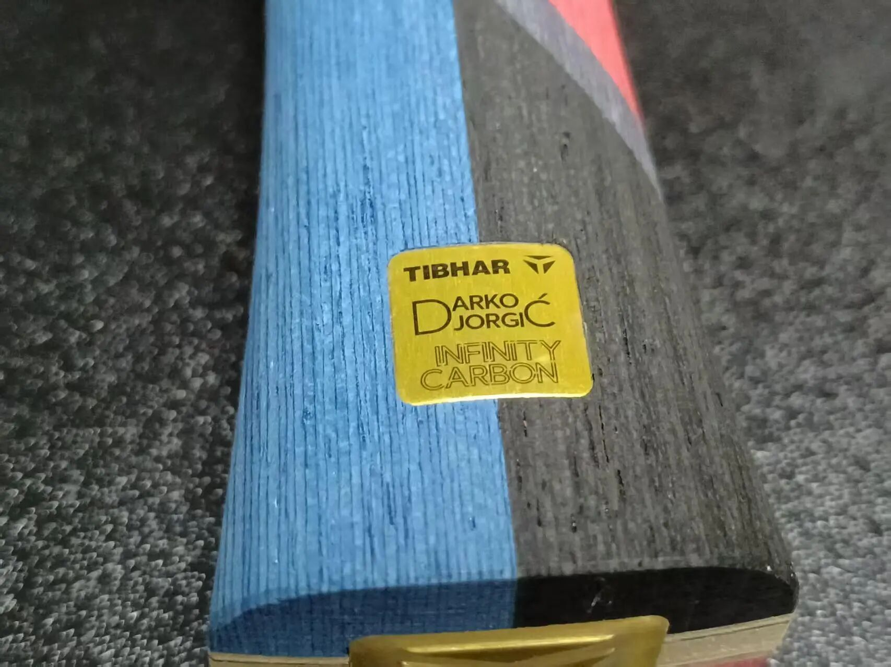

It's hard to definitively call this combination "perfect" — it largely depends on whether the feel and playing style suit you. If it doesn't, it may feel mediocre. If it does, it feels remarkably versatile.

**Short game and control:** No issues here. Whether on the inner or outer side, medium-to-low power strokes offer good ball-holding. Even if flipped — using the outer side on forehand — while the ball releases faster, control remains decent. The arc is still solid, though not exceptionally spinny, thanks to the Limba face. The inner side offers better bite and rotation, feeling more stable.

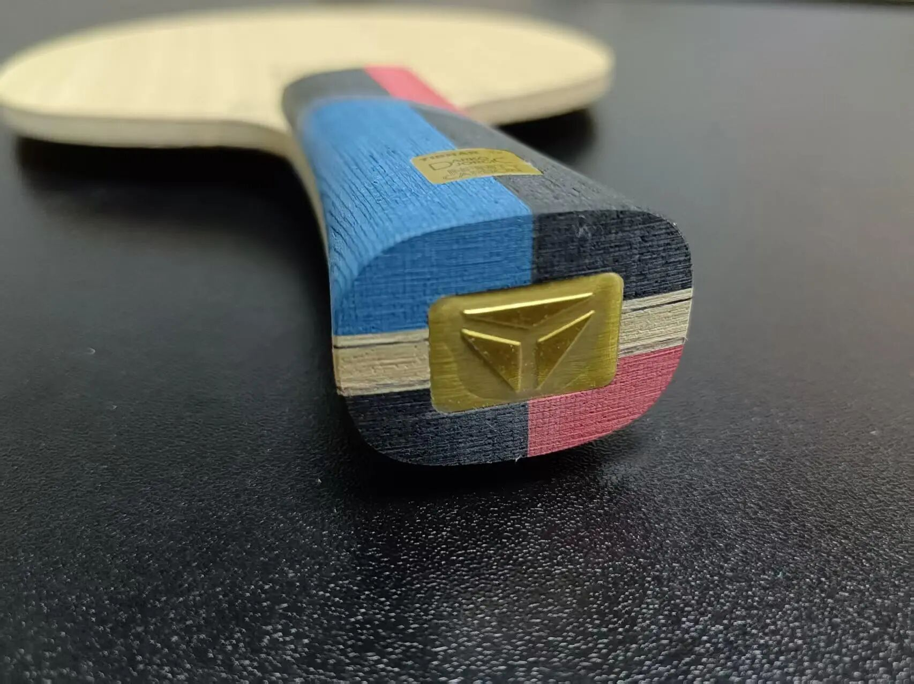

**Jorgic's setup:** Infinity Carbon, forehand **K2**, backhand **MX-P Infinity** (an upcoming new rubber).

Observing Jorgic's style: his forehand focuses on actively generating spin to enter rallies, using placement to move opponents. His backhand features quick counter-drives, presses, and powerful hits — fast, well-placed, and cannon-like. The backhand is more aggressive and speed-oriented; the forehand prioritizes stability, spin, and arc.

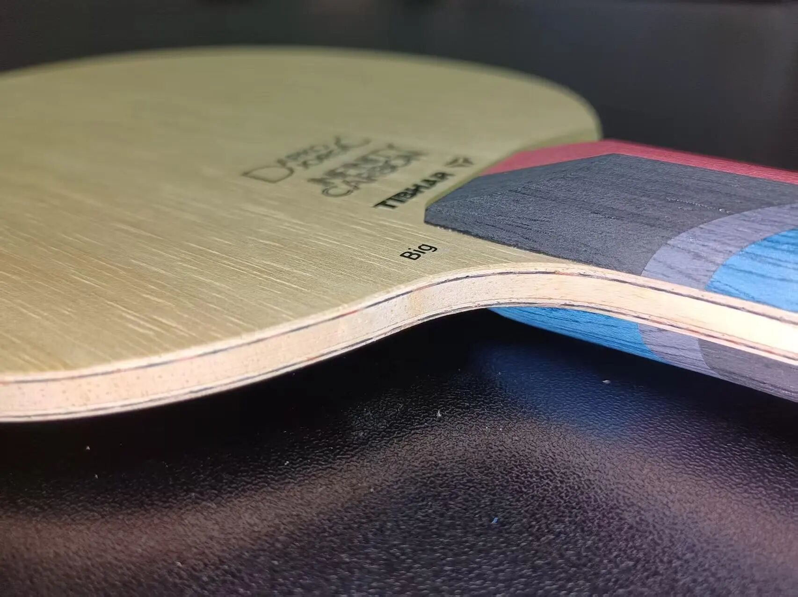

This blade is practically tailor-made for that style. If your backhand relies on quick-hitting techniques while your forehand builds with spin, the Infinity Carbon is genuinely for you. Or, conversely, if your backhand is spin-focused and forehand speed-oriented, you can flip it.

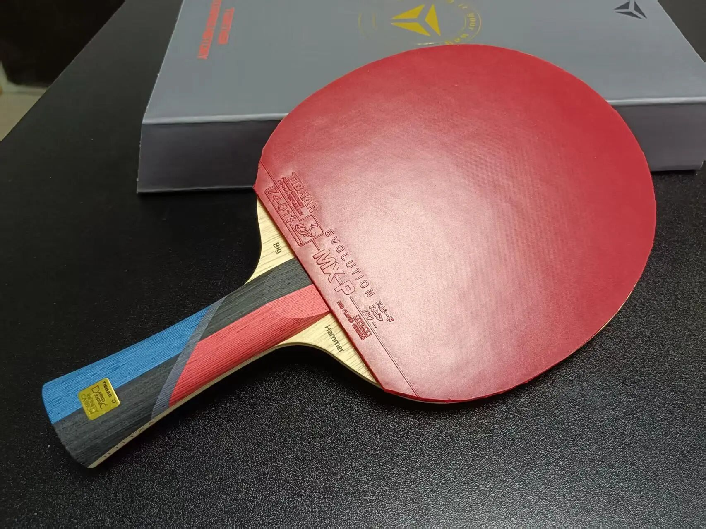

The outer side feels slightly harder with faster release. The inner side, when looping, feels like the ball sinks deep — almost "denting" into the blade. The resulting shot isn't overwhelmingly fast, but the spin quality is excellent, and continuity is strong. The outer side truly delivers suddenness.

---

## Verdict

This is a boldly balanced blade with clear identity. If your backhand arsenal is heavy on quick attacks and explosive power, and you're accustomed to outer-fiber backhands, this fits well. If your backhand still revolves around spin and high-speed loops, the fully inner-fiber Tibhar Félix might be the better match.

Either way, the Darko Jorgic Infinity Carbon is unmistakably distinctive. Opinions on it may be divided, but as the blade of both Jorgic and Li Hechen, its character is sharp and its value clear. If it aligns with your playing style, it's nothing short of perfect.
