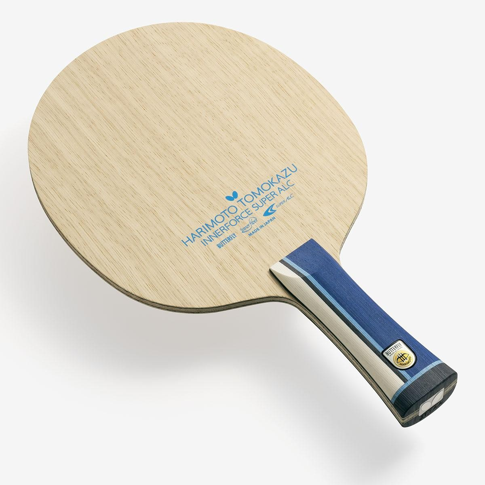
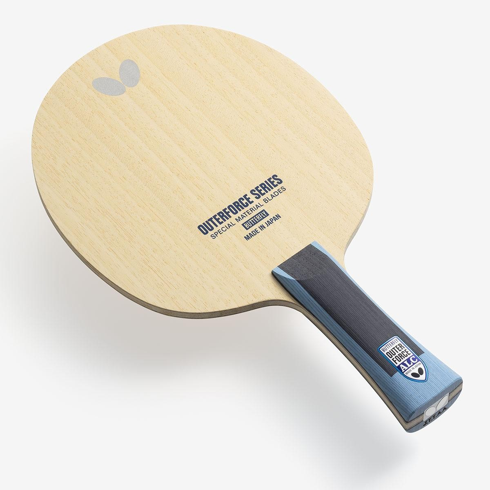
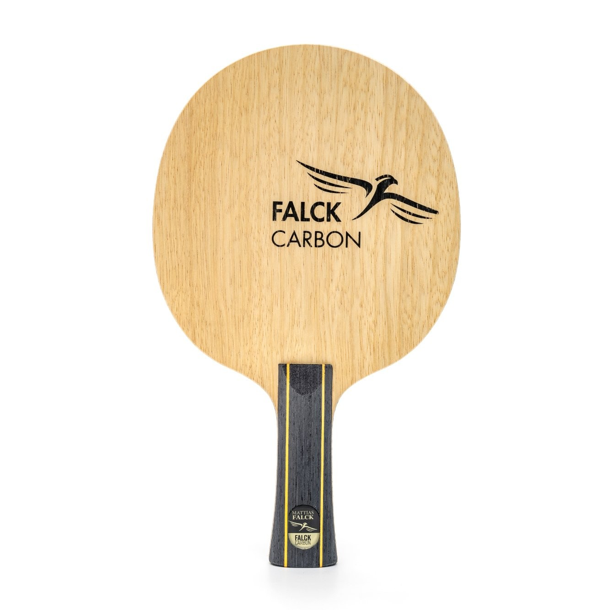
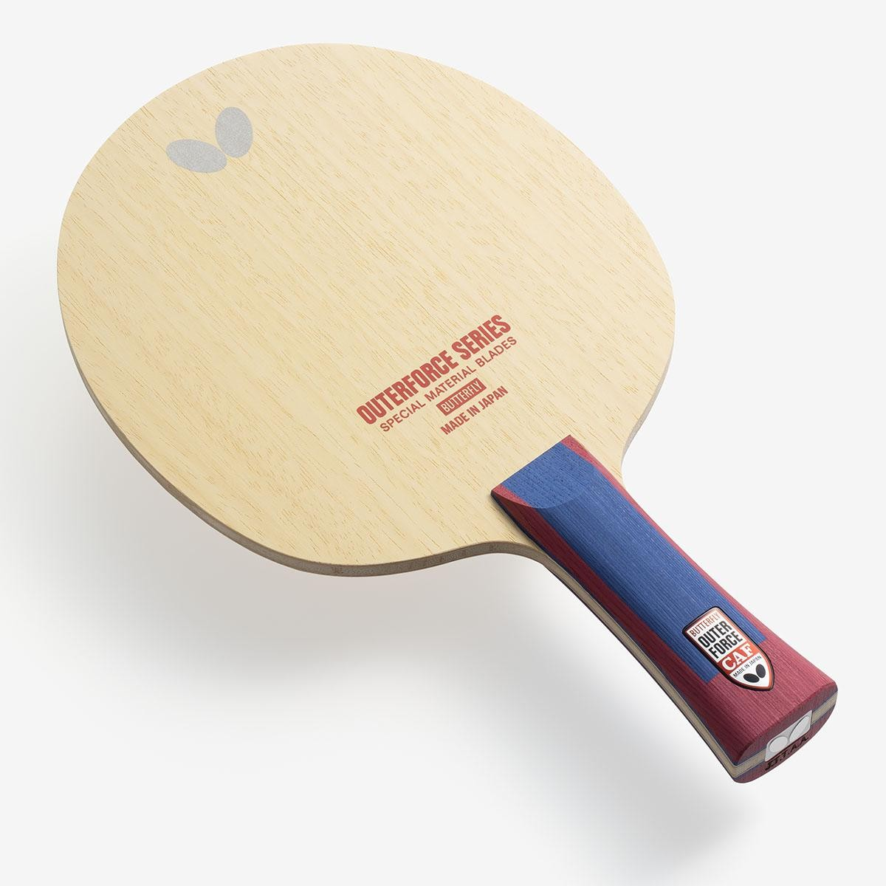
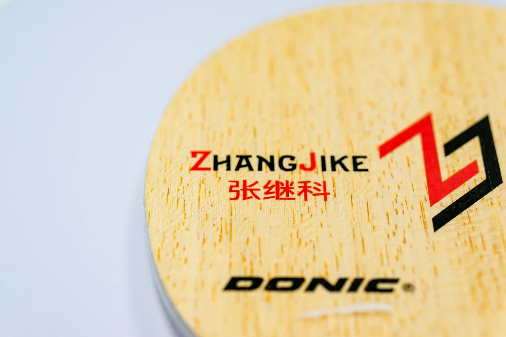
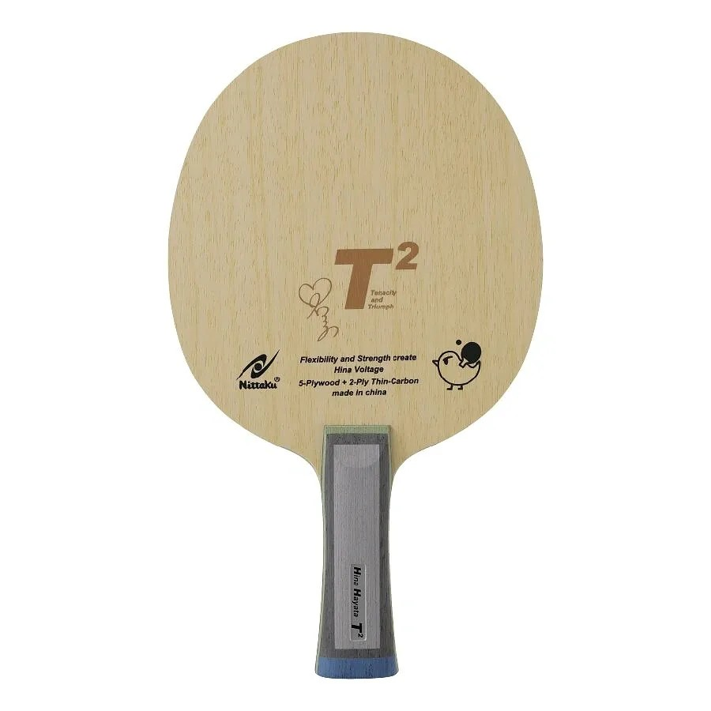
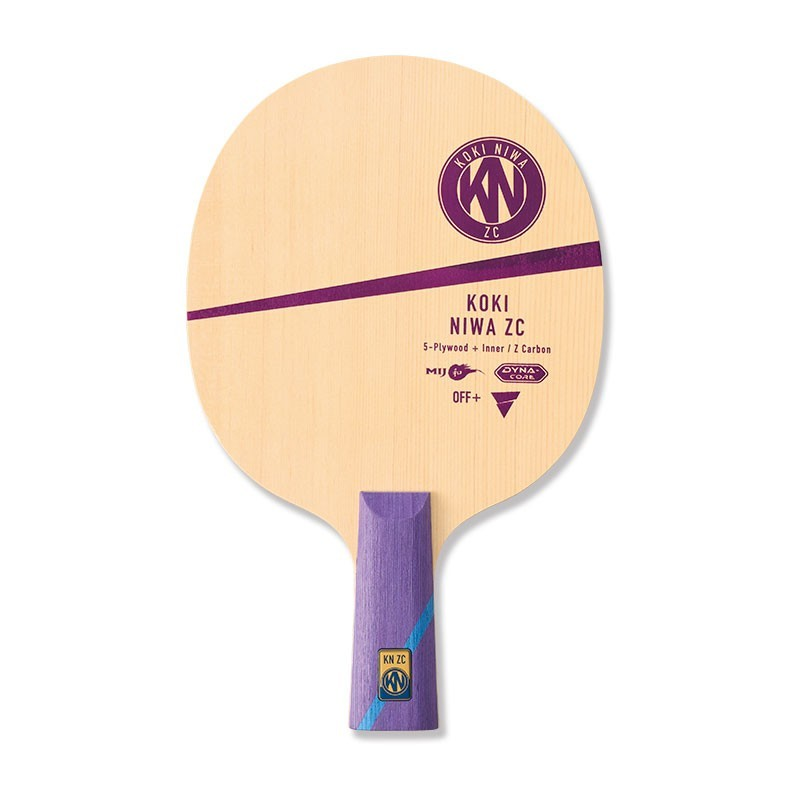
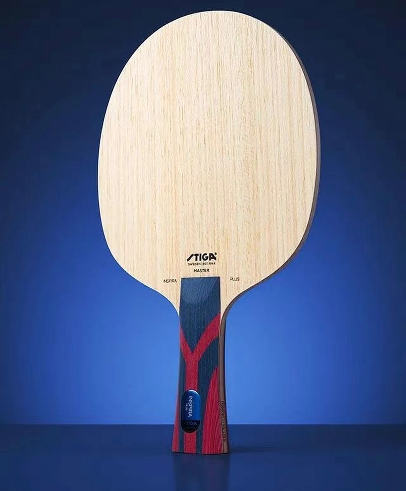
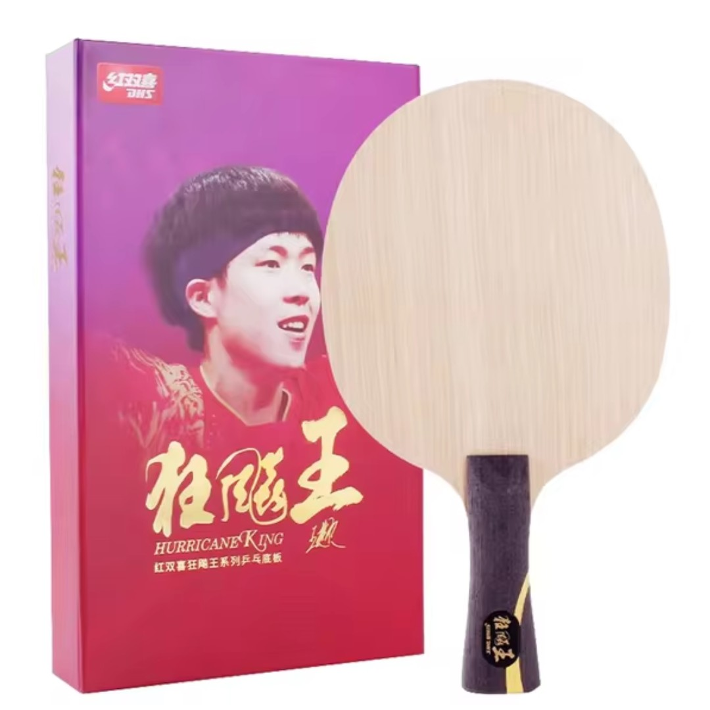
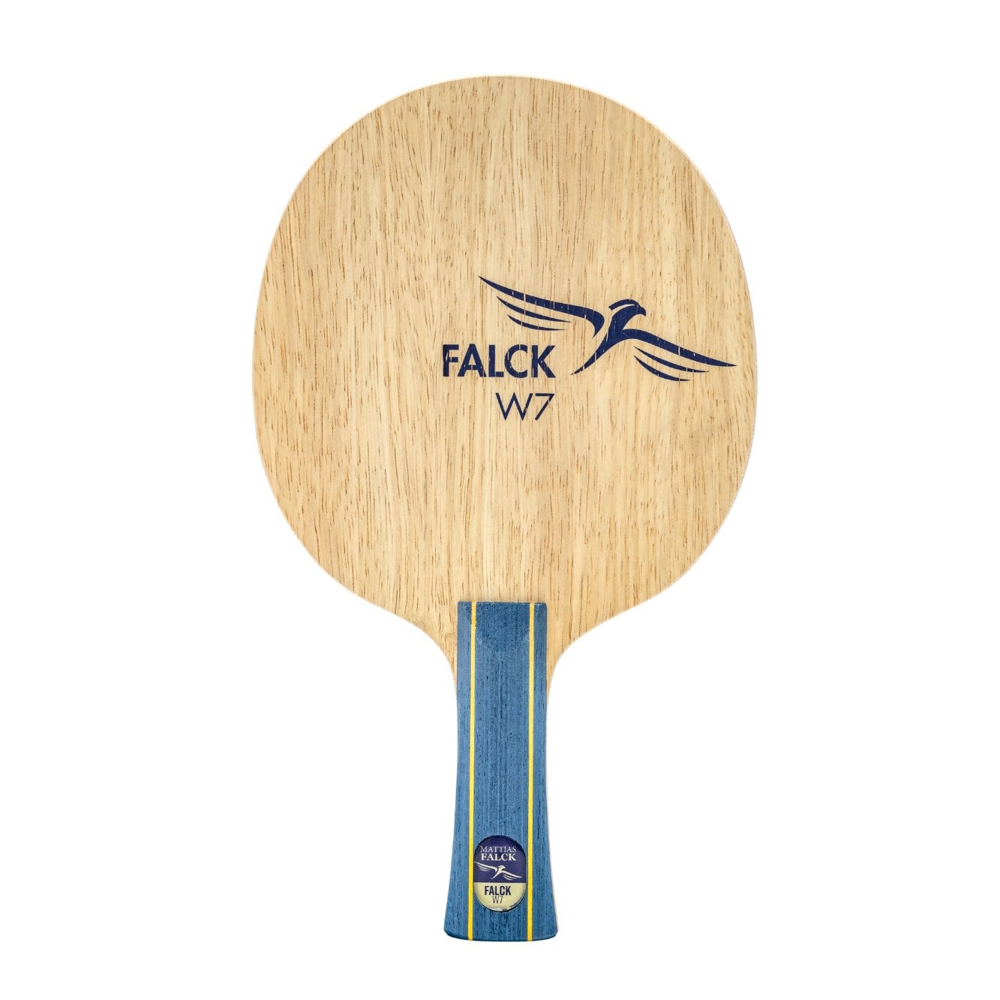

# Table Tennis Kingdom 2025 Top 10 Shakehand Blades

**Table Tennis Kingdom** (*卓球王国*), Japan's leading table tennis magazine, picked its **2025 Top 10 shakehand blades** from a survey of Japanese specialty shops and readers.

## 1. Butterfly Harimoto Tomokazu Innerforce Super ALC

## 2. Butterfly Outerforce ALC

About **6.2mm** thick with a low-density **ayous** face; per official data it is less bouncy overall than the Fan Zhendong ALC.

## 3. Yasaka Falck Carbon

## 4. Butterfly Outerforce CAF

## 5. Donic Zhang Jike Original Carbon

## 6. Nittaku Hina Hayata T2

## 7. Victas Koki Niwa ZC Inner

## 8. Stiga Inspira Plus 灵感碳王

## 9. DHS Hurricane King Wang

## 10. Yasaka Falck W7

!!! tip "Note"
    All picks above are from **Table Tennis Kingdom's 2025 survey** (Japanese specialty shops + reader feedback). Rankings reflect the Japanese market — Chinese domestic results would likely differ. Prices and availability on MyGear.Top: [Blades](../blades.md) · [Pre-owned](../pre-owned.md).
