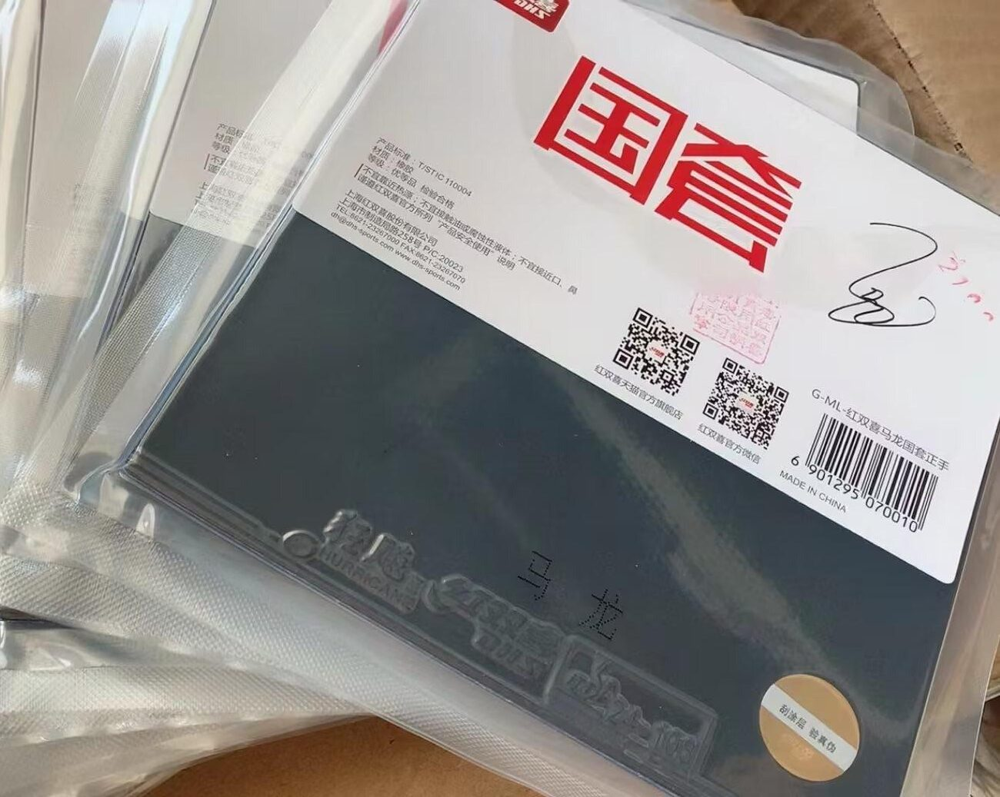
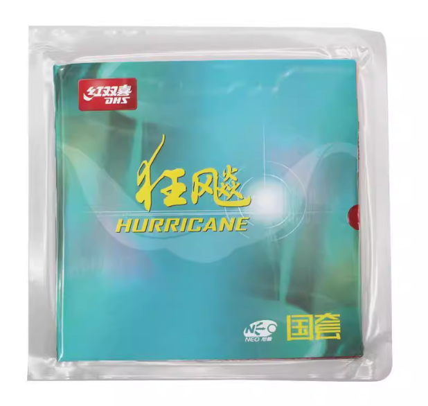
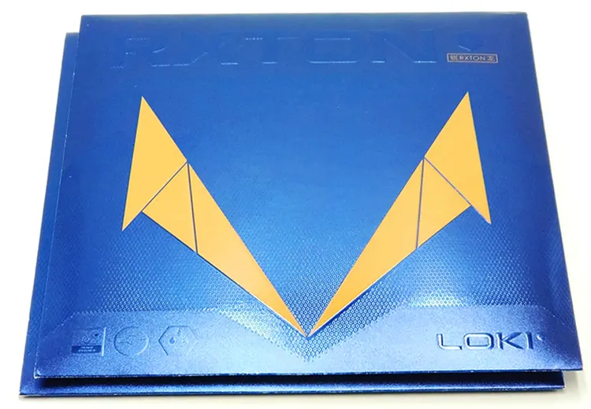
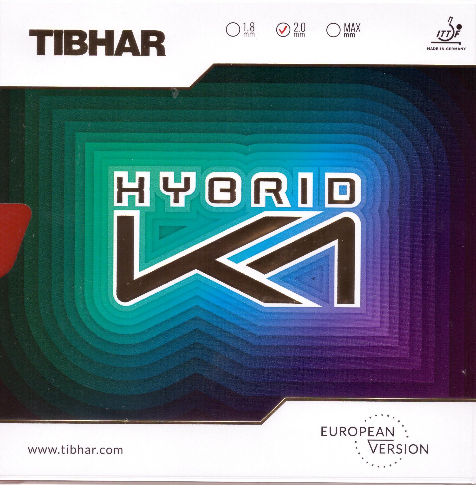
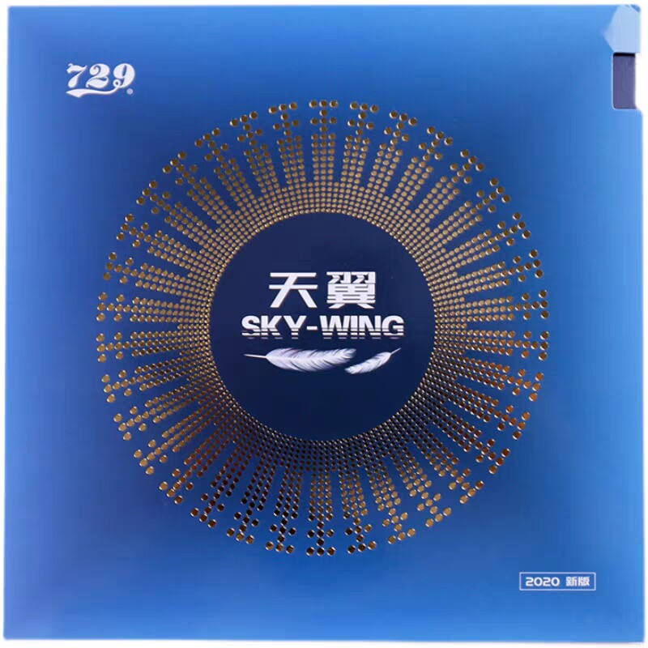

  <section class="mg-home-hero mg-home-hero--shop mg-hero-slides" aria-label="Table tennis rubber photos">
    

      
      
      
      
      
      
    

    

      
MyGear.Top

      <h1 class="mg-home-hero__title">Table Tennis Rubbers</h1>
      
Tap <strong>+</strong> to build a cart, then WhatsApp checkout for a final total (items + shipping).

      

        <a class="mg-home-hero__btn mg-home-hero__btn--primary" href="https://wa.me/8618627156285?text=Hello%2C%20I%27d%20like%20a%20quote%20for%20table%20tennis%20rubbers.%0D%0A%0D%0AShip%20to%20(city%20%2F%20postal%20code)%3A%0D%0A%0D%0A">WhatsApp quote</a>
        <a class="mg-home-hero__btn mg-home-hero__btn--ghost" href="/order/">How to Order</a>
      

    

  </section>

  <section class="mg-home-help">
    

      <a href="/blades/">Blades</a>
      <a href="/pre-owned/">Pre-owned</a>
      <a href="/FAQ/">FAQ &amp; Updates</a>
      <a href="/shipping/">Shipping</a>
    

  </section>

## Rubber list USD prices · Updated 24 Jul 2026

In stockProxy buy

| | Product | Price (USD) |
| :---: | --- | ---: |
|  | Butterfly ZYRE-03 | $89 |
|  | Butterfly Dignics 09C | $75 |
|  | Butterfly Tenergy 05 | $70 |
|  | Butterfly ROZENA | $35 |
|  | Butterfly Dignics 05 | $68 |
|  | Neo H3 National Blue | $52 |
|  | Star H3 National \| Malong | $73 |
|  | Neo H3 National Orange | $50 |
|  | NEO Hurricane 3 Provincial Blue | $38 |
|  | Neo Hurricane 3 Provincial Orange | $31 |
|  | DHS Hurricane8-80 | $25 |
|  | Hurricane 3 (Commercial) | $18 |
|  | Hurricane 3 National Blue Sponge | $45 |
|  | Neo Hurricane 3 | $23 |
|  | Stiga Mantra M | $30 |
|  | Loki RXTON V (Orange Sponge) | $6 |
|  | Loki RXTON IX National (Blue Sponge) | $18 |
|  | Palio CJ8000 | $5 |
|  | Friendship 729 Battle II National | $25 |
|  | Galaxy Moon Speed | $11 |
|  | Galaxy Jupiter III | $10 |
|  | Stiga DNA Dragon Grip | $28 |
|  | DNA Hybrid M (Red/Black) | $38 |
|  | DNA Platinum XH (Red/Black) | $38 |
|  | Stiga DNA Pro | $29 |
|  | Gewo Proton Neo 450 | $29 |
|  | Tibhar K1 | $25 |
|  | Tibhar K1 Plus | $27 |
|  | Tibhar K2 | $27 |
|  | Tibhar Aurus | $25 |
|  | Yasaka Thunder Dragon | $17 |
|  | Yasaka Flying Dragon | $21 |
|  | Victas V>102 | $34 |
|  | Victas Spectol S3 | $34 |
|  | Victas V>15 Stiff | $38 |
|  | FLEXTRA | $25 |
|  | GLAYZER 09C | $47 |
|  | Tenergy 19 | $65 |
|  | 729 Sky-Wing | $7 |
|  | Tibhar Evolution MX-P | $39 |
|  | Tibhar Hybrid K3 | $49 |
|  | Xiom Vega Asia | $29 |
|  | XIOM Vega China | $30 |
|  | Yasaka Rakza 7 Soft | $39 |
|  | Victas V > 15 Extra | $36 |
|  | 729 Battle II Provincial (No. 1) | $19 |
|  | Donic BlueGrip J1 | $33 |
|  | Donic BlueGrip J2 | $33 |
|  | Nittaku Fastarc G-1 | $33 |
|  | Tibhar Evolution EL-P | $36 |
|  | Yasaka Psych Dragon Pro | $33 |

  
Stock notice

  
<strong>In stock</strong> rows ship from our own inventory. <strong>Proxy buy</strong> rows are models we can purchase for you from suppliers—please allow an extra <strong>2–3 days</strong> for inbound shipping before we send your order.

  
Related

  
<a href="/blades/">Blades</a> · <a href="/add-ons/">Add-ons</a> · <a href="/order/">How to Order</a> · <a href="/FAQ/">FAQ & Updates</a> · <a href="/shipping/">Shipping & Delivery</a>

