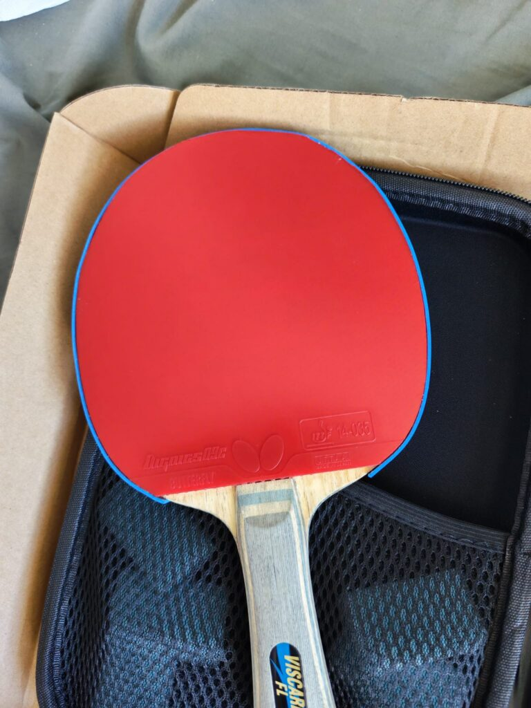
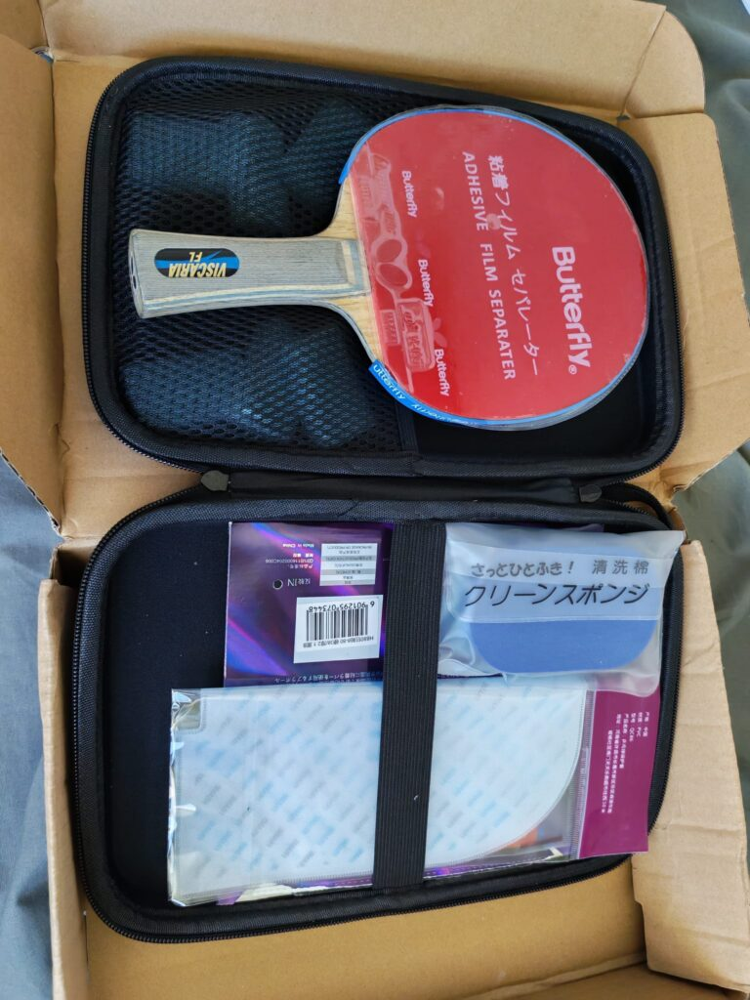
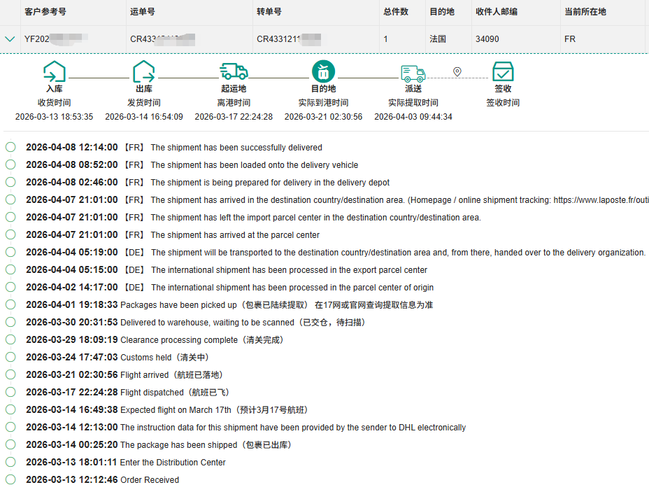
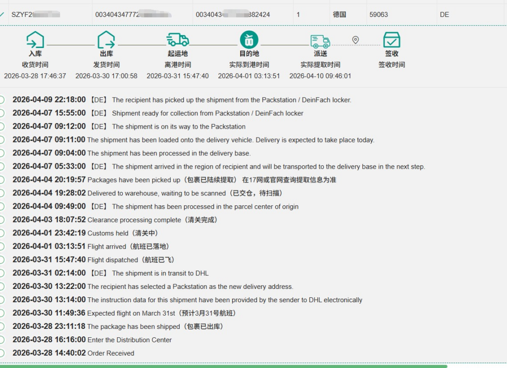
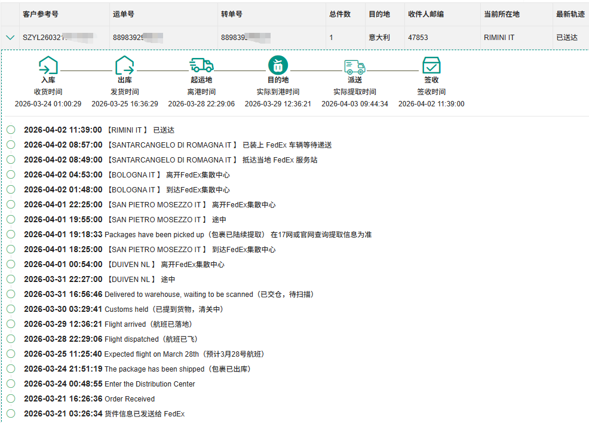
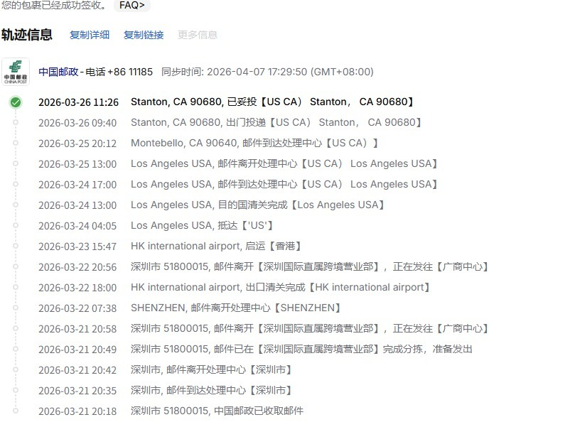

# Packaging & Tracking

How orders are packed, how to track them, and example shipping timelines (FR / DE / IT / USA and similar routes).

---

## How orders are packed

| Situation | What we do |
| --- | --- |
| **No original box** | Thick bubble wrap so the blade is protected from bumps |
| **Original box included** | Assembled racket goes back into its **original box** |
| **Two rackets or extra gear** | Upgrade to a **hard-shell racket case** |

---

## How to track

Every order gets a tracking number. Tracking details are sent on **WhatsApp** after the package ships.

| Region | Tracker |
| --- | --- |
| **European Union (EU)** | [Track here](http://203.195.161.123:8180/track) |
| **USA & Canada** | [Diditrack](https://www.diditrack.com/) |
| **Other regions** | [17TRACK](https://www.17track.net/) |

---

## When will it arrive?

Examples below show packing and transit for customers in **France, Germany, Italy, and the USA**. Plan roughly using the [FAQ](faq.md) guidance (~10 days transit, ~15 days with processing buffer).

!!! tip "Related"
    Ordering basics → [FAQ](faq.md) · List prices → [Price List](price-list.md) · Store changes → [Store Log](log.md)
